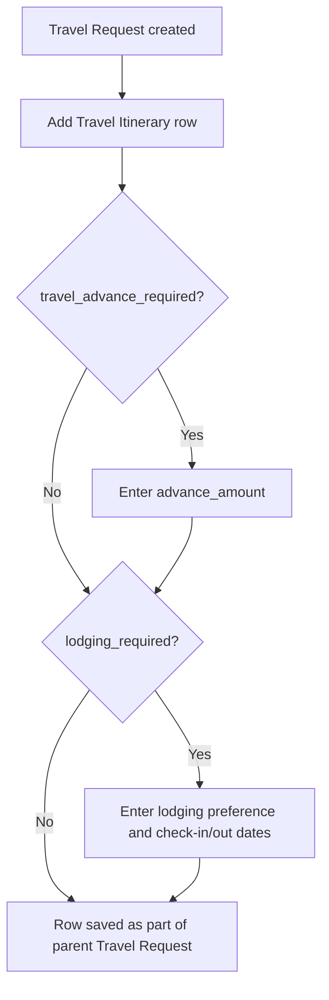

# Travel Itinerary

A child table row on a Travel Request that records one leg of a trip — where the employee travels from and to, how, when, and what accommodation and meal needs apply — so the full trip schedule can be planned and referenced alongside the travel and funding approval.

## Key Fields

| Field | Type | Purpose |
|---|---|---|
| `travel_from` / `travel_to` | Data | Origin/destination of this travel leg. |
| `mode_of_travel` | Select (Flight/Train/Taxi/Rented Car) | How this leg is traveled. |
| `meal_preference` | Select | Dietary preference for the leg (Vegetarian/Non-Vegetarian/Gluten Free/Non Diary). |
| `travel_advance_required` | Check | Flags whether a cash advance is needed for this leg. |
| `advance_amount` | Data | Amount requested when `travel_advance_required` is checked. |
| `departure_date` / `arrival_date` | Datetime | Scheduling for the leg. |
| `lodging_required` | Check | Flags whether accommodation is needed. |
| `preferred_area_for_lodging`, `check_in_date`, `check_out_date` | Data/Date | Lodging preferences shown only when `lodging_required` is set. |
| `other_details` | Small Text | Free-text notes for the leg. |

## Relationships

- [[Travel Request]] — parent; a Travel Request has one or more Travel Itinerary rows (`itinerary` table field).

## Logic — What Happens and Why

Pure data child table: the `.py` file contains only the auto-generated type stubs and `pass` — no `validate`, `before_save`, or other lifecycle hooks. All conditional field display (`advance_amount`, lodging fields) is handled client-side via `depends_on`, not server-side validation. No cross-doctype side effects fire from this doctype; it exists purely to structure trip-leg data under its parent Travel Request.

Not enforced in code: no check that `departure_date` precedes `arrival_date`, no check that `advance_amount` is numeric/non-negative (it is a Data field, not Currency), and no validation that `check_in_date`/`check_out_date` are consistent with the travel dates.

## Roles & Permissions

| Role | Can Do | Notes |
|---|---|---|
| — | — | Child table (`istable: 1`) with an empty `permissions` array; access is governed entirely by the parent [[Travel Request]]'s permissions. |

## Mermaid: State/Flow

