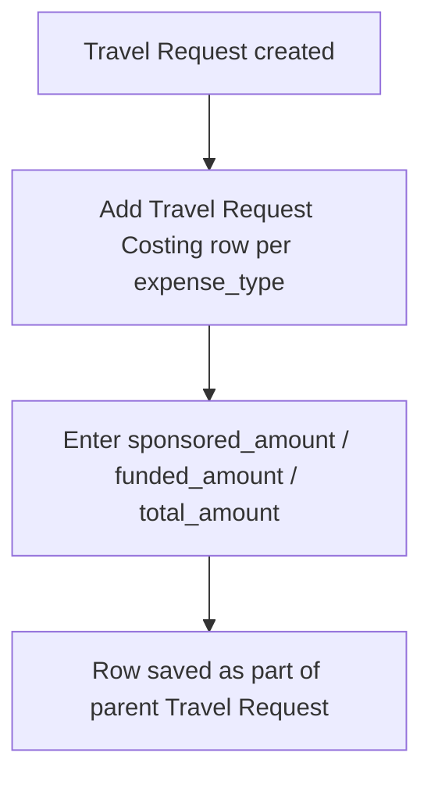

# Travel Request Costing

A child table row on a Travel Request that itemizes the estimated cost of one expense category for the trip — how much is sponsored versus company-funded — so the total funding requirement for the travel can be assessed against the chosen `travel_funding` option.

## Key Fields

| Field | Type | Purpose |
|---|---|---|
| `expense_type` | Link → Expense Claim Type | Category of the cost (e.g., airfare, lodging), reusing the existing Expense Claim Type master. |
| `sponsored_amount` | Currency (non-negative) | Portion of this cost covered by a sponsor. |
| `funded_amount` | Currency (non-negative) | Portion the company is expected to fund. |
| `total_amount` | Currency (non-negative) | Total estimated cost for this expense line. |
| `comments` | Small Text | Free-text notes on the costing line. |

## Relationships

- [[Travel Request]] — parent; a Travel Request has one or more Travel Request Costing rows (`costings` table field), and the parent's `cost_center` applies at the header level.
- Links to [[Expense Claim Type]] via `expense_type`.

## Logic — What Happens and Why

Pure data child table: the `.py` file contains only auto-generated type stubs and `pass` — no `validate` or other lifecycle hooks. `sponsored_amount`, `funded_amount`, and `total_amount` are plain Currency fields with `non_negative: 1` (a field-level constraint enforced by the framework, preventing negative entries), but there is no server-side logic reconciling `sponsored_amount + funded_amount` against `total_amount`, and no roll-up of these child rows into a computed total on the parent Travel Request.

Not enforced in code: no arithmetic validation that `sponsored_amount + funded_amount = total_amount`, and no cross-check against the parent's `travel_funding` selection (e.g., a "Fully Sponsored" request is not required to have `funded_amount = 0`).

## Roles & Permissions

| Role | Can Do | Notes |
|---|---|---|
| — | — | Child table (`istable: 1`) with an empty `permissions` array; access is governed entirely by the parent [[Travel Request]]'s permissions. |

## Mermaid: State/Flow

