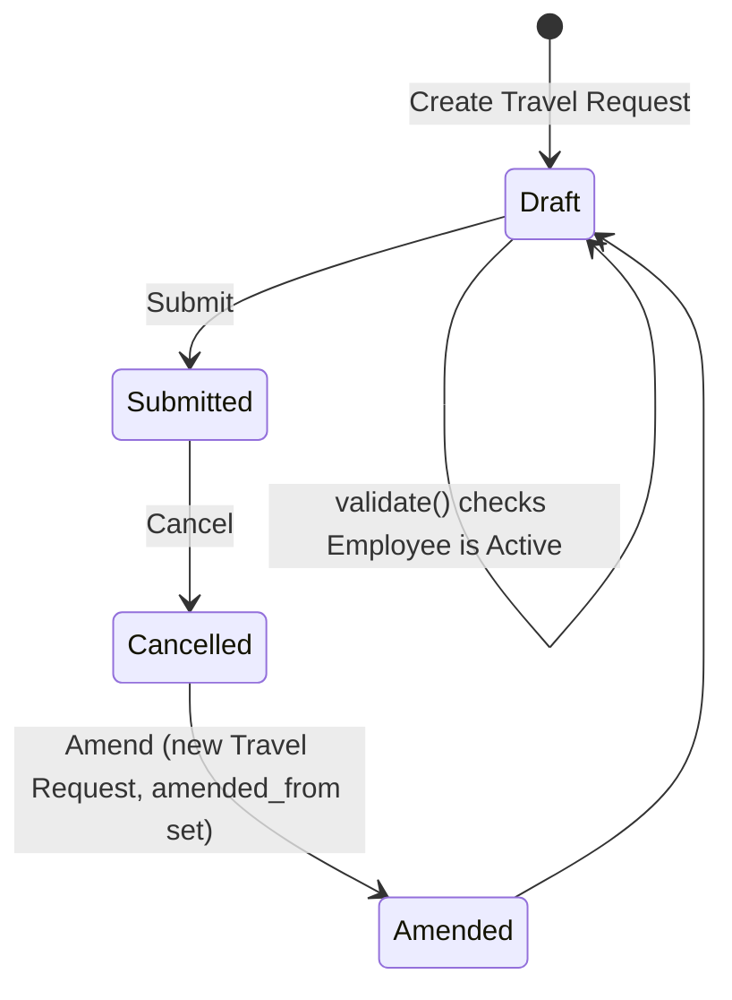

# Travel Request

A submittable record capturing an employee's request to travel for work — domestic or international — including the purpose, funding arrangement, personal identification details needed for travel, a day-by-day itinerary, and an estimated cost breakdown, used to formally request and document business travel before it happens.

## Key Fields

| Field | Type | Purpose |
|---|---|---|
| `travel_type` | Select (Domestic/International) | Classifies the trip; required. |
| `travel_funding` | Select | Whether the company must fully fund, the trip is fully sponsored, or partially sponsored/needs partial funding. |
| `travel_proof` | Attach | Supporting document (invitation/announcement) for the trip. |
| `purpose_of_travel` | Link → Purpose of Travel | Required; reason for the trip, drawn from a controlled list. |
| `details_of_sponsor` | Data | Sponsor name/location when travel is sponsored. |
| `employee` | Link → Employee | Required; the traveling employee. |
| `employee_name`, `cell_number`, `prefered_email`, `date_of_birth`, `passport_number`, `company` | Data/Date/Link (fetched) | Auto-fetched from the linked Employee for reference on the request and any print output. |
| `personal_id_type` | Link → Identification Document Type | Type of ID used for travel. |
| `personal_id_number` | Data | ID number matching `personal_id_type`. |
| `itinerary` | Table → Travel Itinerary | Child table listing each travel leg/stay. |
| `cost_center` | Link → Cost Center | Accounting dimension for the trip's costs. |
| `costings` | Table → Travel Request Costing | Child table breaking down estimated cost by expense type. |
| `name_of_organizer`, `address_of_organizer` | Data | Event/organizer details when travel is tied to an event. |
| `amended_from` | Link → Travel Request | Standard cancel-and-amend trail. |

## Relationships

- [[Employee]] — linked from `employee`; the request cannot be created/validated against an Inactive employee.
- [[Purpose of Travel]] — linked from `purpose_of_travel` (required master).
- [[Travel Itinerary]] — child table (`itinerary`); one Travel Request has many itinerary rows, one per travel leg/stay.
- [[Travel Request Costing]] — child table (`costings`); one Travel Request has many costing rows, one per expense type.

## Logic — What Happens and Why

**Create/Draft.** Standard form entry; employee-derived fields (`employee_name`, `cell_number`, `prefered_email`, `date_of_birth`, `passport_number`, `company`) are fetched automatically from the Employee master so the requester doesn't re-key personal/contact details.

**Validate (`validate`).** The only server-side logic is `validate_active_employee(self.employee)` (from `hrms.hr.utils`), called on every save. It checks the linked Employee's `status`; if the employee's status is `Inactive`, it throws `InactiveEmployeeStatusError` and blocks the save. Business reason: prevents travel (and implicitly its cost/funding commitments) from being requested or recorded against an employee who is no longer active in the company.

**Submit.** No custom `on_submit` logic exists in the `.py` file — submission relies purely on the standard Frappe submit workflow (`is_submittable: 1`) with no additional side effects fired on other doctypes (e.g., no automatic Expense Claim or Employee Advance creation is coded here).

**Cancel/Amend.** No custom `on_cancel` logic; cancellation follows the standard Frappe pattern, and `amended_from` supports the standard cancel → amend → resubmit trail.

**Cross-doctype note.** `hrms/overrides/dashboard_overrides.py` groups "Travel Request" together with [[Expense Claim]] and "Employee Advance" under an "Expense" dashboard link group — this is a UI/reporting grouping only, not a triggered business process.

Not enforced in code: there is no validation tying `costings` totals to `cost_center` budgets, no check that itinerary dates are sequential, and no linkage that automatically creates an Expense Claim or Employee Advance from this document.

## Roles & Permissions

| Role | Can Do | Notes |
|---|---|---|
| [[System Manager]] | Read, Write, Create, Delete, Submit/Cancel (via submittable doctype), Email, Print, Export, Report, Share | Only role defined in the doctype's own permissions; no HR-specific role (e.g., HR Manager/Employee) is granted access at the doctype level in this JSON — broader access, if any, would come from role permission managers or standard Employee self-service rules outside this file.

## Mermaid: State/Flow

