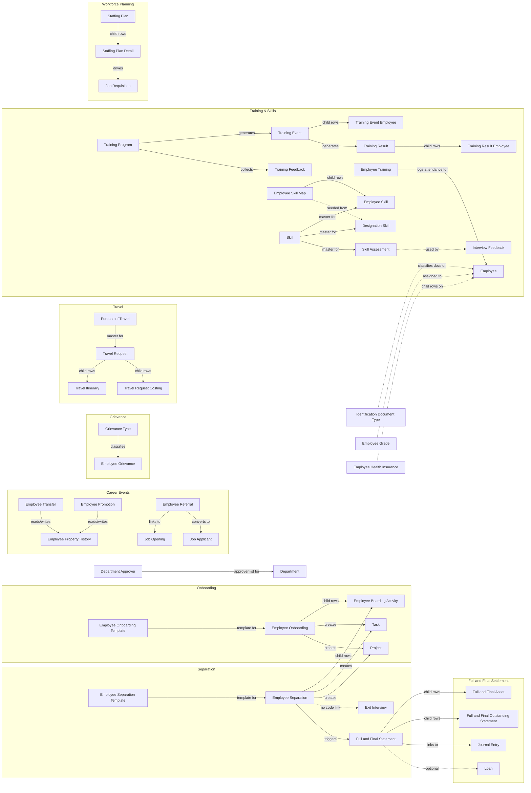

# HR Core

This module covers the employee lifecycle beyond hiring: onboarding into the
organization, ongoing career events (transfer, promotion, referral, skills,
training), workplace processes (travel, grievances), workforce planning
(staffing plans, job requisitions), and separation/exit settlement (full and
final settlement, exit interview). It sits alongside — and links heavily
into — Employee, Department, Designation and Company (owned by other modules)
without owning those masters itself.

All doctypes here live under `hrms/hr/doctype/` in the source repo, module
`HR` in Frappe's doctype metadata (the "HR Core" name is this vault's own
grouping, not a Frappe module).

## Doctype Map

## Why This Module Exists

The employee record itself (owned elsewhere) only captures current-state
data. HR Core exists to capture *transitions* and *events* around that
record, each with its own approval trail, side effects, and audit history:

- **Onboarding/Separation share one controller** (`employee_boarding_controller.py`)
  because both are fundamentally the same shape of problem: a checklist of
  activities, each optionally spawning a Task under a generated Project, that
  must all complete before the employee's status (Active / Relieved) can
  change. Templates (Employee Onboarding Template / Employee Separation
  Template) exist so HR doesn't rebuild that checklist per hire/exit.
- **Full and Final Statement depends on Employee Separation existing first**
  (conceptually — settlement only makes sense once an employee is confirmed
  leaving), and pulls in Payroll (encashment, arrears) and Assets (recovery)
  data that must be reconciled before relieving is complete — hence its own
  child tables for assets and outstanding dues rather than reusing Expense
  Claim or Asset directly.
- **Employee Transfer and Employee Promotion both write to Employee Property
  History** rather than mutating Employee fields directly, so that every
  department/designation/grade/salary change over an employee's tenure stays
  auditable instead of being silently overwritten.
- **Staffing Plan must exist before Job Requisition** in the intended
  workflow: the plan sets headcount/budget ceilings per
  designation/department, and requisitions draw down against those numbers —
  without the plan, requisitions have no ceiling to validate against.
- **Skill data (Skill, Designation Skill, Expected Skill Set, Employee Skill
  Map) is kept as its own small masterset** so the same skill vocabulary can
  be reused across Employee Skill Map (self-declared), Skill Assessment
  (evaluated), and Interview Feedback (candidate-side, owned by
  Recruitment) — one taxonomy, multiple consumers.
- **Grievance Type is separated from Employee Grievance** so HR can classify
  and report on grievance categories without that taxonomy living inside the
  transactional grievance record itself.
- **Travel Request's costing and itinerary are child tables, not links to
  Expense Claim**, because a travel plan is approved *before* actual spend
  happens — Expense Claim (owned elsewhere) is the downstream artifact once
  the trip is complete, not something Travel Request enforces automatically
  in code.

## Related Flows

- [[Hire to Retire Overview]] — the end-to-end employee lifecycle this module's doctypes plug into.
- [[Recruitment to Onboarding]] — the handoff from Job Applicant/Job Offer into [[Employee Onboarding]].
- [[Employee Exit Lifecycle]] — the offboarding flow spanning [[Employee Separation]], [[Exit Interview]], and [[Full and Final Statement]].

## Doctypes in This Module

- [[Employee Onboarding]] — checklist-driven process for bringing a new hire to Active status.
- [[Employee Onboarding Template]] — reusable activity checklist for onboarding.
- [[Employee Boarding Activity]] — child table of activities shared by onboarding and separation.
- [[Employee Separation]] — checklist-driven process for relieving an employee.
- [[Employee Separation Template]] — reusable activity checklist for separation.
- [[Exit Interview]] — standalone feedback capture at offboarding, not code-linked to Employee Separation.
- [[Full and Final Statement]] — final dues/recovery reconciliation at exit.
- [[Full and Final Asset]] — child table of company assets to recover at exit.
- [[Full and Final Outstanding Statement]] — child table of payable/receivable line items at exit.
- [[Employee Transfer]] — records a department/designation/grade change, logging it to property history.
- [[Employee Promotion]] — records a promotion (designation/grade/salary change), logging it to property history.
- [[Employee Property History]] — audit trail of an employee's designation/department/grade/salary changes over time.
- [[Employee Referral]] — employee-submitted candidate referral, linkable to a Job Opening/Applicant.
- [[Employee Grievance]] — a filed workplace grievance and its resolution.
- [[Grievance Type]] — classification master for grievances.
- [[Travel Request]] — a requested business trip.
- [[Travel Itinerary]] — child table of individual legs of a trip.
- [[Travel Request Costing]] — child table of estimated costs for a trip.
- [[Purpose of Travel]] — master list of trip purposes.
- [[Training Program]] — a defined training curriculum.
- [[Training Event]] — a scheduled instance/session of a training program.
- [[Training Event Employee]] — child table of attendees for a training event.
- [[Training Result]] — outcome record for a completed training event.
- [[Training Result Employee]] — child table of per-employee pass/fail results.
- [[Training Feedback]] — feedback collected from attendees about a training program.
- [[Employee Training]] — child table logging an employee's training attendance history.
- [[Employee Skill Map]] — an employee's self-declared/seeded skill set.
- [[Employee Skill]] — child table of individual skills within a skill map.
- [[Skill]] — master list of skills.
- [[Skill Assessment]] — child table recording an evaluated proficiency for a skill.
- [[Designation Skill]] — child table mapping expected skills to a Designation.
- [[Expected Skill Set]] — child table of skills expected for a role/context.
- [[Staffing Plan]] — headcount/budget plan for a department over a period.
- [[Staffing Plan Detail]] — child table of per-designation vacancy targets within a staffing plan.
- [[Job Requisition]] — a request to hire against a staffing plan's approved vacancies.
- [[Employee Grade]] — master grade assignable to employees, tied to leave/expense entitlements.
- [[Employee Health Insurance]] — child table of an employee's insurance policy details.
- [[Identification Document Type]] — master list of ID document types employees can register.
- [[Department Approver]] — child table of approvers configured per Department.
