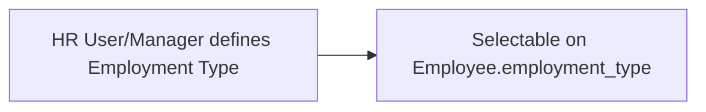

# Employment Type

A simple master doctype naming the categories of employment a company recognizes (e.g. Full-time, Part-time, Contract, Intern). Exists so [[Employee]] records classify their engagement type from a controlled list rather than free text, enabling consistent reporting and policy application (e.g. benefits eligibility often varies by employment type).

## Key Fields

| Field | Type | Purpose |
|---|---|---|
| `employee_type_name` | Data, unique, required | The type label; also the document's name (`autoname: field:employee_type_name`). |

## Relationships

- [[Employee]] — linked from; Employee's `employment_type` field (not shown in this file since Employee belongs to another module) links here.

## Logic — What Happens and Why

No `validate()` or lifecycle hooks (`pass`-only controller). Purely a lookup master; uniqueness is enforced at the field level (`unique: 1`) so the same type name can't be entered twice.

## Roles & Permissions

| Role | Can Do | Notes |
|---|---|---|
| HR User | create/read/write/delete | |
| HR Manager | create/read/write/delete + export/import | Additionally has bulk export/import rights, useful for setting up many types at once during initial configuration. |

## Mermaid: State/Flow

