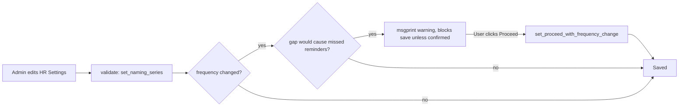

# HR Settings

A single (`issingle: 1`) global configuration document controlling company-wide HR behavior: employee auto-naming, approval-workflow guardrails (self-approval prevention, mandatory approvers), leave/attendance/shift toggles, reminder scheduling, and recruitment notification templates. Exists as the one place administrators tune cross-cutting HR policy without touching code.

## Key Fields

| Field | Type | Purpose |
|---|---|---|
| `emp_created_by` | Select (Naming Series/Employee Number/Full Name) | Controls how new Employee records are named; applied via `set_by_naming_series`. |
| `standard_working_hours` / `retirement_age` | Float/Data | Baseline values used elsewhere in payroll/attendance calculations. |
| `leave_approver_mandatory_in_leave_application` | Check | Whether a Leave Application requires an approver to be set. |
| `prevent_self_leave_approval` | Check | Blocks an employee from approving their own Leave Application even if they hold the permission. |
| `expense_approver_mandatory_in_expense_claim` | Check | Same pattern for Expense Claim. |
| `prevent_self_expense_approval` | Check | Read directly by [[Expense Claim]]`.validate_for_self_approval()` to block self-approval unless a Workflow exists. |
| `restrict_backdated_leave_application` / `role_allowed_to_create_backdated_leave_application` | Check/Link | Gate + exception role for backdated leave entry. |
| `send_holiday_reminders` / `send_birthday_reminders` / `send_work_anniversary_reminders` / `frequency` | Check/Select | Scheduled reminder toggles and cadence (Weekly/Monthly), consumed by `hrms.controllers.employee_reminders` scheduled jobs. |
| `allow_multiple_shift_assignments` | Check | Shift Assignment overlap rule toggle. |
| `allow_employee_checkin_from_mobile_app` / `allow_geolocation_tracking` | Check | Mobile checkin/geofencing toggles. |
| `unlink_payment_on_cancellation_of_employee_advance` | Check | Controls Employee Advance cancellation behavior. |
| `check_vacancies` | Check | Whether Job Offer creation checks open vacancies. |
| `sender` / `hiring_sender` (+ their `*_email`) | Link (Email Account) | Distinct sender identities for general HR vs. hiring/recruitment notifications. |
| `exit_questionnaire_web_form` / `exit_questionnaire_notification_template` | Link | Employee Separation exit-survey configuration. |

## Relationships

- [[Employee]] — `emp_created_by` drives Employee's naming series behavior.
- [[Expense Claim]] — `prevent_self_expense_approval`, `expense_approver_mandatory_in_expense_claim` read directly in its controller.
- [[Leave Application]] (HR-Core/Leaves) — `prevent_self_leave_approval`, `leave_approver_mandatory_in_leave_application`, `restrict_backdated_leave_application`, `send_leave_notification` and its templates.
- Shift Assignment / Employee Checkin — `allow_multiple_shift_assignments`, `allow_employee_checkin_from_mobile_app`, `allow_geolocation_tracking`.
- Employee Advance — `unlink_payment_on_cancellation_of_employee_advance`.
- Job Offer — `check_vacancies`.
- [[Employee Separation]] — `exit_questionnaire_web_form`, `exit_questionnaire_notification_template`.
- Scheduled Job Type — `validate_frequency_change()` looks up the weekly/monthly reminder scheduled jobs by method name to warn about a gap in reminder coverage when frequency changes.

## Logic — What Happens and Why

**`validate()`** runs on every save of this single document:
1. `set_naming_series()` — calls ERPNext's `set_by_naming_series("Employee", "employee_number", ...)`, switching Employee's naming behavior between an auto naming series and manual/full-name-based naming depending on `emp_created_by`. This exists so the naming strategy is a live-editable setting rather than a one-time DocType configuration.
2. `validate_frequency_change()` — guarded by a module-level flag `PROCEED_WITH_FREQUENCY_CHANGE` (reset every call unless a whitelisted confirmation bypass was invoked first). If the holiday-reminder `frequency` is changing (Monthly→Weekly or Weekly→Monthly), it compares the next scheduled execution times of the weekly vs. monthly `Scheduled Job Type` records. If switching would cause employees to miss reminders in the gap between the old and new schedule's next run, `show_freq_change_warning()` raises a confirmable `frappe.msgprint` (a `ValidationError` unless running in test/patch/install/migrate context) asking the user to explicitly proceed — this is a UX safeguard against silently skipping a batch of reminders.
3. `set_proceed_with_frequency_change()` (whitelisted) — sets the module flag so the client's "Yes, Proceed" action can re-save without re-triggering the same warning.

**Why this design:** as a Single doctype, HR Settings has exactly one row in the database and is read via `frappe.db.get_single_value(...)` throughout the codebase (e.g. Expense Claim's self-approval check) rather than being linked to by name — it functions as a lightweight global config/feature-flag store rather than a transactional record.

## Roles & Permissions

| Role | Can Do | Notes |
|---|---|---|
| System Manager | create/write/read | Full admin control. |
| HR Manager | write/read | Can change policy. |
| HR User | read only (no write) | Can view but not change settings — read-only, unlike other HR-Setup masters where HR User has write access. |
| Employee | read only | Can see settings that affect them (e.g. whether leave notifications are sent) but not modify. |

## Mermaid: State/Flow

