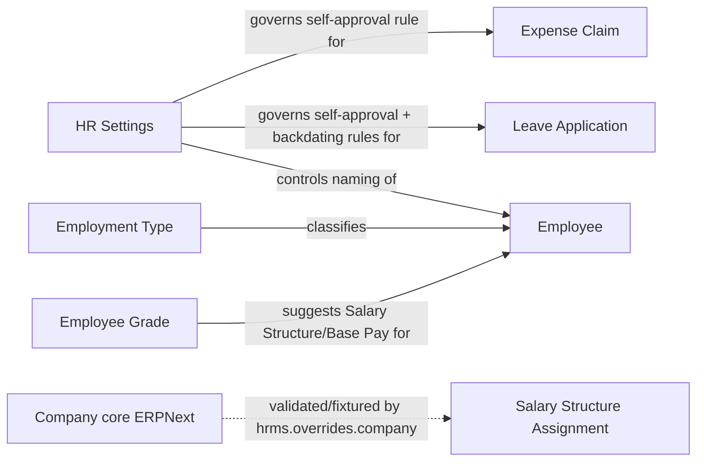

# HR Setup

Covers the foundational configuration doctypes that other HR/Payroll transactions depend on: global HR policy toggles ([[HR Settings]]) and two employee classification masters ([[Employment Type]], [[Employee Grade]]). This is deliberately small — most "setup" in Frappe HRMS is either core ERPNext (Company, Branch, Department) or lives inside the specific module it configures (e.g. Leave Type inside Leaves, Salary Component inside Payroll).

`hrms/hr_setup/` in the source tree holds only workspace/sidebar UI configuration (`hrms/hr_setup/workspace/hr_setup/hr_setup.json`, `hrms/hr_setup/sidebar/hr_setup/hr_setup.json`) — dashboard widgets like "Department Wise Employee Count" and headcount number cards. It defines no doctypes of its own; the doctypes documented here physically live under `hrms/hr/doctype/`.

**Branch** is not present as a doctype in this app — it is a core ERPNext doctype (from the `erpnext` app) and is out of scope for this vault.

**Company** is likewise core ERPNext, not an HRMS doctype, so it has no dedicated file here. HRMS attaches behavior to it via `hrms/hooks.py` `doc_events["Company"]` and `hrms/overrides/company.py`:
- `validate_default_accounts` — on validate, checks that `default_payroll_payable_account` belongs to the company and matches its default currency.
- `make_company_fixtures` — on update, when the company's country changes, runs country-specific regional setup (`hrms.regional.<country>.setup.setup`) and seeds default Salary Components for that country.
- `set_default_hr_accounts` — on update, auto-fills `default_payroll_payable_account` and `default_employee_advance_account` by looking up matching-named accounts in the company's chart of accounts if not already set.
- `handle_linked_docs` — on trash (company deletion), deletes records in doctypes listed under the `company_data_to_be_ignored` hook (e.g. [[Salary Structure]], [[Salary Structure Assignment]], [[Payroll Period]], [[Income Tax Slab]], [[Leave Period]], [[Leave Policy Assignment]]) that reference the deleted company, and clears the `company` field on any Single doctype in the HR/Payroll modules that pointed at it — this prevents orphaned company references from breaking those settings pages.

**Terms and Conditions** specific to HR is not present as a distinct doctype in this app (ERPNext's generic "Terms and Conditions" doctype exists at the framework/ERPNext level but is not an HRMS-module doctype and is out of scope here).

## Doctype Map

## Why This Module Exists

HR policy has organization-wide rules that shouldn't be hardcoded (e.g. "can a manager approve their own expense claim?", "how are employee IDs generated?") — [[HR Settings]] centralizes these as a Single document so they're editable without code changes and are consistently enforced by referencing controllers (Expense Claim, Leave Application) via `frappe.db.get_single_value`. [[Employment Type]] and [[Employee Grade]] exist as lightweight classification masters because Employee records need a controlled vocabulary for engagement category and pay banding — without them, every employee record would need engagement type and compensation defaults entered ad hoc, with no consistency for reporting or bulk policy changes.

## Doctypes in This Module

- [[HR Settings]] — single global configuration document for HR-wide policy toggles (naming, approval rules, reminders, shift/attendance, hiring notifications).
- [[Employment Type]] — master list of employment categories (e.g. Full-time, Contract) assignable to an Employee.
- [[Employee Grade]] — master pay-grade record carrying a default Salary Structure and base pay.

Not covered here: **Branch** (core ERPNext, not part of this app), **Company** (core ERPNext; HRMS-specific hooks summarized above), **HR-specific Terms and Conditions** (not present as a distinct doctype in this app).
