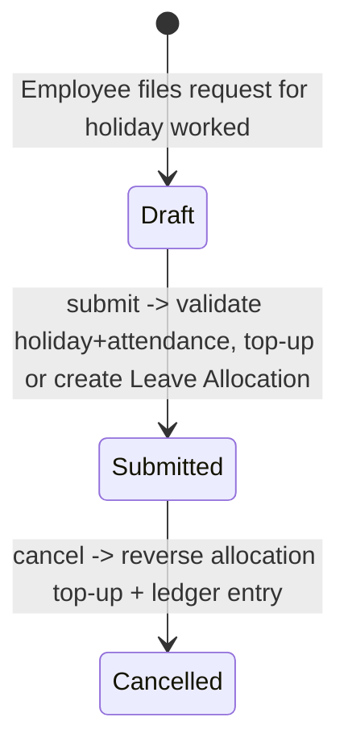

# Compensatory Leave Request

An employee-submitted, submittable request claiming extra leave in exchange for having worked on a holiday. It exists because compensatory ("comp-off") leave cannot be pre-allocated like ordinary leave — it must be earned by verified attendance on a holiday, so this doctype both proves the work happened and drives the resulting allocation.

## Key Fields

| Field | Type | Purpose |
|---|---|---|
| employee | Link (Employee) | Requester |
| leave_type | Link ([[Leave Type]]) | Must be a type flagged `is_compensatory` |
| leave_allocation | Link ([[Leave Allocation]]) | The allocation this request created or updated (set on submit) |
| work_from_date / work_end_date | Date | The holiday date range actually worked |
| half_day / half_day_date | Check/Date | Partial-day comp-off |
| reason | Small Text | Justification |

## Relationships

- [[Leave Type]] — links to; must be the employee's compensatory leave type.
- [[Leave Allocation]] — triggers creation of, or updates an existing one, on submit; reverses the same on cancel.
- [[Leave Ledger Entry]] — an additional ledger entry is posted directly (via `create_additional_leave_ledger_entry`) for the granted/reversed days, on top of whatever [[Leave Allocation]]'s own submit/cancel posts.
- [[Leave Period]] — the allocation is created within whichever leave period covers the day after the work range (`comp_leave_valid_from`); throws if none exists.
- Attendance (Employee module, not covered here) — validated against directly.
- Holiday List (via `get_holiday_dates_for_employee`, sourced outside this module) — the claimed work dates must actually be holidays.

## Logic — What Happens and Why

**validate()**:
- `validate_active_employee`, `validate_dates`, `validate_overlap` (shared helpers): standard employee-status/date-range/no-duplicate-request checks.
- Half-day: if set, `half_day_date` is required and must fall within the work range.
- `validate_holidays()`: every day in the work range must be a holiday on the employee's holiday list — you can only claim comp-off for days that were actually holidays, not for regular working days.
- `validate_attendance()`: the employee must have Present/WFH/Half-Day attendance marked (submitted) for every day in the range — comp-off is only granted for holidays actually worked, verified against Attendance records; a half-day attendance day requires the request itself to also be marked half-day for that date, otherwise it's rejected as inconsistent.
- `leave_type` is mandatory.

**on_submit()**:
- Computes `date_difference` (days worked, minus 0.5 if half day).
- Finds the active [[Leave Period]] covering the day after the work range ends (`comp_leave_valid_from`) — the earned comp-off becomes usable starting the day after the work was done, and if no such active period exists the submission is blocked with a message pointing HR to create one.
- If an allocation already exists for this employee/leave_type covering that date, it's topped up: `new_leaves_allocated` and `total_leaves_allocated` both increase by `date_difference` via direct `db_set` (bypassing normal Leave Allocation validate flow since it's already submitted), and a matching ledger entry is posted via `create_additional_leave_ledger_entry`.
- Otherwise a brand-new [[Leave Allocation]] is created and submitted for exactly this claim, spanning from the day after the work range to the leave period's end date, with `carry_forward` set per the leave type's own `is_carry_forward` flag.
- The resulting allocation is recorded back on this doc (`leave_allocation`).

**on_cancel()**: symmetric reversal — decrements the linked allocation's `new_leaves_allocated`/`total_leaves_allocated` by the same amount (floored at 0), and posts a negative-leaves ledger entry to undo the grant.

## Roles & Permissions

| Role | Can Do | Notes |
|---|---|---|
| [[System Manager]] | read/write/create/delete | No submit right listed |
| [[HR Manager]] | read/write/create/delete/submit/cancel | Full |
| [[HR User]] | read/write/create/delete/submit | No cancel |
| [[Employee]] | read/write/create/delete | Can self-submit request (create), no submit/cancel right — approval effectively happens via someone with submit rights |

## Mermaid: State/Flow

