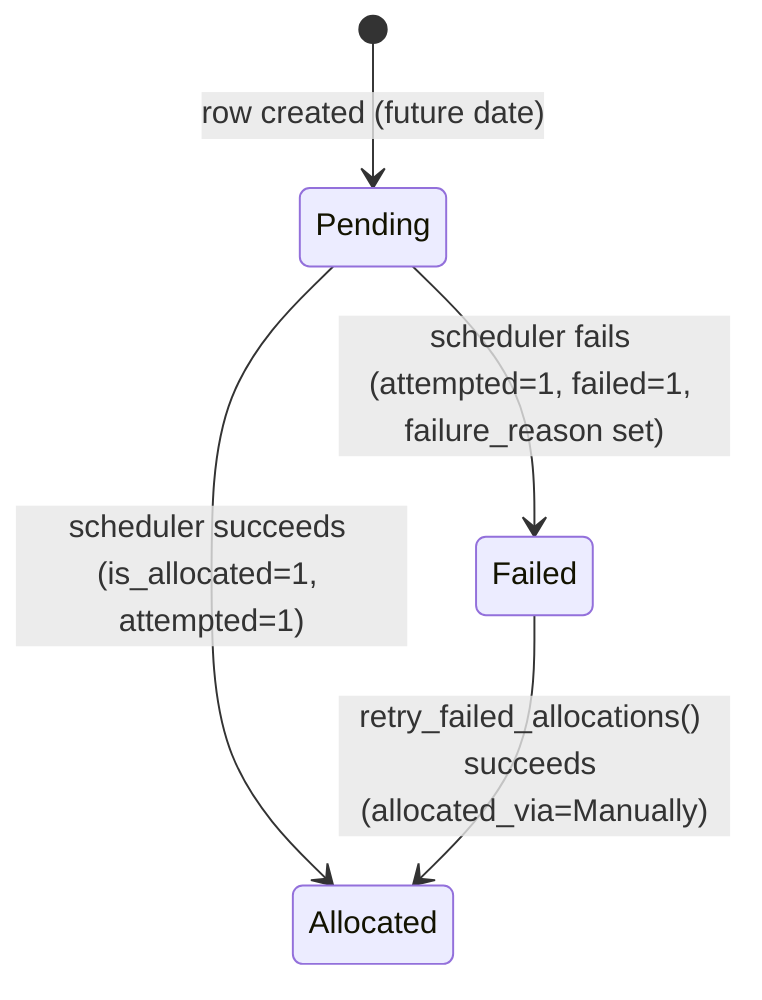

# Earned Leave Schedule

A child-table row on [[Leave Allocation]] that records one future or past accrual event for an earned-leave allocation: a date, a number of leaves, and whether that accrual attempt succeeded, failed, or hasn't happened yet. It exists so earned-leave accrual is auditable and retryable — instead of the scheduler silently adding to a running total, each periodic accrual is a traceable row with its own status.

## Key Fields

| Field | Type | Purpose |
|---|---|---|
| allocation_date | Date | The date this accrual is/was due |
| number_of_leaves | Float | Leaves accrued on this date |
| is_allocated | Check | Whether this row's leaves have actually been added to the allocation |
| attempted | Check | Whether the scheduler has tried to process this row |
| failed | Check | Whether the attempt failed |
| failure_reason | Small Text | Error detail when failed |
| allocated_via | Select | Scheduler / Leave Policy Assignment / Manually — how the accrual was applied |

## Relationships

- [[Leave Allocation]] — parent; stored in `earned_leave_schedule` table field.
- [[Leave Policy Assignment]] — builds this schedule at allocation-creation time (`get_earned_leave_schedule()`), populating past dates as already-allocated and future dates as pending.
- [[Leave Type]] — indirectly; `earned_leave_frequency`, `allocate_on_day`, and `rounding` on the leave type drive how schedule dates and amounts are computed.

## Logic — What Happens and Why

Pure data holder (`pass`-only Document). Its rows are:
1. **Written** by [[Leave Policy Assignment]].`get_earned_leave_schedule()` when the allocation is first created — one row per accrual period through `effective_to`, with rows for periods already elapsed pre-marked `is_allocated=1, attempted=1, allocated_via="Leave Policy Assignment"`.
2. **Consumed** by the `daily_long` scheduled job `hrms.hr.utils.allocate_earned_leaves`, which finds allocations with due, not-yet-allocated schedule rows, adds the leaves to the parent Leave Allocation's `total_leaves_allocated`, and updates the row's `is_allocated`/`attempted`/`allocated_via="Scheduler"` flags — or sets `failed=1` with a `failure_reason` if the addition can't be applied (e.g. would exceed `max_leaves_allowed`).
3. **Retried** manually via `Leave Allocation.retry_failed_allocations()`, a whitelisted method that re-attempts specific failed rows, clearing `failed`/`failure_reason` and setting `allocated_via="Manually"` on success.

## Roles & Permissions

| Role | Can Do | Notes |
|---|---|---|
| — | — | No standalone permissions (`istable` doctype, `permissions: []`); access follows the parent [[Leave Allocation]]. |

## Mermaid: State/Flow

