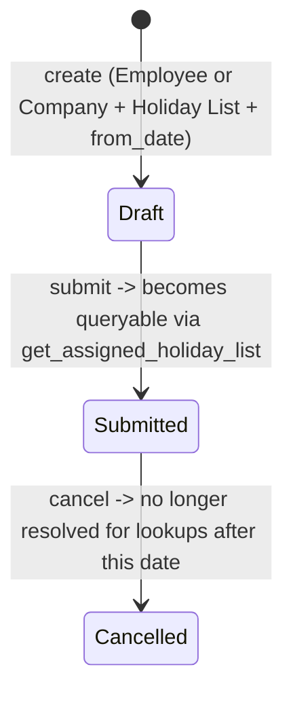

# Holiday List Assignment

A submittable, date-effective binding of an Employee or a Company to a specific Holiday List, replacing the older pattern of storing a single static `holiday_list` field directly on Employee/Company. It exists so an entity's applicable holiday calendar can change over time (e.g. an employee relocates to a region with a different holiday list mid-year) while every historical lookup ("what holidays applied to this employee on this date") remains accurate.

## Key Fields

| Field | Type | Purpose |
|---|---|---|
| applicable_for | Select | "Employee" or "Company" — what kind of entity this assignment targets |
| assigned_to | Dynamic Link (options = applicable_for) | The specific Employee or Company |
| holiday_list | Link (Holiday List) | The holiday list being assigned |
| from_date | Date | The date this assignment becomes effective |
| holiday_list_start / holiday_list_end | Date (virtual) | Read-only display of the referenced Holiday List's own date range |
| employee_company | Link (Company) | Fetched company context when applicable_for is Employee |

## Relationships

- Holiday List (external — see [[_Overview]]) — links to; the assignment's whole purpose is binding an entity to one of these.
- Employee / Company (Employee/company modules) — the `assigned_to` target.
- [[Leave Ledger Entry]] — indirectly; ledger entries carry a `holiday_list` field populated via the resolution this doctype drives.
- [[Leave Application]] — indirectly; holiday-exclusion logic (`get_holiday_dates_for_employee`, `update_attendance`) ultimately resolves through `get_holiday_list_for_employee`, which reads this doctype.
- [[Compensatory Leave Request]] — indirectly; `validate_holidays()` uses the same resolution to confirm claimed work days were holidays.

## Logic — What Happens and Why

**validate()**:
- `validate_assignment_start_date()`: `from_date` must fall within the referenced Holiday List's own `from_date`/`to_date` range — an assignment can't claim to start applying a holiday list before or after that list's own defined period.
- `validate_existing_assignment()`: rejects a duplicate submitted assignment for the same `(assigned_to, from_date)` pair, raising `DuplicateAssignment` — reused from the Salary Structure Assignment module's error class, signaling this doctype follows the same "one active assignment starting on a given date" pattern as salary structure assignments.

No `on_submit`/`on_cancel` side effects beyond the standard submittable lifecycle — the real work is downstream, in `hrms.utils.holiday_list`:
- `get_assigned_holiday_list(assigned_to, as_on)`: finds the latest submitted assignment for the entity with `from_date <= as_on`, i.e. "the holiday list effective on this date," letting later assignments supersede earlier ones without deleting history.
- `get_holiday_list_for_employee(employee, as_on)`: tries the employee's own assignment first, falling back to the employee's company's assignment if none exists — an explicit per-employee assignment always takes precedence over the company default.
- `build_effective_date_ranges_for_holiday_assignments()` / `fill_employee_holiday_list_date_gaps_with_company_holiday_list()`: batch-resolve effective holiday-list date ranges across many employees at once (used by payroll/attendance bulk processing), correctly clipping each assignment's effective range to just before the next assignment starts, and filling any uncovered gaps in an employee's assignment history with the company's holiday list.
- `invalidate_cache()`: registered in `hooks.py` against the Holiday List doctype's `on_update`/`on_trash` events (not this doctype's), clearing the payroll `HOLIDAYS_BETWEEN_DATES` cache whenever the underlying Holiday List content changes.

## Roles & Permissions

| Role | Can Do | Notes |
|---|---|---|
| [[System Manager]] | full incl. submit/cancel/select | Full |
| [[HR Manager]] | full incl. submit/cancel/select | Full |

## Mermaid: State/Flow

