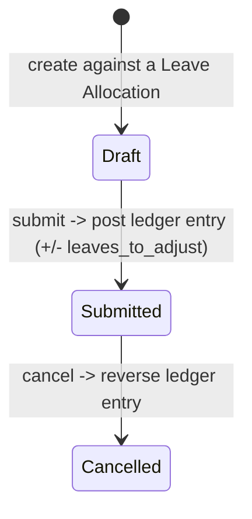

# Leave Adjustment

A submittable record of a manual correction to an existing Leave Allocation's balance — either allocating extra leaves or reducing (deducting) leaves — without editing the allocation itself. It exists to give HR an auditable, reversible way to hand-correct a balance (e.g. compensating for a data-entry error or a one-off grant) while leaving the original allocation's `total_leaves_allocated` field and history intact; the correction flows through the leave ledger instead.

## Key Fields

| Field | Type | Purpose |
|---|---|---|
| employee / leave_type | Link | Whose balance, which leave type |
| leave_allocation | Link ([[Leave Allocation]]) | The allocation being adjusted |
| adjustment_type | Select | "Allocate" (add) or "Reduce" (deduct) |
| leaves_to_adjust | Float | Magnitude of the adjustment (always non-negative; sign applied by type) |
| allocated_leaves | Float | Fetched current `total_leaves_allocated` from the allocation |
| leaves_after_adjustment | Float | Computed preview of the resulting balance |
| posting_date | Date | Effective date of the adjustment |
| from_date / to_date | Date | Fetched from the allocation's period |
| reason_for_adjustment | Small Text | Justification |

## Relationships

- [[Leave Allocation]] — links to; the adjustment reads its `total_leaves_allocated`/dates and posts a ledger entry against the same employee/leave_type/period without modifying the allocation record.
- [[Leave Type]] — read via `max_leaves_allowed` (over-allocation check) and `is_lwp` (ledger entry flag).
- [[Leave Ledger Entry]] — triggers creation of, on submit/cancel.
- [[Leave Application]] — indirectly; `get_leave_balance_on()` (from Leave Application's module) is used to validate a "Reduce" adjustment doesn't exceed current balance, and adjustment ledger rows are counted alongside allocation rows wherever leave balance is computed.

## Logic — What Happens and Why

**before_validate()**: rounds `leaves_to_adjust` to the system's float precision, avoiding floating-point drift in the ledger.

**before_save()**: computes `leaves_after_adjustment` as a live preview (`allocated_leaves + leaves_to_adjust` for Allocate, `- leaves_to_adjust` for Reduce).

**validate()**:
- `validate_duplicate_leave_adjustment()`: only one submitted adjustment is allowed per `(employee, leave_allocation)` pair — prevents accidentally stacking multiple manual corrections on the same allocation; amend the existing one instead.
- `validate_non_zero_adjustment()`: rejects a zero-value adjustment (meaningless).
- `validate_over_allocation()`: for "Allocate" only — the resulting total cannot exceed the leave type's `max_leaves_allowed`.
- `validate_leave_balance()`: for "Reduce" only — cannot reduce below the employee's current leave balance for that type (using the same `get_leave_balance_on()` used everywhere else), preventing the adjustment from creating a false negative balance where one isn't allowed.

**on_submit()** / **on_cancel()**: both call `create_leave_ledger_entry()`, which posts leaves as `+leaves_to_adjust` (Allocate) or `-leaves_to_adjust` (Reduce) against the allocation's period, tagged `is_lwp` per the leave type — cancellation reverses this via the standard ledger delete/reversal path in [[Leave Ledger Entry]].

Two whitelisted helper functions support the UI: `get_leave_allocation_for_posting_date()` finds the allocation covering a given employee/type/date, and `get_allocated_leave_types()` powers the leave-type search filtered to types the employee actually has an allocation for.

## Roles & Permissions

| Role | Can Do | Notes |
|---|---|---|
| [[HR User]] | read/write/create/delete/submit/cancel/amend | Full |
| [[HR Manager]] | read/write/create/delete/submit/cancel/amend | Full |

## Mermaid: State/Flow

