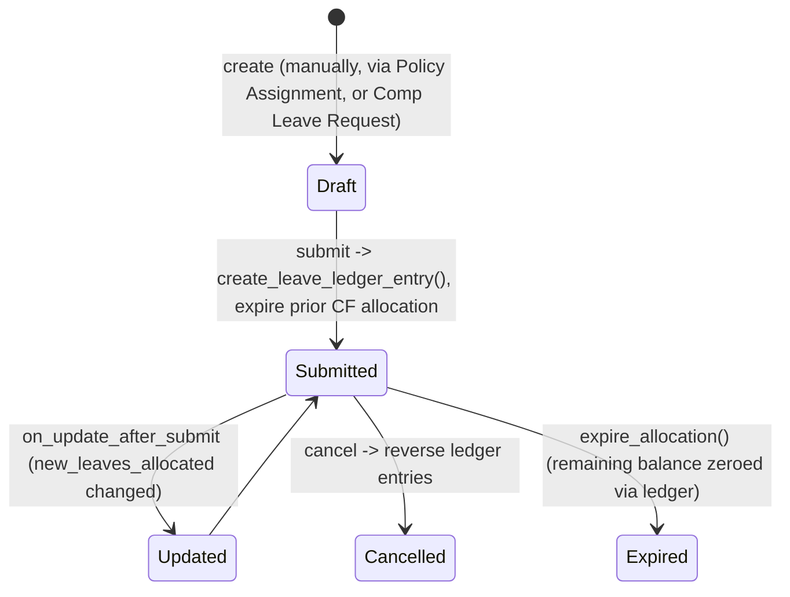

# Leave Allocation

The submittable record of how many days of a given leave type an employee has been granted for a date range — the actual "leave bank balance" every Leave Application draws against. It exists because entitlement (how many leaves) must be tracked, versioned, and audited separately from consumption (Leave Application) and from the policy that generated it (Leave Policy Assignment).

## Key Fields

| Field | Type | Purpose |
|---|---|---|
| employee / leave_type | Link | Who and which leave category |
| from_date / to_date | Date | Allocation period |
| new_leaves_allocated | Float | Fresh leaves granted this period (editable even after submit) |
| carry_forward | Check | Pull unused leaves from the prior allocation into `unused_leaves` |
| unused_leaves | Float | Carried-forward balance computed from the previous allocation |
| total_leaves_allocated | Float | `unused_leaves + new_leaves_allocated`, clipped to `max_leaves_allowed` |
| total_leaves_encashed | Float | Running total encashed against this allocation |
| carry_forwarded_leaves_count | Float | What this allocation passed forward to the *next* one |
| compensatory_request | Link | Source [[Compensatory Leave Request]], if created that way |
| leave_period / leave_policy / leave_policy_assignment | Link | Provenance when generated via policy |
| earned_leave_schedule | Table ([[Earned Leave Schedule]]) | Future/past accrual schedule for earned-leave types |
| expired | Check | Set once the allocation's leaves have been expired via the ledger |

## Relationships

- [[Leave Type]] — links to; drives nearly every validation rule (LWP, carry-forward, max allowed, earned/compensatory).
- [[Leave Period]] — links to, when created within a period.
- [[Leave Policy]] / [[Leave Policy Assignment]] — parent/trigger; assignment submission creates this record.
- [[Compensatory Leave Request]] — parent/trigger for comp-off allocations; also updates this record's `new_leaves_allocated` directly on submit/cancel of new comp-off requests within the same period.
- [[Earned Leave Schedule]] — child table.
- [[Leave Ledger Entry]] — triggers creation of; every allocation change posts one or more ledger entries.
- [[Leave Application]] — linked from; applications validate their dates/balance against the matching allocation and are blocked from exceeding `total_leaves_allocated`.
- [[Leave Adjustment]] — linked from; adjustments target one allocation and change its ledger balance without changing `total_leaves_allocated` on the allocation record itself.
- [[Leave Encashment]] — linked from; reduces effective balance and increments `total_leaves_encashed`.

## Logic — What Happens and Why

**validate()** runs on every save (draft and update-after-submit alike):
- `validate_period()`: to_date must be after from_date.
- `validate_allocation_overlap()`: no two submitted allocations for the same employee+leave type may overlap in date range — a balance must belong to exactly one allocation at a time.
- `validate_lwp()`: a Leave Without Pay type cannot be allocated at all (LWP has no balance concept).
- `set_total_leaves_allocated()`: computes `unused_leaves` (carried forward from the previous allocation, capped by `maximum_carry_forwarded_leaves`) and `total_leaves_allocated = unused + new`, then clips to `max_leaves_allowed` if set. Requires a non-zero total unless the leave type is earned/compensatory/allow-negative (those can validly start at 0).
- `validate_leave_days_and_dates()` (also re-run on `on_update_after_submit`): `validate_back_dated_allocation()` blocks creating/extending an allocation before a period whose balance has already been carry-forwarded into a *future* allocation (would corrupt the forward chain); `validate_total_leaves_allocated()` warns or blocks if total allocated exceeds the number of days in the period (unless `allow_over_allocation`); `validate_leave_allocation_days()` blocks if, summed with other allocations of the same type in the active Leave Period, the total would exceed `max_leaves_allowed`.

**on_submit()**: posts leave ledger entries (`create_leave_ledger_entry()` — separate entries for carried-forward vs newly-allocated leaves, since carried-forward leaves may have an earlier/expiring `to_date`). If this allocation itself carries forward from a prior one, that prior allocation's unused leaves are immediately expired (`expire_allocation`) — once rolled into the new allocation, the old bucket is closed to prevent double-counting.

**on_cancel()**: reverses the ledger entries; if generated via a Leave Policy Assignment, checks whether that assignment now has zero allocations left and if so resets its `leaves_allocated` flag to 0 (allowing re-allocation); if it was a carry-forward allocation, resets the previous allocation's `carry_forwarded_leaves_count` to 0.

**on_update_after_submit()**: fires only when `new_leaves_allocated` changes post-submit (e.g. manual top-up). Blocks the change outright for earned-leave types tied to a policy assignment (those must only change via the scheduler/schedule retry, not manual edits — `validate_earned_leave_update()`). Re-validates that the new total isn't less than leaves already approved against it (`validate_against_leave_applications()` — warns if `allow_negative`, else throws). Recomputes `total_leaves_allocated` and posts a delta ledger entry for just the difference.

**allocate_leaves_manually()** (whitelisted): used by the "Retry Failed Allocations" / ad-hoc top-up UI flow — directly bumps `total_leaves_allocated` via `db_set`, capped at `max_leaves_allowed` and at the policy's `annual_allocation`, logs a comment, and posts a matching ledger entry.

**retry_failed_allocations()** (whitelisted): re-attempts specific failed [[Earned Leave Schedule]] rows, re-validating against `max_leaves_allowed` and the policy's `annual_allocation`, then updates both the allocation total and the schedule row's status.

Module-level helpers `get_previous_allocation`, `get_carry_forwarded_leaves`, `get_unused_leaves`, `validate_carry_forward` implement the carry-forward chain lookup used across validate/submit.

## Roles & Permissions

| Role | Can Do | Notes |
|---|---|---|
| [[HR User]] | read/write/create/delete/submit/cancel/amend | Full |
| [[HR Manager]] | read/write/create/delete/submit/cancel/amend/export/import | Full |

## Mermaid: State/Flow

