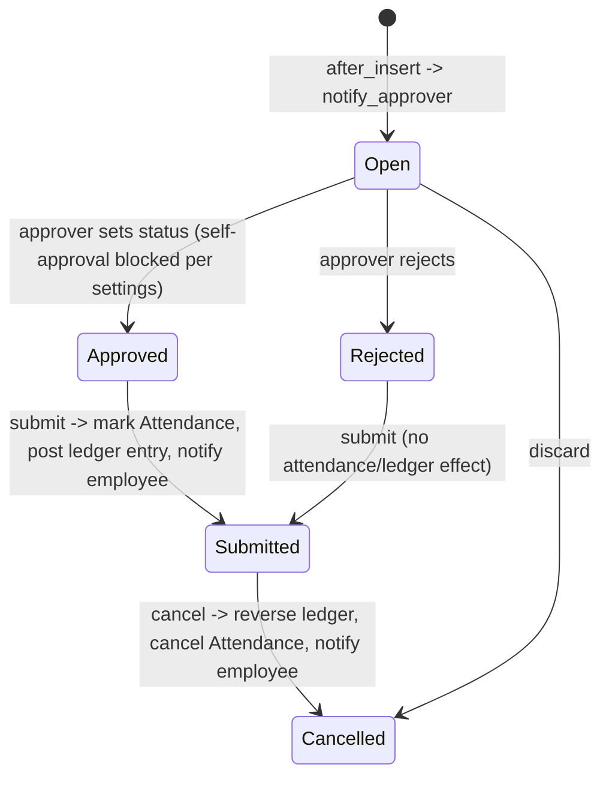

# Leave Application

The employee-facing request to take time off — the single most-used document in the module, and the one that actually consumes leave balance and drives Attendance. It exists to capture, validate against every business rule (balance, overlap, blocked days, max consecutive days, optional-holiday eligibility, backdating rules), route for approval, and — once approved and submitted — mark Attendance and post the ledger entries that make the leave "real."

## Key Fields

| Field | Type | Purpose |
|---|---|---|
| employee / leave_type | Link | Who and what type of leave |
| from_date / to_date | Date | Requested range |
| half_day / half_day_date | Check/Date | Partial-day leave |
| total_leave_days | Float | Computed net leave days (holidays/half-days excluded per leave type rules) |
| leave_balance | Float | Balance before this application, snapshotted |
| status | Select | Open / Approved / Rejected / Cancelled |
| leave_approver / leave_approver_name | Link/Data | Assigned approver |
| posting_date | Date | Filing date |
| salary_slip | Link | Set once processed into payroll |
| color | Color | Calendar display |
| follow_via_email | Check | Whether status-change emails go out |

## Relationships

- [[Leave Type]] — links to; nearly every validation defers to this type's configuration.
- [[Leave Allocation]] — read to check balance and to determine which allocation(s) the application's dates fall under; can span at most one allocation unless `allow_negative` is set (then a single application may create split ledger entries across two consecutive allocations).
- [[Leave Ledger Entry]] — triggers creation of (negative leave entries) on submit; reversed on cancel.
- [[Leave Block List]] / [[Leave Block List Date]] — checked via `get_applicable_block_dates()`; approving on a block date is disallowed unless the approving user is on the list's allow-list.
- [[Leave Period]] — used when the leave type is Optional Leave, to find the period's `optional_holiday_list`.
- Attendance (Employee module) — created/updated/cancelled directly by this doctype's `update_attendance()`/`cancel_attendance()`.
- [[Salary Slip]] (Payroll module) — blocks LWP applications overlapping an already-processed payroll period.
- Holiday List / Holiday (external, ERPNext core — see [[_Overview]]) — used throughout to exclude holidays from leave-day counts and to populate the leave calendar.

## Logic — What Happens and Why

**after_insert()**: immediately notifies the leave approver of the new request.

**validate()** runs a long chain, each guarding a distinct business rule:
- `validate_active_employee` — no leave for inactive employees.
- `validate_dates()` — backdated applications are blocked unless HR Settings' "restrict backdated leave application" is off or the user holds the configured allowed role; to_date can't precede from_date; half-day date must be within range and not itself a holiday; unless the type is LWP, the application's dates must fall entirely within (not across) a single leave allocation record (`validate_dates_across_allocation`) and must not predate a future carry-forwarded allocation (`validate_back_dated_application`).
- `validate_balance_leaves()` — computes `total_leave_days` (excludes holidays unless `include_holiday` is set on the type) and rejects an application whose range is entirely holidays (nothing to apply for). For non-LWP types, checks `leave_balance_for_consumption` (a balance figure that also accounts for imminent allocation expiry) is sufficient; if not, either warns (if `allow_negative`) or throws.
- `validate_leave_overlap()` — no two Open/Approved applications for the same employee can cover overlapping dates, with a special-cased exception allowing two half-day applications to abut on the same boundary date.
- `validate_max_days()` — walks backward/forward through adjoining consecutive leave applications of the same type to compute a *total* consecutive-leave span, and rejects if it exceeds the leave type's `max_continuous_days_allowed`.
- `show_block_day_warning()` / `validate_block_days()` — warns about (or, at Approved status, blocks) leave overlapping [[Leave Block List]] dates.
- `validate_salary_processed_days()` — an LWP application cannot fall inside a date range already covered by a submitted Salary Slip (payroll has already been finalized for that period).
- `validate_attendance()` — blocks applying for leave on days already marked Present/WFH (non-absent) attendance.
- `validate_optional_leave()` — for Optional Leave types, every day in range must exist as a Holiday on the active leave period's `optional_holiday_list`.
- `validate_applicable_after()` — blocks applying before the leave type's minimum tenure (`applicable_after` calendar days since joining) has elapsed.
- `validate_for_self_approval()` — if HR Settings disables self-approval and there's no workflow governing this doctype, an employee cannot set their own request to Approved.
- `validate_leave_approver()` — approver is mandatory if HR Settings requires it.

**on_update()**: notifies the leave approver by email while still Open and un-submitted (subject to HR Settings); shares the document with the approver if they lack submit permission (`share_doc_with_approver`); publishes a realtime update so "my leaves"/"team leaves" widgets refresh.

**on_submit()**: only Approved or Rejected applications may be submitted (Open/Cancelled cannot). Re-validates backdating, then `update_attendance()` — for every day in range not itself a holiday (per the type's `include_holiday` setting), creates or updates an Attendance record as "On Leave" or "Half Day" (upgrading an existing Absent record rather than duplicating). Notifies the employee of the approval outcome. Posts leave ledger entries (`create_leave_ledger_entry`) — only for Approved status; if the application's range crosses an allocation's carry-forward expiry, or spans two consecutive allocations, the ledger posting is split into separate entries per sub-range so each accounting period's balance stays correct.

**before_cancel()/on_cancel()**: status forced to Cancelled; ledger entries for the application are deleted/reversed; employee is notified; any Attendance records created for this application are marked cancelled (`cancel_attendance`).

**on_discard()**: also sets status to Cancelled (covers the discard-before-submit path).

A large set of module-level whitelisted helpers (`get_leave_balance_on`, `get_number_of_leave_days`, `get_leave_details`, `get_events`, etc.) implement the shared "leave balance/day-count" engine that Leave Allocation, Leave Adjustment, Leave Encashment and Payroll all call into — this doctype's module effectively owns the canonical leave-balance calculation, not just its own record's lifecycle.

## Roles & Permissions

| Role | Can Do | Notes |
|---|---|---|
| [[Employee]] | create/write/read | Files their own requests; cannot submit/cancel/delete |
| [[HR Manager]] | full incl. submit/cancel/delete/amend | Approves for any employee |
| [[HR User]] | full incl. submit/cancel/delete/amend | Same operational rights as HR Manager |
| [[Leave Approver]] | read/write/submit/cancel/delete | Approves assigned applications (submitting = approving/rejecting) |
| All | read (permlevel 1) | Read-only visibility at the restricted field level (e.g. status) |

## Mermaid: State/Flow

