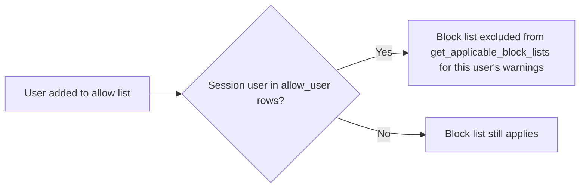

# Leave Block List Allow

A single user exempted from a [[Leave Block List]]'s restrictions, held as a child row. It exists so specific approvers (e.g. senior managers) can still approve leave on otherwise-blocked dates.

## Key Fields

| Field | Type | Purpose |
|---|---|---|
| allow_user | Link (User) | The exempted user |

## Relationships

- [[Leave Block List]] — parent.
- [[Leave Application]] — read via `is_user_in_allow_list()` during `get_applicable_block_lists()` to decide whether the current session user (typically the approver) is exempt from a given block list.

## Logic — What Happens and Why

No controller logic (`istable`, no behavior beyond the auto-generated stub). Its only runtime effect is being queried by `hrms.hr.doctype.leave_block_list.leave_block_list.is_user_in_allow_list()`: if the current `frappe.session.user` matches an `allow_user` row on a block list, that list is excluded from the blocking set for that user (unless the caller explicitly requested `all_lists=True`, as the calendar view and the hard `validate_block_days()` check both do).

## Roles & Permissions

| Role | Can Do | Notes |
|---|---|---|
| — | — | No standalone permissions; inherits access from parent [[Leave Block List]]. |

## Mermaid: State/Flow

