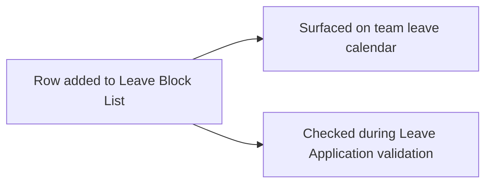

# Leave Block List Date

A single blocked calendar date with a stated reason, held as a child row of [[Leave Block List]]. It exists purely to let one block list carry an arbitrary number of individually-reasoned blocked dates.

## Key Fields

| Field | Type | Purpose |
|---|---|---|
| block_date | Date | The blocked date |
| reason | Text | Why leave is blocked on this date |

## Relationships

- [[Leave Block List]] — parent.
- [[Leave Application]] — read via `get_applicable_block_dates()` to warn on or block leave overlapping this date.

## Logic — What Happens and Why

No controller logic (`istable`, no `.py` behavior beyond the auto-generated stub — see `leave_block_list_date.py`). Uniqueness of dates within a list is enforced by the parent's `validate()`, not here. Also surfaces directly as a calendar event type in `Leave Application.add_block_dates()`, shown on the team leave calendar as "Leave Blocked: {reason}".

## Roles & Permissions

| Role | Can Do | Notes |
|---|---|---|
| — | — | No standalone permissions; inherits access from parent [[Leave Block List]]. |

## Mermaid: State/Flow

