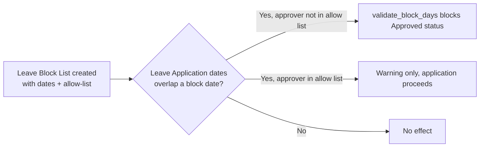

# Leave Block List

A named set of dates on which leave applications are blocked from being approved (e.g. financial year-end, major project deadlines), scoped to a company and optionally to one leave type, with an allow-list of users exempt from the block. It exists so HR can enforce "no leave during these critical days" company- or department-wide without editing every employee's leave rules.

## Key Fields

| Field | Type | Purpose |
|---|---|---|
| leave_block_list_name | Data | Unique name (autoname key) |
| company | Link (Company) | Scope |
| applies_to_all_departments | Check | Global vs. per-department application |
| leave_type | Link ([[Leave Type]]) | Optionally restricts the block to one leave type |
| leave_block_list_dates | Table ([[Leave Block List Date]]) | The actual blocked dates + reasons |
| leave_block_list_allowed | Table ([[Leave Block List Allow]]) | Users exempt from this block |

## Relationships

- [[Leave Block List Date]] — child table; the blocked dates.
- [[Leave Block List Allow]] — child table; exempted users.
- [[Leave Type]] — optionally links to, scoping the block to one type.
- Department (Employee module) — a department can reference one Leave Block List via its own `leave_block_list` field, applying the block to just that department's employees.
- [[Leave Application]] — reads this doctype (via `get_applicable_block_dates`/`get_applicable_block_lists`) during `show_block_day_warning()` and `validate_block_days()` to warn on, or block approval of, leave overlapping a block date.

## Logic — What Happens and Why

**validate()**: rejects duplicate dates within `leave_block_list_dates` — a date should appear at most once per list.

**set_weekly_off_dates()** (whitelisted): a convenience bulk-add tool — given a start/end range and a list of weekday names, appends one block-date row per matching weekday not already present (used for e.g. "block every Saturday this quarter").

Module-level helpers (not doctype methods) implement the actual enforcement used by Leave Application:
- `get_applicable_block_lists()`: resolves which block lists apply to a given employee — company-wide lists (`applies_to_all_departments`) plus the one list assigned to the employee's department, each filtered by `leave_type` match, and (unless `all_lists=True`) excluding lists the current session user is on the allow-list for.
- `get_applicable_block_dates()`: returns the actual blocked dates within a range from the resolved lists.
- `is_user_in_allow_list()`: checks the [[Leave Block List Allow]] child rows for the current user.

No submit/cancel lifecycle — plain master doctype.

## Roles & Permissions

| Role | Can Do | Notes |
|---|---|---|
| [[HR User]] | read/write/create | No delete right listed |
| [[HR Manager]] | read/write/create | No delete right listed |

## Mermaid: State/Flow

