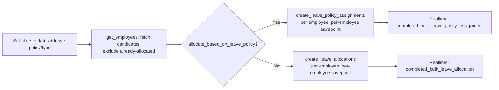

# Leave Control Panel

A single (non-data-storing) bulk-action tool doctype used to allocate leave — either directly or via a Leave Policy — to many filtered employees at once, instead of creating individual Leave Allocation / Leave Policy Assignment records one by one. It exists purely as a UI/whitelisted-method surface; it holds no persistent records of its own (`issingle`).

## Key Fields

| Field | Type | Purpose |
|---|---|---|
| dates_based_on | Select | Leave Period / Joining Date / Custom Range — how to derive the allocation window |
| allocate_based_on_leave_policy | Check | Direct allocation vs. policy-driven allocation |
| leave_policy | Link ([[Leave Policy]]) | Used when policy-based |
| leave_type / no_of_days | Link/Float | Used when directly allocating |
| carry_forward | Check | Passed through to created allocations/assignments |
| company / employment_type / branch / department / designation / employee_grade | Link | Quick filters to select target employees |
| leave_period | Link ([[Leave Period]]) | Used when dates are period-based |
| from_date / to_date | Date | Used for Custom Range |

## Relationships

- [[Leave Allocation]] — bulk-creates and submits one per selected employee, when not policy-based.
- [[Leave Policy Assignment]] — bulk-creates and submits one per selected employee, when policy-based.
- [[Leave Policy]] — links to; supplies leave types filtered against when excluding employees who already have allocations.
- [[Leave Period]] — links to, when dates are period-based; also used by `get_latest_leave_period()` to default to the most recent active period for the company.
- Employee (Employee module) — the pool of candidates filtered and allocated to.

## Logic — What Happens and Why

**allocate_leave()** (whitelisted): validates required fields via `validate_fields()`/`hrms.hr.utils.validate_bulk_tool_fields` (different fields are mandatory depending on `dates_based_on` and `allocate_based_on_leave_policy`), then dispatches to either `create_leave_policy_assignments()` or `create_leave_allocations()`.

**create_leave_allocations()**: for each employee, creates and submits a Leave Allocation directly (`from_date` defaults to the employee's date of joining if unset), inside a savepoint per employee so one failure doesn't roll back the whole batch — failures are logged (`log_error`) and collected, successes/failures reported together via a realtime event (`completed_bulk_leave_allocation`) so the UI can show a summary without blocking on the whole request.

**create_leave_policy_assignments()**: same per-employee savepoint/batch pattern, but creates+submits a [[Leave Policy Assignment]] instead — which itself fans out into per-leave-type allocations (see that doctype).

**get_employees()** / **get_employees_without_allocations()** (whitelisted): resolves the filtered candidate pool and excludes employees who already have a submitted Leave Allocation (or, in policy mode, an allocation for any leave type in the chosen policy) overlapping the target date range — so re-running the tool doesn't create duplicate/overlapping allocations.

**get_latest_leave_period()** (whitelisted): defaults the leave period picker to the most recently created active period for the company.

No submit/cancel/validate lifecycle in the usual sense — as an `issingle` tool doctype, "validate" happens inline inside `validate_fields()` when the bulk action is invoked, not via document save.

## Roles & Permissions

| Role | Can Do | Notes |
|---|---|---|
| [[HR Manager]] | read/write/create | Runs bulk allocation |
| [[HR User]] | read/write/create | Runs bulk allocation |

## Mermaid: State/Flow

