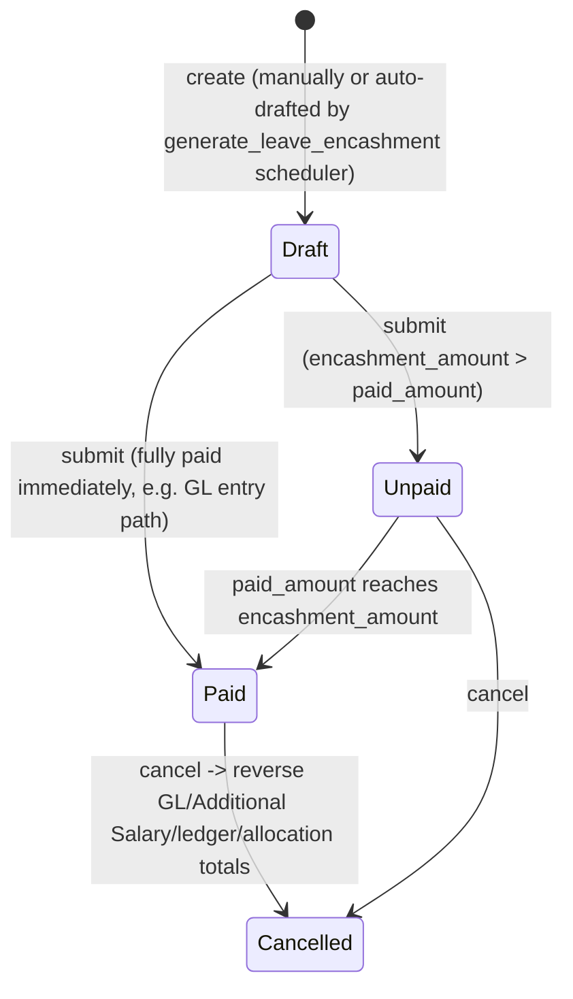

# Leave Encashment

The submittable record that converts an employee's unused leave balance into a cash payout — either through payroll (an Additional Salary component added to the next Salary Slip) or directly via a Payment Entry/GL posting. It exists to let leave that would otherwise expire unused be monetized, per the leave type's encashment rules, and to keep an auditable link between the leave consumed and the payment made.

## Key Fields

| Field | Type | Purpose |
|---|---|---|
| employee / leave_type / leave_period | Link | Whose leave, which type, which period |
| leave_allocation | Link ([[Leave Allocation]]) | The specific allocation being encashed against |
| leave_balance | Float | Balance as of encashment_date |
| actual_encashable_days | Float | Balance after applying non-encashable/max-encashable caps from the leave type |
| encashment_days | Float | Days actually being encashed (defaults to `actual_encashable_days`, can be overridden downward) |
| encashment_amount | Currency | Computed payout |
| pay_via_payment_entry | Check | Direct GL/Payment Entry path vs. Additional Salary/payroll path |
| payable_account / expense_account / cost_center | Link | Accounting dimensions for the direct GL path |
| additional_salary | Link | The Additional Salary record created for the payroll path |
| paid_amount | Currency | Amount actually paid so far (direct path) |
| status | Select | Draft / Unpaid / Paid / Submitted / Cancelled |

## Relationships

- [[Leave Type]] — read for `allow_encashment`, `non_encashable_leaves`, `max_encashable_leaves`, `earning_component`.
- [[Leave Allocation]] — links to; reads balance figures and is updated (`total_leaves_encashed`) on submit/cancel.
- [[Leave Ledger Entry]] — triggers creation of; encashed days post as a negative leave entry, with a reversing entry if the allocation had already expired by the encashment date.
- [[Leave Period]] — required field; the encashment is scoped to a period.
- [[Additional Salary]] / [[Salary Structure Assignment]] (Payroll module) — created on submit when not `pay_via_payment_entry`; requires an assigned salary structure and the leave type's `earning_component`.
- GL Entry (Accounting, via `AccountsController`) — created on submit when `pay_via_payment_entry` is set.

## Logic — What Happens and Why

**validate()**: sets employee name, checks active-employee status, defaults `encashment_date` to today, then `get_leave_details_for_encashment()` recomputes the whole balance/eligibility chain fresh on every save:
- `set_leave_balance()`: finds the allocation covering `encashment_date`; balance = `total_leaves_allocated - carry_forwarded_leaves_count + leaves already taken in period` (leaves-taken is naturally negative in the ledger, so this nets correctly). Throws if no allocation exists.
- `set_actual_encashable_days()`: throws if the leave type doesn't allow encashment at all; otherwise subtracts `non_encashable_leaves` (a floor of leave that must always remain unencashed — kept for backward compatibility per the code's own TODO) and caps at `max_encashable_leaves`.
- `set_encashment_days()`: defaults to the actual encashable days but allows the user to enter fewer; throws if more than the actual encashable days is requested.
- `set_encashment_amount()`: not via `pay_via_payment_entry` requires an assigned Salary Structure on the encashment date (`set_salary_structure`); the per-day rate comes from the most recent Salary Structure Assignment's `leave_encashment_amount_per_day` (falling back to the Salary Structure's own default), multiplied by `encashment_days`.
- `set_status()` recomputes Draft/Unpaid/Paid/Cancelled from docstatus and paid vs. encashment amount.

**before_submit()**: blocks submission unless `encashment_amount` is a positive number — an encashment with nothing to pay is meaningless.

**on_submit()**: locks in the allocation reference if not already set; then either `create_gl_entries()` (payable credit + expense debit against the employee as party) or `create_additional_salary()` (creates and submits an Additional Salary doc tied back to this encashment via `ref_doctype`/`ref_docname`, using the leave type's `earning_component`); then `set_encashed_leaves_in_allocation()` bumps the allocation's `total_leaves_encashed`; finally posts the leave ledger entry for the encashed days (with a reversing entry if the allocation had already expired as of today, mirroring the same expiry-aware pattern used in Leave Application).

**on_cancel()**: cancels the linked Additional Salary (if any) and clears the reference; reverses the allocation's `total_leaves_encashed`; reverses GL entries if applicable; reverses the ledger entry; explicitly ignores GL/Payment Ledger/Advance Payment Ledger Entry link checks (`ignore_linked_doctypes`) since those are being cancelled as part of the same operation; recomputes status.

**set_total_advance_paid()**: reconciles `paid_amount` from Advance Payment Ledger Entries against this encashment (for the direct payment-entry path), throwing if paid exceeds the encashment amount, and refreshes status.

`create_leave_encashment()` (module-level): the entry point used by the `daily_long` scheduled job `hrms.hr.utils.generate_leave_encashment` — for each expiring allocation of an encashment-enabled leave type (when HR Settings' "auto leave encashment" is on), auto-drafts (but does not submit) an encashment so HR can review before finalizing, skipping employees with no assigned salary structure.

## Roles & Permissions

| Role | Can Do | Notes |
|---|---|---|
| [[System Manager]] | full incl. submit/cancel/amend | Full |
| [[HR Manager]] | full incl. submit/cancel/amend | Full |
| [[HR User]] | full incl. submit/cancel/amend | Full |
| [[Employee]] | read/write/create/delete | No submit/cancel — cannot finalize their own encashment |

## Mermaid: State/Flow

