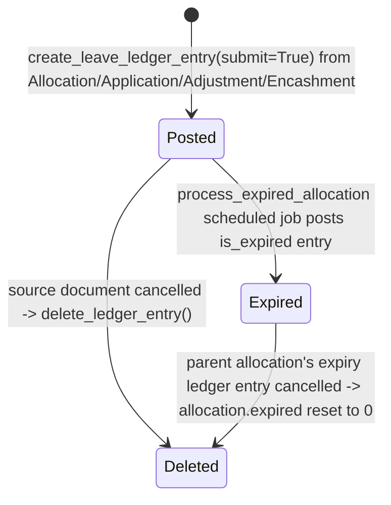

# Leave Ledger Entry

The immutable, submittable transaction log underlying every leave balance in the system — every allocation, consumption, adjustment, encashment, and expiry is a signed `leaves` value posted here, and every balance query (`get_leave_balance_on`, `get_leave_details`, payroll's leave-day calculations) is ultimately a sum over these rows. It exists so leave balance has a proper double-entry-style audit trail instead of being a single mutable counter, and so expiry/carry-forward/backdated corrections can all be reasoned about as ledger movements.

## Key Fields

| Field | Type | Purpose |
|---|---|---|
| employee / leave_type | Link | Whose balance, which type |
| transaction_type | Link (DocType) | Source doctype of this entry (Leave Allocation / Leave Application / Leave Adjustment / Leave Encashment) |
| transaction_name | Dynamic Link | Source document name |
| leaves | Float | Signed quantity — positive = credit (allocated/adjusted-in), negative = debit (taken/encashed/expired) |
| from_date / to_date | Date | Period the entry covers |
| is_carry_forward | Check | Whether this entry represents carried-forward balance |
| is_expired | Check | Whether this entry is an expiry write-off |
| is_lwp | Check | Whether the source was leave-without-pay (excluded from normal balance sums) |
| holiday_list | Link (Holiday List) | Holiday list in effect for the entry, where relevant |
| company | Link | Fetched from employee |

## Relationships

- [[Leave Allocation]] — most common `transaction_type`; posts credit entries on submit, carry-forward entries, and expiry entries.
- [[Leave Application]] — posts debit entries on submit (possibly split across allocations/expiry boundaries).
- [[Leave Adjustment]] — posts +/- entries per adjustment type.
- [[Leave Encashment]] — posts debit entries for encashed days.
- [[Leave Type]] — read for `expire_carry_forwarded_leaves_after_days` when deciding which leave types are eligible for automatic expiry processing.

## Logic — What Happens and Why

**validate()**: `to_date` must not precede `from_date`.

**on_cancel()**: normally a ledger entry can only be cancelled if `is_expired` is set (reverts the parent allocation's `expired` flag back to 0) — ordinary transactional entries are deleted via `delete_ledger_entry()` rather than formally cancelled, except entries from Leave Adjustment which are allowed to cancel directly.

**create_leave_ledger_entry(ref_doc, args, submit)** (module-level, called by every other leave doctype): builds a ledger dict from the source document plus caller-supplied overrides, then either submits it (creating a permanent, docstatus=1 record) or, if `submit=False` (i.e. the caller is being cancelled), calls `delete_ledger_entry()` instead of creating a cancelled record — ledger reversals are physical deletes, not docstatus=2 records, keeping balance sums simple.

**delete_ledger_entry()**: before deleting an allocation's ledger entry, `validate_leave_allocation_against_leave_application()` blocks the delete if any Leave Application ledger entries still reference dates within that allocation's range — you cannot retract an allocation's ledger footing while applications have already consumed against it. Also finds and deletes the corresponding expiry entry (matched by same creation timestamp/employee/leave_type) so reversing an allocation also undoes any expiry that was recorded against it.

**process_expired_allocation()** (the `daily_long` scheduled job target): finds all non-expired Leave Allocation ledger entries whose `to_date` has passed and which have no sibling ledger entry of the same carry-forward status still open — i.e. allocations that have run out their period without already being expired or replaced — and dispatches each to `expire_allocation()` (non-carry-forward, or leave types with no carry-forward expiry window) or `expire_carried_forward_allocation()` (carry-forward types with a specific expiry window), each of which posts a negative "is_expired" ledger entry for the remaining unused balance and flips the parent allocation's `expired` checkbox.

**expire_allocation()** (whitelisted): also directly callable from the UI (the "Expire Leaves" action on Leave Allocation's `show_expire_leave_dialog`), letting HR manually force-expire an allocation's remaining leaves before its natural expiry date.

`on_doctype_update()` adds a composite index on `(transaction_type, transaction_name)` for lookup performance, since nearly every leave-balance query joins back through this table.

## Roles & Permissions

| Role | Can Do | Notes |
|---|---|---|
| [[System Manager]] | full incl. submit | Full |
| [[HR Manager]] | full incl. submit/cancel | Full |
| [[HR User]] | full incl. submit/cancel | Full |
| All | create/write/read/submit (if_owner) | Any user can post entries they own — reflects that this doctype is written programmatically by many other doctypes' controllers, not directly by end users through a form |

## Mermaid: State/Flow

