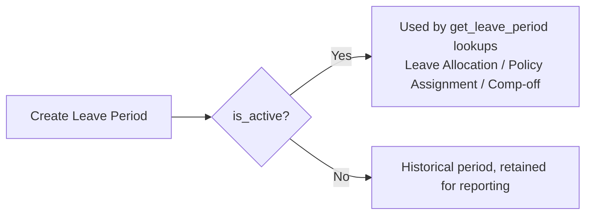

# Leave Period

A named date range (typically a fiscal/leave year) scoped to a company, used as the reference window that Leave Allocation, Leave Policy Assignment, and Compensatory Leave Request all anchor to when they need to know "what allocation cycle are we in right now." It exists so leave accounting has a bounded period instead of running indefinitely, letting balances, carry-forward and expiry be evaluated per cycle.

## Key Fields

| Field | Type | Purpose |
|---|---|---|
| from_date / to_date | Date | The period's date range |
| is_active | Check | Marks the currently effective period for the company |
| company | Link (Company) | Scopes the period to one company |
| optional_holiday_list | Link (Holiday List) | Holiday list used to validate Optional Leave applications during this period |

## Relationships

- [[Leave Allocation]] — linked from; allocations can reference a `leave_period`.
- [[Leave Policy Assignment]] — linked from, when `assignment_based_on == "Leave Period"`.
- [[Leave Encashment]] — linked from; encashment records reference the period.
- [[Compensatory Leave Request]] — indirectly, via `get_leave_period()` used to find the active period for a comp-off's applicable-from date.
- [[Holiday List]] — links to, via `optional_holiday_list`.
- [[Leave Application]] — indirectly, via `validate_optional_leave()` which looks up the active period's optional holiday list.

## Logic — What Happens and Why

**validate()**:
- `validate_dates()`: `to_date` must be strictly after `from_date`.
- `validate_overlap()` (shared helper in `hrms.hr.utils`): rejects a new/edited period whose date range overlaps another Leave Period for the same company — a company can only have one leave period active over any given date, otherwise "the active leave period for this date" would be ambiguous for every downstream lookup (`get_leave_period()`).

No submit/cancel lifecycle — it's a plain master doctype. Its only real runtime role is being queried by `hrms.hr.utils.get_leave_period(from_date, to_date, company)`, which every allocation, policy assignment, and comp-off creation path calls to resolve "the currently active period" — the `is_active` flag plus date-range containment together drive that resolution.

## Roles & Permissions

| Role | Can Do | Notes |
|---|---|---|
| [[System Manager]] | read/write/create/delete | Full |
| [[HR Manager]] | read/write/create/delete | Full |
| [[HR User]] | read/write/create/delete | Full |

## Mermaid: State/Flow

