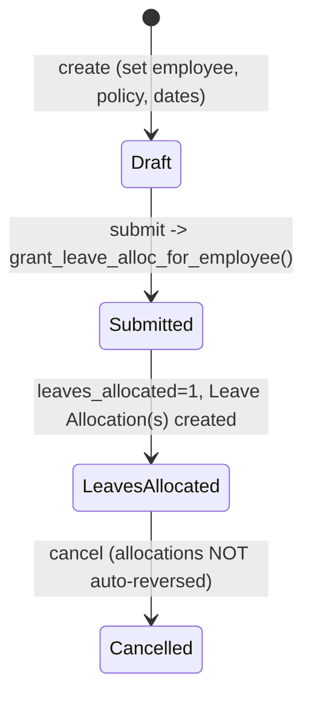

# Leave Policy Assignment

The document that binds one employee to one Leave Policy for an effective date range and, on submission, actually generates that employee's Leave Allocation records for every leave type in the policy. It exists as the bridge between a reusable policy template and per-employee, per-period leave balances — including the non-trivial pro-rating and earned-leave scheduling math for late joiners and periodic accrual types.

## Key Fields

| Field | Type | Purpose |
|---|---|---|
| employee | Link (Employee) | Who the policy applies to |
| leave_policy | Link ([[Leave Policy]]) | Which policy template to expand |
| assignment_based_on | Select | "Leave Period" / "Joining Date" — how effective dates are derived |
| leave_period | Link ([[Leave Period]]) | Source of effective_from/to when based on Leave Period |
| effective_from / effective_to | Date | The allocation window (derived or manually set for Custom Range via Leave Control Panel) |
| carry_forward | Check | Whether unused leave from the previous allocation should roll in |
| leaves_allocated | Check | Guard flag — set true once allocations have been generated, to block double-allocation |

## Relationships

- [[Leave Policy]] — links to; source of `leave_policy_details` expanded into allocations.
- [[Leave Period]] — links to, when `assignment_based_on == "Leave Period"`.
- [[Leave Allocation]] — triggers creation of; one allocation per non-LWP leave type in the policy, each stamped with `leave_policy_assignment` and `leave_policy`.
- [[Leave Type]] — read via `get_leave_type_details()` to decide per-type behavior (LWP, earned, compensatory, carry-forward).
- [[Earned Leave Schedule]] — created as child rows on the resulting Leave Allocation when a type `is_earned_leave`.
- [[Leave Control Panel]] — linked from; the bulk tool creates assignments programmatically via `create_assignment`/`create_assignment_for_multiple_employees`.

## Logic — What Happens and Why

**validate()**:
- `set_dates()`: derives `effective_from`/`effective_to` from the chosen Leave Period, or from the employee's `date_of_joining` (+12 months by default) when based on Joining Date.
- `validate_policy_assignment_overlap()`: blocks a second active assignment for the same employee whose effective range overlaps an existing one — an employee cannot be on two policies covering the same dates, since that would double-allocate leave.
- `warn_about_carry_forwarding()`: if `carry_forward` is checked but a leave type in the policy has carry-forward disabled, warns (doesn't block) that those specific leaves won't actually roll over.

**on_submit()** calls `grant_leave_alloc_for_employee()`:
- Throws if `leaves_allocated` is already set (idempotency guard against re-submission via amendment re-triggering allocation).
- For every non-LWP leave type in the policy: computes `new_leaves_allocated` via `get_new_leaves()`, which branches on leave type:
  - **Compensatory** types get 0 initial allocation — comp-off leaves are added later by [[Compensatory Leave Request]] on its own submission.
  - **Earned leave** types allocated before the assignment period ends: calculate the *already-elapsed* pro-rata via `get_leaves_for_passed_period()` (counts accrual periods passed since joining/effective-from, handling mid-period joiners with a specially pro-rated first period) — this immediately grants leave for months already worked, rather than waiting for the scheduler.
  - **Other types**: `calculate_pro_rated_leaves()` — if the employee joined after the period start, allocation is scaled by the fraction of the period actually worked (rounded to whole days); otherwise full annual allocation.
  - The result is clamped to the policy's `annual_allocation` for that leave type (except Yearly-frequency earned leave, which can legitimately equal it exactly).
- For earned-leave types, additionally builds an `earned_leave_schedule` (via `get_earned_leave_schedule()`) — a forward-looking table of future accrual dates/amounts through `effective_to`, each row later consumed/attempted by the `allocate_earned_leaves` scheduled job (see [[_Overview]]).
- If the computed allocation is 0 and the type isn't earned/negative-allowed, the allocation is skipped and a Comment is logged instead, rather than creating a zero-value Leave Allocation.
- Otherwise a [[Leave Allocation]] is created, saved and submitted per leave type, and `leaves_allocated` is set to 1 to prevent re-running.

There is no `on_cancel` override — cancelling a Leave Policy Assignment does not automatically reverse the Leave Allocations it created; those must be cancelled independently (Leave Allocation's own `on_cancel` clears `leaves_allocated` back to 0 via `update_leave_policy_assignments_when_no_allocations_left` once all its allocations are gone).

`create_assignment()` / `create_assignment_for_multiple_employees()` are the whitelisted entry points the frontend/Leave Control Panel bulk tool uses to create+submit assignments for many employees in one action, isolating failures per employee via savepoints so one failure doesn't roll back the whole batch.

## Roles & Permissions

| Role | Can Do | Notes |
|---|---|---|
| [[System Manager]] | read/write/create/delete/submit/cancel | Full |
| [[HR Manager]] | read/write/create/delete/submit/cancel | Full |
| [[HR User]] | read/write/create/delete/submit/cancel | Full |

## Mermaid: State/Flow

