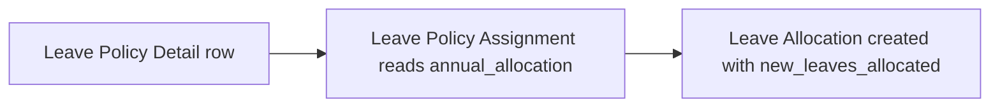

# Leave Policy Detail

A pure child-table row of [[Leave Policy]] stating one leave type's annual allocation figure within that policy. It exists purely to let a policy carry a variable number of (leave type, annual allocation) pairs.

## Key Fields

| Field | Type | Purpose |
|---|---|---|
| leave_type | Link ([[Leave Type]]) | The leave type this row allocates |
| annual_allocation | Float | Number of days allocated per year for this type under the parent policy |

## Relationships

- [[Leave Policy]] — parent; this is one row in `leave_policy_details`.
- [[Leave Type]] — links to; the `max_leaves_allowed` on the referenced type caps this row's value (enforced in Leave Policy's `validate()`).
- [[Leave Allocation]] — read indirectly by `Leave Allocation.get_monthly_earned_leave()` and `create_leave_adjustment` flows, and by [[Leave Policy Assignment]] when computing pro-rated/earned allocations.

## Logic — What Happens and Why

No controller logic of its own (`pass`-only Document subclass). Its `annual_allocation` value is the source figure that [[Leave Policy Assignment]] reads (`get_new_leaves`, `calculate_pro_rated_leaves`, `get_earned_leave_schedule`) to compute how many leaves to actually allocate — pro-rated for late joiners, spread across accrual periods for earned leave, or allocated in full for other types.

## Roles & Permissions

| Role | Can Do | Notes |
|---|---|---|
| — | — | No standalone permissions; inherits access from parent [[Leave Policy]] (`istable` doctype). |

## Mermaid: State/Flow

