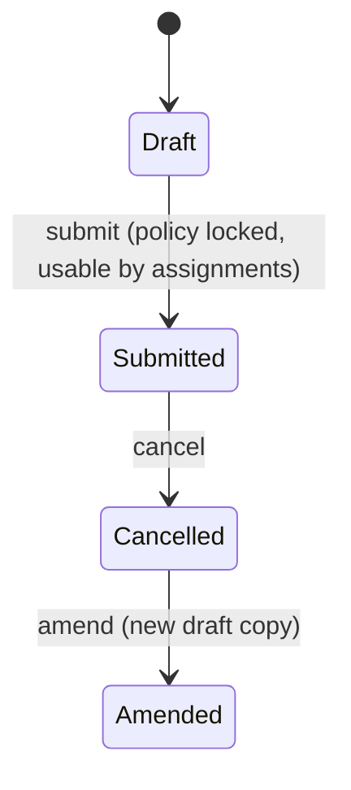

# Leave Policy

A reusable, submittable template that states "employees on this policy get N days of leave type X per year" for a set of leave types. It exists so HR defines the leave entitlement once per grade/company/role and applies it to many employees via Leave Policy Assignment, instead of hand-configuring each employee's Leave Allocation individually.

## Key Fields

| Field | Type | Purpose |
|---|---|---|
| title | Data | Policy name |
| leave_policy_details | Table ([[Leave Policy Detail]]) | Child rows: one per leave type with its annual allocation |
| amended_from | Link | Standard amendment trail |

## Relationships

- [[Leave Policy Detail]] — parent/child; each row pairs a [[Leave Type]] with an annual allocation figure.
- [[Leave Policy Assignment]] — linked from; an assignment references one Leave Policy and, on submit, expands its detail rows into individual [[Leave Allocation]] records.
- [[Leave Allocation]] — linked from indirectly (`leave_policy` field is fetched onto the allocation once created via a policy assignment).
- [[Leave Type]] — links to, once per detail row.

## Logic — What Happens and Why

**validate()**: for each `leave_policy_details` row, if the referenced Leave Type has a positive `max_leaves_allowed`, the row's `annual_allocation` cannot exceed it — a policy is not allowed to promise more leave than the leave type's own configured ceiling permits.

Submittable but has no `on_submit`/`on_cancel` side effects of its own — submission simply locks the policy as an approved, referenceable template. All allocation logic lives in [[Leave Policy Assignment]], which reads the submitted policy's `leave_policy_details` to generate allocations per employee.

## Roles & Permissions

| Role | Can Do | Notes |
|---|---|---|
| [[System Manager]] | read/write/create/delete/submit/cancel/amend | Full |
| [[HR Manager]] | read/write/create/delete/submit/cancel/amend | Full |
| [[HR User]] | read/write/create/delete/submit/cancel/amend | Full |

## Mermaid: State/Flow

