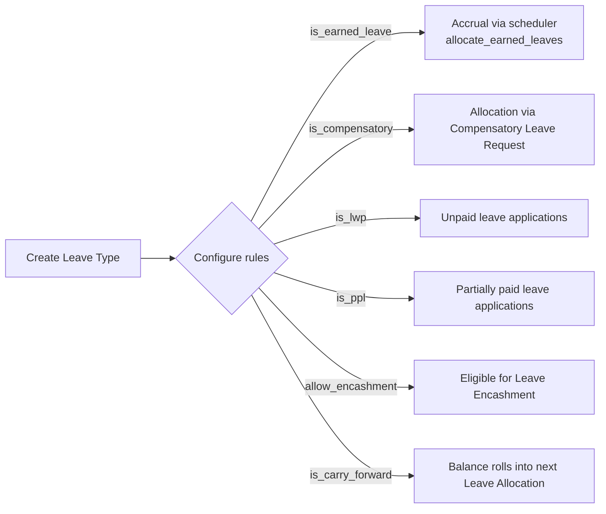

# Leave Type

The master record that defines a category of leave (Casual, Sick, Earned, Compensatory, Leave Without Pay, etc.) and the rule set every allocation and application of that category obeys. It exists so a single place governs whether a leave type carries forward, expires, can be encashed, accrues over time, or is paid at all — every other leave doctype defers to it instead of hard-coding these rules.

## Key Fields

| Field | Type | Purpose |
|---|---|---|
| leave_type_name | Data | Unique name/autoname key for the type |
| is_lwp | Check | Marks leave as unpaid (Leave Without Pay) |
| is_ppl | Check | Partially paid leave; pairs with `fraction_of_daily_salary_per_leave` |
| fraction_of_daily_salary_per_leave | Float | Fraction of a day's pay retained per PPL day taken |
| is_compensatory | Check | Allocation is driven by Compensatory Leave Request, not manually/by policy |
| is_earned_leave | Check | Allocation accrues periodically via the scheduler |
| earned_leave_frequency | Select | Monthly/Quarterly/Half-Yearly/Yearly accrual cadence |
| allocate_on_day | Select | First Day / Last Day / Date of Joining — when in the period the accrual posts |
| rounding | Select | Rounding applied to fractional earned-leave accrual |
| is_carry_forward | Check | Unused balance can roll into the next allocation |
| maximum_carry_forwarded_leaves | Float | Cap on carried-forward balance |
| expire_carry_forwarded_leaves_after_days | Int | Days after which carried-forward leaves expire |
| allow_negative | Check | Employee balance may go negative |
| allow_over_allocation | Check | Total allocated may exceed days in the allocation period |
| max_leaves_allowed | Float | Cap on total allocation per leave period |
| max_continuous_days_allowed | Int | Cap on consecutive days per application |
| applicable_after | Int | Calendar days since joining before this type can be applied |
| is_optional_leave | Check | Leave only valid against an Optional Holiday List date |
| include_holiday | Check | Holidays inside the application range still count as leave days |
| allow_encashment | Check | Balance can be converted to pay via Leave Encashment |
| earning_component | Link (Salary Component) | Component used to pay out encashment |
| max_encashable_leaves / non_encashable_leaves | Int | Encashment caps/floors |

## Relationships

- [[Leave Allocation]] — linked from; every allocation references a Leave Type and inherits its rules.
- [[Leave Application]] — linked from; validated against this type's rules (LWP, over-allocation, block days, etc.).
- [[Leave Policy Detail]] — linked from; a policy's per-type annual allocation row.
- [[Compensatory Leave Request]] — linked from, when `is_compensatory` is set.
- [[Leave Encashment]] — linked from, when `allow_encashment` is set.
- [[Leave Block List]] — linked from, optionally scoping a block list to one leave type.
- [[Leave Ledger Entry]] — linked from; every ledger row carries a leave_type.
- [[Leave Adjustment]] — linked from; adjustments read `max_leaves_allowed` and `is_lwp`.
- [[Salary Component]] (Payroll module) — links to via `earning_component`, the component [[Leave Encashment]] pays the encashed amount under.

## Logic — What Happens and Why

**validate()** runs three checks on every save:
- `validate_lwp()`: if `is_lwp` is set, blocks the change while any Leave Allocation currently overlaps today's date for this type — you cannot silently turn a paid leave type into unpaid leave out from under an existing allocation.
- `validate_leave_types()`: enforces mutual exclusivity — a type cannot be both `is_compensatory` and `is_earned_leave` (compensatory allocation is created by Compensatory Leave Request submission; earned leave is created by the scheduler — the two allocation paths would conflict). Also blocks `is_lwp` + `is_ppl` together (a leave day is either fully unpaid or partially paid, not both), and requires `fraction_of_daily_salary_per_leave` between 0 and 1 for PPL types.
- `validate_allocated_earned_leave()`: if an earned-leave type's `max_leaves_allowed` is being reduced while a current allocation already exists, only warns (doesn't block) that the scheduler may now allocate an inconsistent number of earned leaves — since the cap normally clips new accrual in `Leave Allocation.limit_carry_forward_based_on_max_allowed_leaves`.

**clear_cache()** additionally purges the payroll `LEAVE_TYPE_MAP` cache on any change, since Salary Slip's leave-day computations are keyed off leave type properties cached for performance.

There is no submit/cancel lifecycle — Leave Type is a plain (non-submittable) master.

## Roles & Permissions

| Role | Can Do | Notes |
|---|---|---|
| [[HR User]] | read/write/create/delete | Full master maintenance |
| [[HR Manager]] | read/write/create/delete | Full master maintenance |
| [[Employee]] | read | Can view leave type definitions (e.g. when applying) but not edit |

## Mermaid: State/Flow

