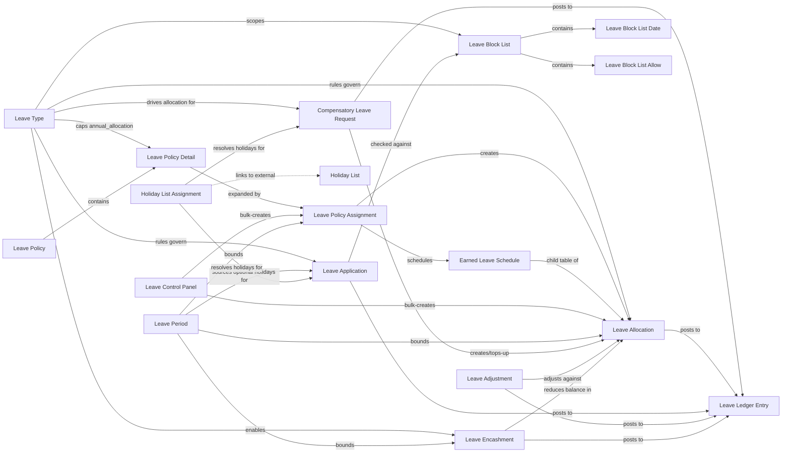

# Leaves Module

Covers the full leave-management lifecycle in Frappe HRMS: defining leave categories and their rules ([[Leave Type]]), templating and granting entitlement ([[Leave Policy]], [[Leave Policy Detail]], [[Leave Policy Assignment]], [[Leave Control Panel]]), tracking balances ([[Leave Allocation]], [[Earned Leave Schedule]], [[Leave Ledger Entry]]), consuming leave ([[Leave Application]]), correcting balances ([[Leave Adjustment]]), rewarding holiday work ([[Compensatory Leave Request]]), monetizing unused leave ([[Leave Encashment]]), restricting when leave can be taken ([[Leave Block List]], [[Leave Block List Date]], [[Leave Block List Allow]]), bounding the accounting cycle ([[Leave Period]]), and resolving which public holidays apply to whom ([[Holiday List Assignment]]).

**Note on Holiday List / Holiday**: these two doctypes are core ERPNext doctypes (not part of the `hrms` app's own `hr/doctype` folder in this repository), so no source was available to document them as standalone files here per the ground rule against inventing content. They are referenced throughout this module via wikilinks (`[[Holiday List]]`, `[[Holiday]]`) as external dependencies — [[Holiday List Assignment]] binds Employees/Companies to a Holiday List; `hrms.utils.holiday_list` and `hrms.hr.utils` contain most of the resolution logic that reads them.

## Doctype Map

## Why This Module Exists

Leave management needs entitlement (how much leave exists) tracked separately from consumption (when it's used), because the two follow different rules and cadences: entitlement is granted per period via policy or manually ([[Leave Policy Assignment]] → [[Leave Allocation]]), sometimes accrues gradually over the period ([[Earned Leave Schedule]] driven by the `allocate_earned_leaves` scheduled job), and can be corrected after the fact ([[Leave Adjustment]]) or converted to cash ([[Leave Encashment]]) or extended by working through a holiday ([[Compensatory Leave Request]]). Consumption ([[Leave Application]]) must be validated against that entitlement at the moment of request, while also respecting company-wide constraints that have nothing to do with balance — blocked dates ([[Leave Block List]]), holidays ([[Holiday List Assignment]] / Holiday List), minimum tenure, and maximum consecutive days.

All of this ties together through [[Leave Ledger Entry]], a single append-only ledger that every allocation, application, adjustment, and encashment posts signed entries to. This exists because a leave balance is not a single mutable number — it must be reconstructible at any point in time (what was the balance on this date, before this allocation expired, after this encashment), auditable (who changed it and why), and reversible (cancelling a submitted document must exactly undo its ledger footprint). [[Leave Allocation]] must exist before [[Leave Application]] can consume against it for the same reason a Payroll Salary Structure Assignment must exist before a Salary Slip can run: the record of entitlement is a hard precondition for anything that draws down against it, and the system actively rejects applications, encashments, and comp-off top-ups made without a matching, currently-valid allocation.

Two background jobs (registered in `hooks.py` under `scheduler_events.daily_long`) keep balances correct without manual intervention: `hrms.hr.doctype.leave_ledger_entry.leave_ledger_entry.process_expired_allocation` expires allocations whose period has ended and writes off unused, non-carry-forwarded balance; `hrms.hr.utils.allocate_earned_leaves` processes due [[Earned Leave Schedule]] rows to accrue earned leave; `hrms.hr.utils.generate_leave_encashment` auto-drafts [[Leave Encashment]] records for allocations about to expire on encashment-enabled leave types (gated by HR Settings' "auto leave encashment"). `hrms.utils.holiday_list.invalidate_cache` is wired to the (external) Holiday List doctype's `on_update`/`on_trash` events to keep payroll's holiday cache correct whenever a holiday list changes.

## Doctypes in This Module

- [[Leave Type]] — master defining a leave category's rules (paid/unpaid, carry-forward, earned, compensatory, encashable, limits).
- [[Leave Period]] — a company-scoped date range that allocations, policy assignments, and encashments anchor to.
- [[Leave Policy]] — reusable template of per-leave-type annual allocations.
- [[Leave Policy Detail]] — child row of Leave Policy: one leave type's annual allocation figure.
- [[Leave Policy Assignment]] — binds an employee to a policy for a date range and generates their Leave Allocations on submit.
- [[Leave Control Panel]] — bulk tool to allocate leave (directly or via policy) to many filtered employees at once.
- [[Leave Allocation]] — the submittable leave balance record an employee draws down against.
- [[Earned Leave Schedule]] — child table of Leave Allocation tracking periodic earned-leave accrual events.
- [[Leave Adjustment]] — manual allocate/reduce correction to an existing allocation's balance, via the ledger.
- [[Compensatory Leave Request]] — employee claim for leave earned by working a holiday; creates/tops-up an allocation on submit.
- [[Leave Application]] — the employee's request to take leave; drives Attendance and the leave ledger once approved and submitted.
- [[Leave Encashment]] — converts unused leave balance into a payroll or direct payment.
- [[Leave Ledger Entry]] — the append-only transaction log underlying every leave balance calculation.
- [[Leave Block List]] — company/department-scoped set of dates on which leave cannot be approved.
- [[Leave Block List Date]] — child row: one blocked date + reason.
- [[Leave Block List Allow]] — child row: one user exempted from a block list.
- [[Holiday List Assignment]] — date-effective binding of an Employee or Company to a Holiday List.

## Related Flow

See [[Leave Request Lifecycle]] for the end-to-end sequence from Leave Allocation through Leave Application to ledger posting.
