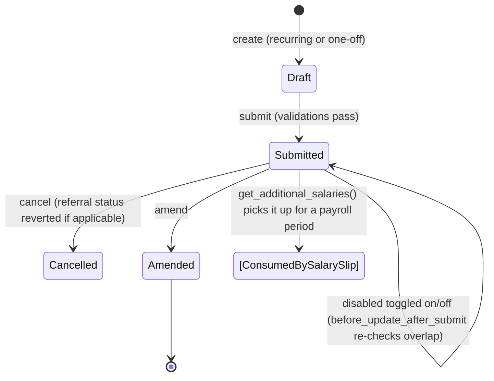

# Additional Salary

A one-off or recurring adjustment to an employee's pay outside their normal Salary Structure — bonuses, referral payouts, ad-hoc deductions, gratuity payouts routed through payroll, arrear payments, or Employee Advance recoveries. It exists so HR can inject or deduct amounts for a specific payroll date (or a recurring date range) without editing the underlying Salary Structure, and so other doctypes (Gratuity, Retention Bonus, Arrear, Payroll Correction, Employee Referral) have a single, auditable mechanism to push amounts into a Salary Slip.

## Key Fields

| Field | Type | Purpose |
|---|---|---|
| `employee` | Link (Employee) | Target employee; must be active. |
| `salary_component` | Link (Salary Component) | Which earning/deduction component gets the amount. |
| `amount` | Currency | Amount to add/deduct; must be ≥ 0. |
| `type` | Data (fetched) | Earning or Deduction, fetched from `salary_component.type`. |
| `is_recurring` | Check | Switches between a single `payroll_date` and a `from_date`/`to_date` range. |
| `payroll_date` | Date | Date this component applies to a Salary Slip (non-recurring only). |
| `from_date` / `to_date` | Date | Effective range for recurring additional salary. |
| `overwrite_salary_structure_amount` | Check | If set, this amount replaces (not adds to) the component's Salary Structure amount in the slip. |
| `deduct_full_tax_on_selected_payroll_date` | Check | Forces full tax deduction on the one payroll date rather than spreading it. |
| `disabled` | Check | Can be toggled after submit to stop a recurring entry from applying further, without cancelling it. |
| `ref_doctype` / `ref_docname` | Link / Dynamic Link | Points back to the originating document (Gratuity, Retention Bonus, Arrear, Payroll Correction, Employee Referral, Employee Advance). |
| `currency` | Link (Currency) | Locked once employee is set. |

## Relationships

- [[Employee]] — linked from; validated active via `validate_active_employee`.
- [[Salary Structure Assignment]] — looked up in `validate_salary_structure` to confirm the employee has an active structure as of the payroll/from date.
- [[Salary Structure]] — the resolved structure whose components are checked when `overwrite_salary_structure_amount` is set.
- [[Salary Slip]] — consumed by `get_additional_salaries()` during slip generation to inject earnings/deductions.
- [[Gratuity]] — triggers (creates an Additional Salary via `create_additional_salary` when `pay_via_salary_slip` is set).
- [[Retention Bonus]] — triggers (creates or tops up an Additional Salary on submit).
- [[Arrear]] — triggers (creates one Additional Salary per earning/deduction arrear component on submit).
- [[Payroll Correction]] — triggers (same pattern as Arrear).
- Employee Referral — triggers/linked from via `ref_doctype`/`ref_docname`; updates `referral_payment_status` to Paid/Unpaid on submit/cancel.
- Employee Advance — linked from via `ref_doctype`; `validate_employee_advance_return` caps the amount against the advance's unreturned balance.

## Logic — What Happens and Why

**Create / before_validate:** `before_validate()` clears whichever date field doesn't apply — `payroll_date` is nulled when recurring, `from_date`/`to_date` are nulled when not — keeping the record internally consistent with `is_recurring`.

**Validate (`validate()`):**
- `validate_active_employee` — blocks additional salary for an inactive employee.
- `validate_dates` — requires `from_date`/`to_date` for recurring, `payroll_date` for one-off; both must fall within the employee's joining/relieving date window. Prevents paying/deducting outside employment.
- `validate_salary_structure` — an active Salary Structure Assignment must exist as of the relevant date; if `overwrite_salary_structure_amount` is checked but the component isn't part of that structure, the flag is silently cleared with a message (overwrite only makes sense for existing structure components).
- `validate_recurring_additional_salary_overlap` — blocks a second recurring entry for the same employee/component whose date range overlaps an existing submitted, non-disabled one (prevents double-counting a recurring earning/deduction).
- `validate_employee_referral` — for referral-bonus additional salary: referral must be applicable for bonus, status must be "Accepted", and the component must be an Earning (a referral bonus can't be a deduction).
- `validate_duplicate_additional_salary` — blocks two submitted, non-disabled overwrite entries for the same component covering the same payroll date (only one component amount can win).
- `validate_tax_component_overwrite` — a variable-based-on-taxable-salary (tax) component may only be touched with `overwrite_salary_structure_amount` on; otherwise throws, since a non-overwrite additional amount would corrupt automatic tax slab calculation.
- `validate_accrual_component` — warns (does not block) if the component is an accrual component, since it will show up in the Employee Benefits Ledger as a payout.
- Amount must not be negative.
- `validate_employee_advance_return` (only when `ref_doctype == "Employee Advance"`) — sums all other submitted Additional Salary rows referencing the same advance and ensures the new amount doesn't exceed the advance's remaining unreturned balance (`paid_amount - claimed_amount`, minus already-scheduled deductions); throws with the exact available/pending figures otherwise.

**Submit (`on_submit`):** `update_employee_referral()` sets the linked Employee Referral's `referral_payment_status` to "Paid" if `ref_doctype == "Employee Referral"`.

**Cancel (`on_cancel`):** reverses the same referral status update to "Unpaid".

**Update after submit (`before_update_after_submit`):** if `disabled` is being turned off (re-enabled), re-runs the recurring overlap check so a re-enabled recurring entry can't collide with another active one.

**Consumption in payroll:** the module-level `get_additional_salaries(employee, start_date, end_date, component_type)` is called by Salary Slip generation. It selects submitted, non-disabled rows of the right type (Earning/Deduction) whose recurring range covers the period end date, or whose one-off `payroll_date` falls within the period. It also detects and throws on multiple overwrite rows for the same component in the same period (`components_to_overwrite` check) since only one can apply per slip.

**Helper `get_amount(sal_start_date, sal_end_date)`:** pro-rates a recurring additional salary's total amount by days, for the portion of its `from_date`–`to_date` range that overlaps a given salary period.

## Roles & Permissions

| Role | Can Do | Notes |
|---|---|---|
| [[System Manager]] | read/write/create/delete/submit/cancel/amend | Full control. |
| [[HR User]] | read/write/create/submit | No delete/cancel/amend rights per the doctype JSON. |
| [[HR Manager]] | read/write/create/submit | Same rights as HR User in this doctype's permission list (no delete/cancel listed). |

## Mermaid: State/Flow

