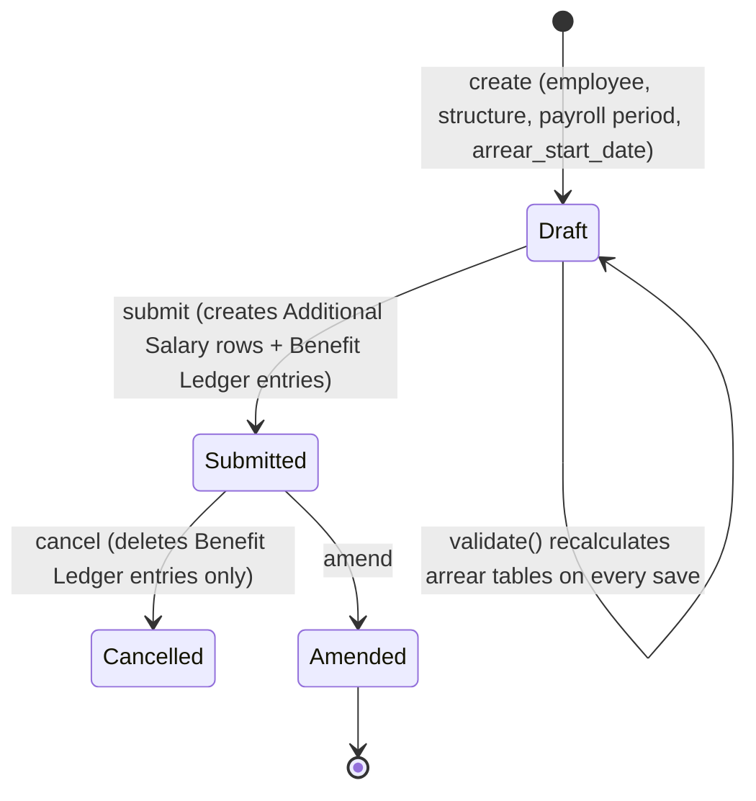

# Arrear

Captures back-pay owed to an employee when a new Salary Structure is assigned retroactively (e.g. a raise effective from an earlier date than when it was actually processed). It recomputes what already-processed Salary Slips *would have paid* under the new structure, diffs that against what was *actually paid*, and turns the positive differences into Additional Salary entries and Employee Benefit Ledger accruals — so the employee gets the make-up amount without editing historical, submitted Salary Slips.

## Key Fields

| Field | Type | Purpose |
|---|---|---|
| `employee` | Link (Employee) | Whose arrears are being calculated. |
| `salary_structure` | Link (Salary Structure) | The new/retroactive structure to compare against. |
| `payroll_period` | Link (Payroll Period) | Bounds the arrear window. |
| `arrear_start_date` | Date | Salary slips starting on/after this date are considered; must fall within the Payroll Period. |
| `payroll_date` | Date | The date the resulting Additional Salary entries will be posted for. |
| `earning_arrears` / `deduction_arrears` / `accrual_arrears` | Table (Payroll Correction Child) | Computed component/amount breakdown by category. |
| `currency` | Link (Currency) | From employee/company. |

## Relationships

- [[Employee]] — linked from.
- [[Salary Structure]] — linked from; used to generate a preview Salary Slip via `make_salary_slip`.
- [[Salary Structure Assignment]] — validated to exist for the employee/structure on or after `arrear_start_date`.
- [[Salary Slip]] — reads existing submitted slips (from `arrear_start_date` onward) to get already-paid component amounts; also builds an in-memory preview slip (not saved) per existing slip to compute what the new structure would have paid.
- [[Salary Component]] — only components flagged `arrear_component` are considered.
- [[Payroll Correction]] — reads existing Payroll Correction amounts for the same slips so arrears aren't double counted; shares the child table doctype ([[Payroll Correction Child]]).
- [[Additional Salary]] — triggers: one Additional Salary is created and submitted per non-zero earning/deduction arrear component.
- [[Employee Benefit Ledger]] — triggers: one ledger entry created per accrual arrear component (transaction_type "Accrual"), and deleted on cancel via `delete_employee_benefit_ledger_entry`.
- [[Payroll Period]] — linked from; bounds valid `arrear_start_date`.

## Logic — What Happens and Why

**Validate (`validate()`):**
- `validate_dates` — `arrear_start_date` must fall within the selected Payroll Period's start/end date.
- `validate_salary_structure_assignment` — an active (submitted) Salary Structure Assignment for this employee+structure must exist with `from_date >= arrear_start_date`; otherwise there's no basis to recompute pay.
- `validate_duplicate_doc` — blocks a second submitted Arrear for the same employee/structure/payroll period (arrears would double-apply).
- `calculate_salary_structure_arrears` — the core computation:
  1. `get_existing_salary_slips` — fetches all submitted Salary Slips for the employee starting on/after `arrear_start_date`; throws if none exist (nothing to correct).
  2. `fetch_existing_salary_components` — sums actual paid amounts per arrear-flagged component from those slips' Salary Detail rows (excluding rows already tied to an Additional Salary, and excluding tax-variable components), plus existing accrual amounts from Employee Benefit Detail, plus amounts already captured by prior submitted Payroll Corrections for the same slips (so a correction already paid isn't re-arreared).
  3. `generate_preview_components` — for each existing slip, builds an unsaved preview Salary Slip using the new `salary_structure` (via `make_salary_slip`), adjusting for any `days_to_reverse` from linked Payroll Corrections, and sums the preview's arrear-flagged earning/deduction/accrual amounts.
  4. `compute_component_differences` — per component, `new - existing`; only positive differences are kept (arrears represent money owed, not overpayment clawback) — throws if there are none.
  5. `populate_arrear_tables` — writes the positive differences into the `earning_arrears`, `deduction_arrears`, `accrual_arrears` child tables.

**Submit (`on_submit`):**
- `validate_arrear_details` — re-confirms at least one arrear row exists.
- `create_additional_salary` — for every row in `earning_arrears`/`deduction_arrears`, creates and submits an Additional Salary (non-overwrite) dated `payroll_date`, tagged `ref_doctype="Arrear"` back to this document — this is what actually pays the employee the difference through the next Salary Slip.
- `create_benefit_ledger_entry` — for every row in `accrual_arrears`, inserts an Employee Benefit Ledger accrual entry referencing this Arrear.

**Cancel (`on_cancel`):** deletes the Employee Benefit Ledger entries created for this document (`delete_employee_benefit_ledger_entry`). Note: the Additional Salary documents created on submit are *not* automatically cancelled by Arrear cancellation — they stand as independent submitted documents once created.

## Roles & Permissions

| Role | Can Do | Notes |
|---|---|---|
| [[System Manager]] | read/write/create/delete/submit | No cancel listed in JSON. |
| [[HR Manager]] | read/write/create/delete/submit/cancel | Full lifecycle control. |

## Mermaid: State/Flow

