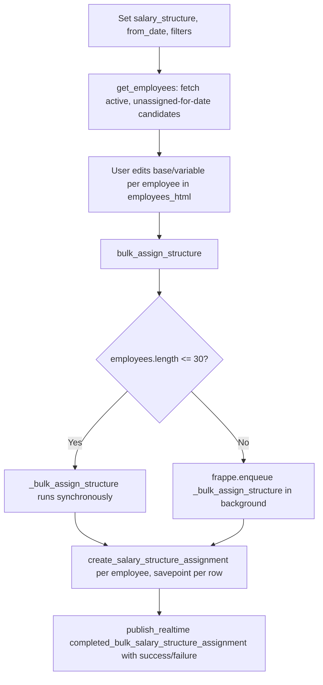

# Bulk Salary Structure Assignment

A single-instance (`issingle: 1`) utility tool for assigning one [[Salary Structure]] to many employees at once, instead of creating [[Salary Structure Assignment]] records one at a time. It exists purely as an operational workflow aid — it holds no history of its own (single doctype, no submit/cancel), just the current filter/selection state used to drive a bulk-creation job.

## Key Fields

| Field | Type | Purpose |
|---|---|---|
| `salary_structure` | Link → Salary Structure (reqd) | The structure to bulk-assign. |
| `from_date` | Date (reqd) | Effective date applied to every generated assignment. |
| `income_tax_slab` | Link → Income Tax Slab | Applied to all generated assignments (only shown/relevant once a structure is picked). |
| `company` | Link → Company (fetched from `salary_structure.company`, read-only) | Scopes employee search to the structure's company. |
| `currency` | Link → Currency (fetched from `salary_structure.currency`, read-only) | Assignment currency, inherited from the structure. |
| `payroll_payable_account` | Link → Account (fetched from Company default) | Payable account applied to all generated assignments. |
| `branch`, `department`, `designation`, `employment_type`, `grade` (Quick Filters) | Link | Narrow the employee candidate pool before bulk assignment. |
| `filter_list` (Advanced Filters) | HTML | Client-rendered arbitrary filter builder passed as `advanced_filters` to `get_employees()`. |
| `employees_html` | HTML | Client-rendered list/grid of candidate employees with editable base/variable values, built from `get_employees()` results. |

## Relationships

- [[Salary Structure]] — links to: `salary_structure`; imports and calls `create_salary_structure_assignment()` from `hrms.payroll.doctype.salary_structure.salary_structure`.
- [[Salary Structure Assignment]] — triggers: `bulk_assign_structure()` creates and submits one Assignment per selected employee.
- Employee — linked from: `get_employees()` queries active employees matching quick/advanced filters, excluding those already assigned for the same `from_date`, and excluding employees who joined after or were relieved before `from_date`.
- Employee Grade — linked from: left-joined in `get_employees()` to default each candidate's `base` to the grade's `default_base_pay`.
- [[Income Tax Slab]] — links to: passed through to each created assignment.

## Logic — What Happens and Why

**`get_employees(advanced_filters)` (whitelisted)**
- Builds filters from the quick-filter fields (`company`, `employment_type`, `branch`, `department`, `designation`, `grade`) plus any `advanced_filters` from the client-side filter builder.
- Excludes employees who already have a submitted [[Salary Structure Assignment]] with the same `from_date` (a subquery on Assignment), since re-assigning the same structure/date would collide with `Salary Structure Assignment.validate_dates()`'s duplicate check.
- Restricts to `Active` employees whose `date_of_joining <= from_date` and whose `relieving_date` is null or after `from_date` — an assignment can't start before employment begins or after it ends, mirroring the same rule enforced later in `Salary Structure Assignment.validate_dates()`.
- Left-joins Employee Grade to default each candidate's `base` from `default_base_pay` (0 if none), and initializes `variable` to 0 — pre-filling the bulk-edit grid.

**`bulk_assign_structure(employees)` (whitelisted)**
- `validate_bulk_tool_fields()` (shared HR-tools utility) enforces `salary_structure`, `from_date`, `company` are set and that an employee list was actually passed.
- If ≤30 employees, runs `_bulk_assign_structure()` synchronously; otherwise enqueues it as a background job (`frappe.enqueue`, 3000s timeout) and informs the user via `frappe.msgprint` that creation was queued — mirrors the same synchronous/background split pattern used in `Salary Structure.assign_salary_structure()`, sized for a heavier bulk operation.
- `_bulk_assign_structure()` — for each employee, inside a DB savepoint, calls `create_salary_structure_assignment()` (from the Salary Structure module) with the tool's structure/company/currency/payable-account/from_date/tax-slab plus that employee's edited `base`/`variable`; on failure, rolls back to the savepoint and logs the error (so one bad employee doesn't abort the batch), and records success/failure per employee. Publishes progress via `frappe.publish_progress` and, on completion, broadcasts a `completed_bulk_salary_structure_assignment` realtime event (after commit) carrying the success/failure lists so the client can render a results dialog with links to each created [[Salary Structure Assignment]].

**Regional/hook overrides**
- No doc_events entries for "Bulk Salary Structure Assignment" in `hrms/hooks.py`; no references found in the checked regional setup/util files.

## Roles & Permissions

| Role | Can Do | Notes |
|---|---|---|
| [[HR User]] | read/write/create/print/email/share | Single doctype — no delete/submit concept applies. |
| [[HR Manager]] | read/write/create/print/email/share | Same rights as HR User for this tool. |

## Mermaid: State/Flow

