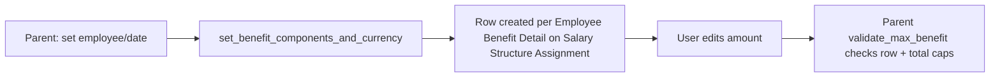

# Employee Benefit Application Detail

The child-table row type of [[Employee Benefit Application]]: one row per flexible-benefit
salary component the employee is choosing to allocate part of their benefit budget to. It
exists purely to hold, per component, the ceiling amount permitted (as configured on the
Salary Structure Assignment) versus the amount the employee actually elects.

## Key Fields

| Field | Type | Purpose |
|---|---|---|
| salary_component | Link (Salary Component) | The flexible-benefit earning component being elected; read-only, populated by `set_benefit_components_and_currency` on the parent |
| max_benefit_amount | Currency | Per-component ceiling copied from the employee's Salary Structure Assignment's Employee Benefit Detail row; read-only |
| amount | Currency | The amount the employee elects for this component; must be > 0 and ≤ max_benefit_amount (validated on parent) |

## Relationships

- [[Employee Benefit Application]] — parent doctype (`employee_benefits` table field).
- [[Salary Component]] — each row links to one flexible-benefit earning component.
- [[Salary Structure Assignment]] — indirectly, since `max_benefit_amount` is sourced from that document's [[Employee Benefit Detail]] child rows.

## Logic — What Happens and Why

No controller logic of its own (`pass` — plain `Document` subclass). All validation
(amount > 0, amount ≤ max_benefit_amount, sum ≤ header max_benefits) lives in the parent
[[Employee Benefit Application]]'s `validate_max_benefit`. Row population is likewise driven by
the parent's `set_benefit_components_and_currency` whitelisted method, which clears and
rebuilds this table whenever employee or date changes on the parent form.

## Roles & Permissions

No `permissions` defined in this doctype's JSON (child tables inherit access from the parent
[[Employee Benefit Application]]).

## Mermaid: State/Flow

