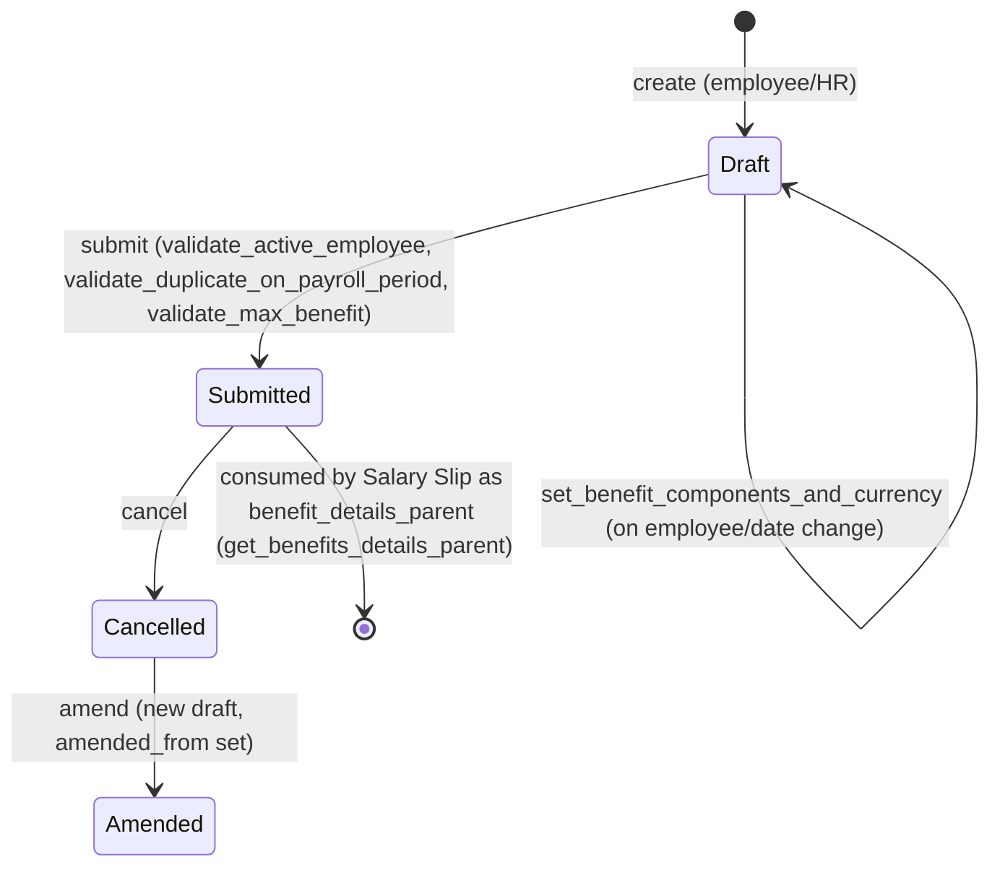

# Employee Benefit Application

Represents an employee's yearly election of how to allocate their flexible-benefit
pool (the "Max Benefits" amount configured on their [[Salary Structure Assignment]]) across
flexible-benefit-eligible earning components, for a given [[Payroll Period]]. It exists because
flexible benefit plans let an employee choose the mix of benefit components (e.g. LTA,
medical allowance) up to a capped yearly amount, rather than have payroll hard-code a fixed
split — this document is the employee's binding declaration of that mix for the period.

## Key Fields

| Field | Type | Purpose |
|---|---|---|
| employee | Link (Employee) | Whose benefit election this is |
| date | Date | Date used to resolve the applicable Salary Structure Assignment |
| payroll_period | Link (Payroll Period) | Period the election applies to; used to prevent duplicate applications |
| company | Link (Company) | Fetched from employee; scopes currency/component validation |
| max_benefits | Currency | Yearly flexible-benefit cap, pulled from Salary Structure Assignment |
| remaining_benefit | Currency | max_benefits minus total_amount (calculated client-side) |
| employee_benefits | Table (Employee Benefit Application Detail) | Line items: component + max allowed + elected amount |
| total_amount | Currency | Sum of elected amounts across all line items |
| currency | Link (Currency) | Fetched from Salary Structure Assignment |
| amended_from | Link (Employee Benefit Application) | Standard amendment trail for cancelled/resubmitted docs |

## Relationships

- [[Employee Benefit Application Detail]] — child table (`employee_benefits`), one row per flexible-benefit salary component with its max and elected amount.
- [[Employee]] — linked; must be active (`validate_active_employee`).
- [[Payroll Period]] — linked; one submitted application per employee per period is enforced.
- [[Salary Structure Assignment]] — source of `max_benefits`, `currency`, and the set of eligible components (via `Employee Benefit Detail` child table read directly with a query, not a doctype link field).
- [[Salary Component]] — each `employee_benefits` row references one (must be a flexible-benefit earning component).
- [[Employee Benefit Ledger]] — triggered indirectly: once submitted, this document becomes the "benefit details parent" that [[Salary Slip]] logic (`get_benefits_details_parent` in `hrms/payroll/doctype/salary_slip/salary_slip.py`) reads from to accrue/pay out benefits into the ledger, in preference to the Salary Structure Assignment's own Employee Benefit Detail rows.
- [[Additional Salary]] — not created directly by this doctype; downstream benefit payouts driven off it flow through [[Employee Benefit Claim]] instead.

## Logic — What Happens and Why

**Populate (`set_benefit_components_and_currency`, whitelisted method, called from client `employee`/`date` change handlers):**
Looks up the employee's active Salary Structure Assignment as of `date` (`get_salary_structure_assignment`,
imported from `employee_benefit_claim.py`), throws if none exists. Reads all `Employee Benefit Detail` rows
under that assignment (component + configured amount) and rebuilds `employee_benefits` from scratch, setting
each row's `max_benefit_amount` to the assignment's configured amount. Also copies `max_benefits` and
`currency` from the assignment onto the application header. This exists so the employee cannot exceed
whatever cap and component list HR configured on their salary structure.

**Client-side totals (`employee_benefit_application.js`):** on every `amount` change or row removal,
recomputes `total_amount` (sum of positive amounts) and `remaining_benefit` (`max_benefits - total_amount`).
Purely a UI convenience; the same rule is re-validated server-side.

**Validate (`validate`):**
1. `validate_active_employee` — blocks the application if the employee is inactive.
2. `validate_duplicate_on_payroll_period` — throws if a submitted (`docstatus=1`) application already
   exists for this employee+payroll_period, because only one election per period is meaningful (the flexible
   benefit budget is per-period, not per-application).
3. `validate_max_benefit` — if `employee_benefits` is empty, throws entirely ("As per your assigned Salary
   Structure you cannot apply for benefits") since there is nothing to elect. Otherwise, for each line: amount
   must be > 0, and must not exceed that line's `max_benefit_amount` (the per-component ceiling from the salary
   structure). Then sums all line amounts and throws if the rounded total exceeds the header `max_benefits`
   cap. This is the core business rule: an employee can shuffle amounts between flexible components but can
   never exceed either the per-component or the overall yearly cap.

**Submit:** no explicit `on_submit` override — submission just fixes the document (docstatus 1), after which
it becomes eligible to be picked up by `get_benefits_details_parent` in Salary Slip processing as the
authoritative source of the employee's flexible benefit allocation for the period (in preference to reading
directly off the Salary Structure Assignment, unless "Mandatory Benefit Application" is off and no application
exists — then Salary Structure Assignment's own Employee Benefit Detail rows are used as fallback). This is why
the doctype is submittable: once submitted it becomes a locked, audit-safe input to payroll accrual.

**Cancel/Amend:** standard Frappe submittable behavior (`amended_from` trail). No custom `on_cancel` logic in
this controller — cancelling an application does not appear to retroactively clean up already-created
[[Employee Benefit Ledger]] entries (those are tied to Salary Slip lifecycle, not to this doc).

## Roles & Permissions

| Role | Can Do | Notes |
|---|---|---|
| [[System Manager]] | read/write/create/submit/cancel/delete/amend | Full control |
| [[HR Manager]] | read/write/create/submit/cancel/delete/amend | Full control |
| [[HR User]] | read/write/create/submit/cancel/delete/amend | Full control, same as HR Manager in this doctype |
| [[Employee]] | read/write/create/delete | No submit/cancel/amend right — an employee can draft and edit their own application but cannot self-submit or self-approve it; submission requires HR (not enforced further by an approval workflow in code — no `workflow_state_field`/`states` defined). |

## Mermaid: State/Flow

