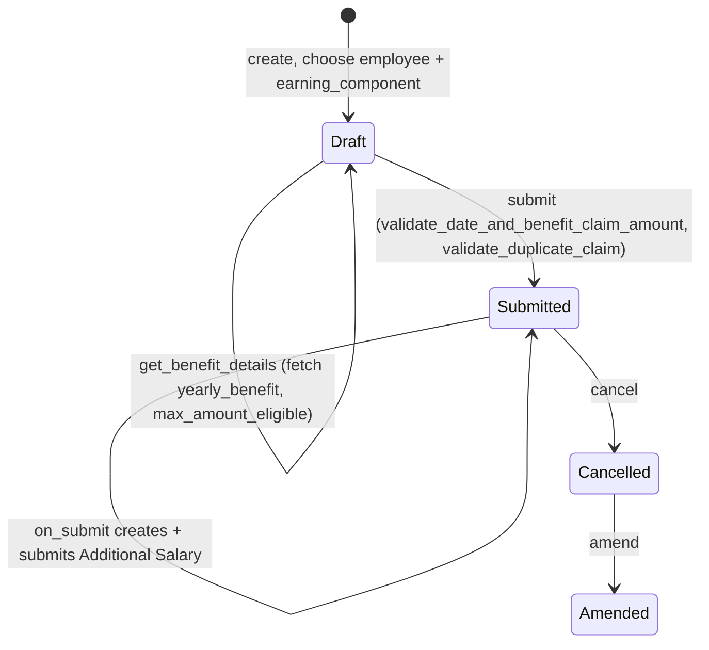

# Employee Benefit Claim

Records an employee's request to be paid out (via payroll) a specific amount of an already
accrued or eligible flexible benefit component — e.g. claiming reimbursement for a medical
expense against their configured medical allowance benefit. It exists because some benefit
components are only paid out on-demand against proof of expense ("Accrue per cycle, pay only
on claim") rather than automatically every payroll cycle, and this doctype is both the claim
request and the trigger that actually pushes money into the employee's pay via
[[Additional Salary]].

## Key Fields

| Field | Type | Purpose |
|---|---|---|
| employee | Link (Employee, filtered to Active) | Who is claiming |
| payroll_date | Date | Payroll cycle the claim targets; must not be in the past |
| earning_component | Link (Salary Component) | Which flexible benefit component is being claimed; query-filtered server-side to components eligible for claim |
| yearly_benefit | Currency | Read-only, fetched via `get_benefit_details` — the component's configured yearly amount |
| max_amount_eligible | Currency | Read-only, computed max claimable right now (accrued/full-amount minus already paid) |
| claimed_amount | Currency | Amount being claimed; must be >0 and ≤ max_amount_eligible |
| attachments | Attach | Expense proof upload |
| currency | Link (Currency) | Fetched based on employee |
| amended_from | Link (Employee Benefit Claim) | Amendment trail |

## Relationships

- [[Employee]] — must be Active (enforced via `link_filters` on the field, not a validate check in this controller).
- [[Salary Component]] — `earning_component`; claimable components are queried via `get_benefit_components` whitelisted method, filtered to `payout_method` in `Accrue per cycle, pay only on claim` or `Allow claim for full benefit amount`.
- [[Payroll Period]] — resolved internally via `get_payroll_period(payroll_date, payroll_date, company)`, not a stored field.
- [[Salary Structure Assignment]] — used to resolve the employee's assigned structure/benefit detail parent.
- [[Employee Benefit Application]] / Salary Structure Assignment's Employee Benefit Detail — whichever is the current "benefit details parent" per `get_benefits_details_parent` (in `hrms/payroll/doctype/salary_slip/salary_slip.py`) supplies the component's configured amount and payout method.
- [[Employee Benefit Ledger]] — read (not written) by this doctype: `get_max_claim_eligible` (in `hrms/payroll/doctype/employee_benefit_ledger/employee_benefit_ledger.py`) sums prior Accrual/Payout ledger entries for this employee+component+payroll period to compute how much is still claimable.
- [[Salary Slip]] — for "Accrue per cycle, pay only on claim" components, a preview Salary Slip is generated (`make_salary_slip(..., for_preview=1)`) purely to read the current month's not-yet-posted accrued benefit amount.
- [[Additional Salary]] — created and submitted on `on_submit` (`create_additional_salary`), which is how the claimed amount actually reaches the employee's pay; linked back via `ref_doctype`/`ref_docname`, and the doctype JSON declares an explicit `links` entry to Additional Salary via `ref_docname`.

## Logic — What Happens and Why

**Client-side (`employee_benefit_claim.js`):** on `employee` change, resets `earning_component` and
fetches the employee's currency; on `earning_component` change, calls whitelisted `get_benefit_details` to
populate `yearly_benefit`/`max_amount_eligible`. The `earning_component` field's query is server-filtered by
`get_benefit_components`.

**`get_benefit_details` (whitelisted):** resolves the payroll period for `payroll_date`+`company`, resolves
the employee's Salary Structure Assignment as of `payroll_date`, then reads the component's config
(`get_component_details`) from whichever benefit-details parent is authoritative
(`get_benefits_details_parent`). If the component's `payout_method` is "Accrue per cycle, pay only on claim",
it also computes the *current* month's not-yet-ledgered accrual by previewing a Salary Slip
(`preview_salary_slip_and_fetch_current_month_benefit_amount`) — this exists because ledger entries are only
posted on Salary Slip *submission*, so without this preview the current cycle's accrual would be invisible when
computing eligibility mid-cycle. Finally calls `get_max_claim_eligible` to compute `max_amount_eligible`:
for "Accrue per cycle..." components, eligible = accrued-to-date (ledger + current month preview) − already
paid, and throws if accrued < paid (a data-integrity guard); for "Allow claim for full benefit amount"
components, eligible = full yearly amount − already paid.

**Validate (`validate`):**
1. `validate_date_and_benefit_claim_amount` — throws if `payroll_date` is in the past (claims must target
   the current or a future payroll cycle, so they can still be processed), throws if `claimed_amount` ≤ 0, and
   throws if `claimed_amount` exceeds `max_amount_eligible`.
2. `validate_duplicate_claim` — via `get_existing_claim_for_month`, blocks a second submitted claim for the
   same employee+component within the same calendar month as `payroll_date`. The docstring explains why: ledger
   entries only materialize on Salary Slip submission, so without this guard two claims filed in the same cycle
   could both pass the (stale) eligibility check and jointly overpay the employee.

**On Submit (`on_submit` → `create_additional_salary`):** creates and submits an [[Additional Salary]] record
for `claimed_amount` against `earning_component`, dated `payroll_date`, with `overwrite_salary_structure_amount=0`
(added on top of, not replacing, the structure's normal payout) and `ref_doctype`/`ref_docname` pointing back to
this claim — this is the actual payment mechanism; the claim itself carries no ledger or payroll effect beyond
generating this Additional Salary.

## Roles & Permissions

| Role | Can Do | Notes |
|---|---|---|
| [[System Manager]] | read/write/create/submit/cancel/delete/amend | Full control |
| [[HR Manager]] | read/write/create/submit/cancel/delete/amend | Full control |
| [[HR User]] | read/write/create/submit/cancel/delete/amend | Full control |
| [[Employee]] | read/write/create/delete | No submit/cancel/amend — can prepare a claim but not finalize it themselves (submission gated to HR roles; not enforced via a workflow state, just permission absence). |

## Mermaid: State/Flow

