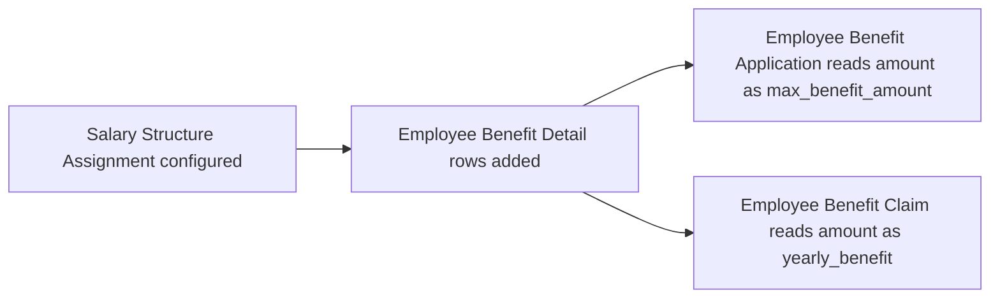

# Employee Benefit Detail

A child-table row configuring one flexible-benefit earning component's yearly amount, attached
to a parent document (most commonly [[Salary Structure Assignment]]). It exists to define,
per employee assignment, which earning components are treated as flexible benefits and what
their configured yearly amount is — the baseline that [[Employee Benefit Application]] and
[[Employee Benefit Claim]] both read from when the employee has not (or need not) submitted a
benefit application.

## Key Fields

| Field | Type | Purpose |
|---|---|---|
| salary_component | Link (Salary Component, filtered to type=Earning and is_flexible_benefit=1) | The flexible benefit component configured |
| amount | Currency | Configured yearly amount for this component on the parent assignment |

## Relationships

- [[Salary Structure Assignment]] — typical parent; also referenced generically wherever `benefit_details_doctype`/`benefit_details_parent` resolution is used (`get_benefits_details_parent` in `hrms/payroll/doctype/salary_slip/salary_slip.py`).
- [[Salary Component]] — must be an Earning-type, flexible-benefit-flagged component.
- [[Employee Benefit Application]] — provides the max ceiling copied into `Employee Benefit Application Detail.max_benefit_amount` when an application is drafted.
- [[Employee Benefit Claim]] — reads this table's `amount` as `yearly_benefit`/basis for `max_amount_eligible` calculations when this parent is the authoritative benefit-details source.
- [[Employee Benefit Ledger]] — accrual/payout amounts posted per [[Salary Slip]] cycle are ultimately bounded by the yearly `amount` configured here.

## Logic — What Happens and Why

No controller logic of its own (`pass` — plain `Document` subclass). All meaning is derived from
how other doctypes' controllers query this child table by `parent`/`salary_component` (e.g.
`EmployeeBenefitApplication.set_benefit_components_and_currency`, `EmployeeBenefitClaim.get_component_details`).

## Roles & Permissions

No `permissions` defined in this doctype's JSON (child tables inherit access from whichever
parent it is attached to, most commonly [[Salary Structure Assignment]]).

## Mermaid: State/Flow

