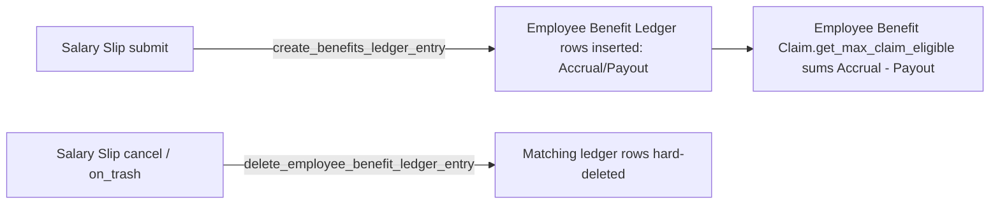

# Employee Benefit Ledger

An immutable, system-generated audit trail of every flexible-benefit accrual and payout
posted against an employee, one row per component per Salary Slip cycle. It exists so the
system can always answer "how much of this benefit has already been accrued/paid this payroll
period" without recomputing it from historical Salary Slips — [[Employee Benefit Claim]]
eligibility checks and payroll accrual logic both depend on summing these rows.

## Key Fields

| Field | Type | Purpose |
|---|---|---|
| employee | Link (Employee) | Whose benefit ledger row this is |
| salary_component | Link (Salary Component, filtered to accrual_component=1) | Which benefit component was accrued/paid |
| transaction_type | Select (Accrual / Payout) | Whether this row represents value accruing or being paid out |
| amount | Currency | The accrual or payout amount for this cycle |
| yearly_benefit | Currency | The component's configured yearly cap at time of posting |
| payroll_period | Link (Payroll Period) | Period the entry belongs to; used to scope eligibility sums |
| salary_slip | Link (Salary Slip) | The salary slip that generated this entry; also the deletion key on cancel |
| flexible_benefit | Check | Whether this component came from a flexible-benefit configuration (vs. a plain accrual component) |
| reference_doctype / reference_document | Link/Dynamic Link | For flexible benefits, points to whichever doc supplied the config — Salary Structure Assignment or Employee Benefit Application |
| posting_date | Date | Defaults to Today |
| remarks | Data | Free-text note set by the creating logic |

## Relationships

- [[Salary Slip]] — parent trigger: `create_employee_benefit_ledger_entry` is called from `SalarySlip.create_benefits_ledger_entry` (in `hrms/payroll/doctype/salary_slip/salary_slip.py`) on submit, and rows are deleted via `delete_employee_benefit_ledger_entry("salary_slip", self.name)` in both `SalarySlip.on_cancel` and `SalarySlip.on_trash`.
- [[Salary Structure Assignment]] / [[Employee Benefit Application]] — one of these is set as `reference_document` when `flexible_benefit=1`, identifying the source configuration for that period's benefit.
- [[Salary Component]] — the component being accrued/paid; restricted by `link_filters` to accrual components.
- [[Employee Benefit Claim]] — reader, not writer: `get_max_claim_eligible`/`get_benefit_amount` (in this doctype's own `.py`) sum ledger `Accrual` vs `Payout` amounts per employee+component+payroll_period to compute claim eligibility.
- [[Payroll Period]] — scopes eligibility queries.
- [[Employee]] — owner of the ledger entry.

## Logic — What Happens and Why

This doctype is **not submittable** and has no create/write/delete permission for any role in
its own JSON (permissions only grant read/report/etc.) — it is purely system-inserted, and the
client script (`employee_benefit_ledger.js`) forces the form read-only and hides the primary
save button, reinforcing that it must never be hand-edited.

**Validate (`validate`):** the only guard is that `salary_component` must be of type "Earning"
(checked against the cached Salary Component doctype), else it throws — flexible benefits/accruals
are always earnings, never deductions, so this prevents miscategorized ledger entries.

**`create_employee_benefit_ledger_entry(ref_doc, args, delete=False)`:** called from Salary Slip
on submit. Iterates `args["benefit_ledger_components"]` (built up during salary slip calculation)
and inserts one Employee Benefit Ledger doc per component, carrying over employee/company/posting
date/salary slip/payroll period from the slip, and the component/amount/transaction_type/yearly_benefit/
flexible_benefit/remarks per component. If `flexible_benefit==1`, it also sets `reference_doctype`
(Salary Structure Assignment if the benefit source was `Employee Benefit Detail`, else Employee
Benefit Application) and `reference_document`, and — if the component list didn't already carry a
`yearly_benefit` — backfills it by querying the benefit-details doctype/parent directly. This design
lets a claim later trace exactly which configuration (assignment vs application) governed that
period's accrual.

**`delete_employee_benefit_ledger_entry(ref_field, ref_value)`:** a hard SQL-level delete
(`frappe.qb ... .delete()`) of all ledger rows matching `ref_field == ref_value` (used with
`ref_field="salary_slip"`). Called on Salary Slip cancel and on_trash so that reversing/removing a
salary slip cleanly reverses its accrual/payout footprint — otherwise claim eligibility
calculations (which sum all historical ledger rows) would remain permanently and incorrectly
inflated/deflated after a slip is cancelled.

**`get_max_claim_eligible(employee, payroll_period, benefit_component, current_month_benefit_amount=0)`:**
used by [[Employee Benefit Claim]].`get_benefit_details`. Sums this employee/component/period's
`Accrual` and `Payout` ledger amounts via `get_benefit_amount`. For "Accrue per cycle, pay only on
claim" components: eligible = (accrued + current month unposted accrual) − paid, throwing if that
implies accrued < paid (a sign that payouts have outpaced accrual, which should be impossible under
correct ledger bookkeeping). For "Allow claim for full benefit amount": eligible = full yearly
amount − paid.

## Roles & Permissions

| Role | Can Do | Notes |
|---|---|---|
| [[System Manager]] | read/report/print/email/export/share | No write/create/delete — system-generated only |
| [[HR Manager]] | read/report/print/email/export/share | Same restriction |
| Administrator | read/report/print/email/export/share | Same restriction |
| [[Employee]] | read/report/print/email/export/share | Can view their own ledger (row-level visibility governed by standard employee self-permission elsewhere) |
| [[HR User]] | read/report | No print/email/export/share, most restricted of the listed roles |

## Mermaid: State/Flow

