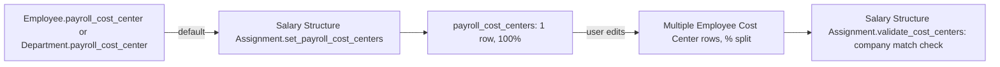

# Employee Cost Center

A single row splitting an employee's payroll cost across one [[Cost Center]] by percentage. It exists so an employee's salary expense can be allocated across multiple cost centers (e.g. an employee who splits time between two departments/projects) instead of being posted entirely to one, when Salary Slip journal entries are generated.

## Key Fields

| Field | Type | Purpose |
|---|---|---|
| `cost_center` | Link (Cost Center) | One of the cost centers this employee's pay is allocated to. |
| `percentage` | Int (non-negative) | Share of pay allocated to this cost center. |

Both fields carry `allow_on_submit: 1`, meaning they can still be edited after the parent (Salary Structure Assignment) is submitted.

## Relationships

- [[Salary Structure Assignment]] — parent, via the `payroll_cost_centers` Table field (labelled "Cost Centers" in the UI). This is the only parent doctype that references it in the codebase.
- [[Cost Center]] — linked from; must belong to the same Company as the parent Salary Structure Assignment (enforced in the parent's `validate_cost_centers`, not in this child doctype itself).
- [[Employee]] — indirectly: `Salary Structure Assignment.get_payroll_cost_center()` defaults this table to the employee's (or their Department's) `payroll_cost_center` field at 100% if no rows are set explicitly (`set_payroll_cost_centers`, whitelisted method).

## Logic — What Happens and Why

No controller logic of its own (`employee_cost_center.py` is a stock Document with no overrides). All logic lives in the parent [[Salary Structure Assignment]]:
- `set_payroll_cost_centers()` auto-populates a single 100% row from the employee's or department's default `payroll_cost_center` when the table is empty — ensures every assignment resolves to at least one cost center without forcing manual entry in the common single-cost-center case.
- `validate_cost_centers()` rejects any row whose Cost Center's Company doesn't match the assignment's Company (`Row {idx}: Cost Center {x} does not belong to Company {y}`) — prevents cross-company GL misallocation.
- A one-time data-migration patch, hrms/patches/post_install/set_payroll_cost_centers.py, backfilled this table onto existing Salary Structure Assignments from each employee's (or department's) legacy `payroll_cost_center` value when the feature was introduced.

## Roles & Permissions

| Role | Can Do | Notes |
|---|---|---|
| — | — | No `permissions` entries; access follows the parent [[Salary Structure Assignment]]. |

## Mermaid: State/Flow

