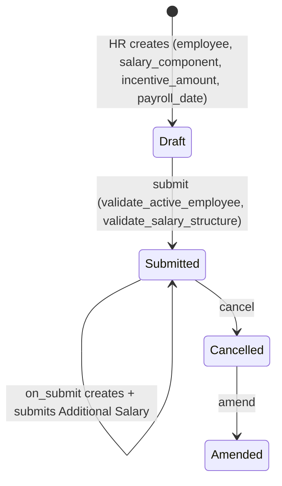

# Employee Incentive

Records a one-off discretionary payment (bonus/incentive) awarded to an employee, to be paid
through payroll on a specific date. It exists as a lightweight approval-and-audit record for
ad hoc pay that isn't part of the employee's regular Salary Structure — HR grants it, and
submission is the trigger that actually pushes the amount into the employee's pay via
[[Additional Salary]].

## Key Fields

| Field | Type | Purpose |
|---|---|---|
| employee | Link (Employee, filtered to Active) | Recipient |
| salary_component | Link (Salary Component, filtered to Earning type + company) | Which earning component the incentive is paid under |
| incentive_amount | Currency | Amount awarded; non-negative |
| payroll_date | Date | Date the incentive should hit payroll |
| currency | Link (Currency) | Fetched based on employee |
| company | Link (Company) | Employee's company |
| department | Link (Department) | Fetched from employee, read-only |
| amended_from | Link (Employee Incentive) | Amendment trail |

## Relationships

- [[Employee]] — recipient, filtered to Active in the client script's query.
- [[Salary Component]] — must be an Earning-type component for the employee's company (`get_salary_component` query).
- [[Salary Structure Assignment]] — existence checked in `validate_salary_structure`; the employee must have one before an incentive can be validated.
- [[Additional Salary]] — created and submitted on `on_submit`, carrying `ref_doctype`/`ref_docname` back to this document — this is the actual payroll payment mechanism.

## Logic — What Happens and Why

**Client-side (`employee_incentive.js`):** filters `employee` to Active employees; on employee
change fetches currency (`get_employee_currency`) and the employee's company, then restricts the
`salary_component` query to Earning-type components for that company (`get_salary_component`).

**Validate (`validate`):**
1. `validate_active_employee` — blocks incentives for inactive employees.
2. `validate_salary_structure` — throws if no [[Salary Structure Assignment]] exists at all for the
   employee ("First assign a Salary Structure"), since an incentive is layered as Additional Salary
   on top of a structure and payroll cannot process it otherwise.

**On Submit (`on_submit`):** looks up the employee's `company` directly from the Employee doctype
(not reused from the form field), then builds and submits a new [[Additional Salary]] with
`amount=incentive_amount`, `salary_component`, `payroll_date`, `currency`,
`overwrite_salary_structure_amount=0` (additive, not replacing structure pay), and
`ref_doctype`/`ref_docname` pointing back to this Employee Incentive. No ledger entry is created —
unlike flexible benefits, incentives are not accrual-tracked; they are a straight one-time
Additional Salary push.

**Cancel/Amend:** no custom `on_cancel`; standard submittable amendment trail via `amended_from`.
Cancelling this document does not appear to cancel the already-created Additional Salary
automatically (no code path for it in this controller).

## Roles & Permissions

| Role | Can Do | Notes |
|---|---|---|
| [[HR Manager]] | read/write/create/submit/cancel/delete/amend | Full control |
| [[HR User]] | read/write/create | No submit/cancel/amend/delete right — can prepare but not finalize |
| [[Employee]] | read | View-only — cannot create or edit their own incentive records |

## Mermaid: State/Flow

