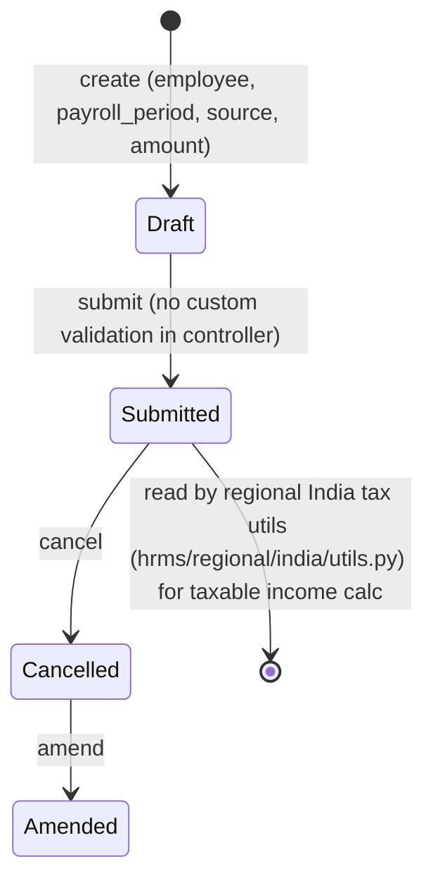

# Employee Other Income

A declaration of income an employee receives from a source outside their regular salary from
this employer (e.g. rental income, freelance income, income from a previous employer) for a
given [[Payroll Period]]. It exists so this additional income can be factored into the
employee's total taxable income for the period — this doctype itself carries no computation
logic; it is a data-capture record consumed elsewhere (income tax computation) in the payroll
module.

## Key Fields

| Field | Type | Purpose |
|---|---|---|
| employee | Link (Employee) | Whose declared other-income this is |
| payroll_period | Link (Payroll Period) | Period the income applies to |
| company | Link (Company) | Employee's company |
| source | Data | Free-text description of the income source |
| amount | Currency (currency derived from Company's default currency) | Declared amount |
| amended_from | Link (Employee Other Income) | Amendment trail |

## Relationships

- [[Employee]] — declares the income.
- [[Payroll Period]] — period it is attributed to.
- [[Company]] — determines the currency used (`options: "Company:company:default_currency"`).
- No reference to this doctype found in `hrms/regional/india/setup.py`, `hrms/regional/india/utils.py`, or `hrms/regional/united_arab_emirates/setup.py` — no regional override exists in code for this doctype.

## Logic — What Happens and Why

No controller logic of its own (`pass` — plain submittable `Document` subclass, no
`validate`/`on_submit`/`on_cancel` overrides). No other file in `hrms/hooks.py`, `hrms/overrides/`,
or the checked regional modules references this doctype, so its consumption elsewhere in the
codebase is not enforced in code as far as this review found — treat its downstream use (e.g. in
income tax computation) as "not enforced in code" rather than assumed.

## Roles & Permissions

| Role | Can Do | Notes |
|---|---|---|
| [[HR Manager]] | read/write/create/submit/cancel/delete/amend | Full control |
| [[HR User]] | read/write/create/submit/cancel/delete/amend | Full control |
| [[Employee]] | read/write/create/submit/cancel/delete/amend | Full control — unlike Employee Benefit Claim/Incentive, employees can self-submit their own Other Income declarations |

## Mermaid: State/Flow

