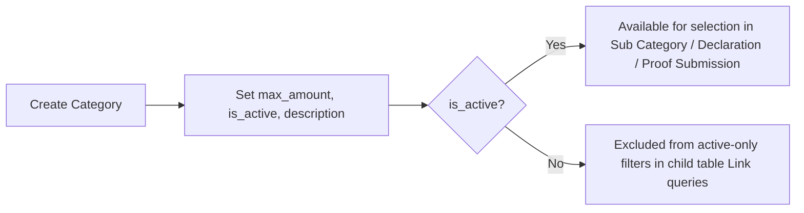

# Employee Tax Exemption Category

Represents a top-level statutory income-tax exemption category (e.g. India's Section 80C, 80D, etc.) that HR configures once per jurisdiction/company policy. It defines the ceiling amount an employee's declared investments/expenses under that category can be exempted from taxable income, and every sub-category and declaration line rolls up to it. It exists so the tax-exemption calculation logic has a single authoritative cap per statutory category instead of hardcoding limits in code.

## Key Fields

| Field | Type | Purpose |
|---|---|---|
| `max_amount` | Currency | Statutory ceiling for total exemptions claimable under this category; enforced downstream in [[Employee Tax Exemption Sub Category]] validation and in `get_total_exemption_amount`. |
| `is_active` | Check | Only active categories/sub-categories are offered in declaration/proof-submission child table filters (client-side `frm.set_query`). |
| `description` | Small Text | Free-text explanation shown to the employee filling declarations. |

Autoname is `Prompt` — the user types the category name directly (e.g. "Section 80C") as the document name.

## Relationships

- [[Employee Tax Exemption Sub Category]] — linked from (sub-category's `exemption_category` Link field fetches `max_amount` from this doctype).
- [[Employee Tax Exemption Declaration Category]] — linked from indirectly, via `exemption_sub_category.exemption_category` fetch, used to group declaration totals by category.
- [[Employee Tax Exemption Proof Submission Detail]] — linked from indirectly the same way, for proof totals.

## Logic — What Happens and Why

This is a pure master/setup doctype with no submittable lifecycle (`is_submittable` is not set) and no `validate`/`on_submit` hooks in `employee_tax_exemption_category.py` — the class body is `pass`. All enforcement of `max_amount` happens elsewhere:
- [[Employee Tax Exemption Sub Category]].`validate()` throws if a sub-category's `max_amount` exceeds its parent category's `max_amount` (read via `frappe.db.get_value`).
- `hrms.hr.utils.get_total_exemption_amount()` (called from both [[Employee Tax Exemption Declaration]] and [[Employee Tax Exemption Proof Submission]]) caps the summed exemption amount per category at this doctype's `max_amount`, so an employee cannot claim more than the statutory ceiling across all sub-categories under one category.

Why: statutory tax categories (e.g. Section 80C in India) have a combined ceiling across many instruments (PF, insurance, tuition fees, etc.); modelling the category as its own master lets the ceiling be configured once and enforced uniformly regardless of how many sub-categories/declarations reference it.

## Roles & Permissions

| Role | Can Do | Notes |
|---|---|---|
| [[System Manager]] | read/write/create/delete | Full control, standard admin access. |
| [[HR Manager]] | read/write/create/delete | Full control over category master. |
| [[HR User]] | read/write/create/delete | Full control — no distinction from HR Manager in this doctype's permission rows. |

No `Employee` role permission — employees cannot view or edit categories directly (they only see them via linked fields on declarations/proofs).

## Mermaid: State/Flow

