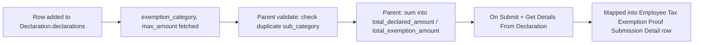

# Employee Tax Exemption Declaration Category

Child table row of [[Employee Tax Exemption Declaration]] — one line per sub-category an employee is declaring an intended tax-saving amount for at the start of a payroll period (a forward-looking "I plan to invest/spend this much" statement, before actual proof exists). It exists to carry the per-instrument declared amount that later feeds `total_declared_amount` and `total_exemption_amount` on the parent, and to seed the corresponding [[Employee Tax Exemption Proof Submission Detail]] row via `make_proof_submission`.

## Key Fields

| Field | Type | Purpose |
|---|---|---|
| `exemption_sub_category` | Link (Employee Tax Exemption Sub Category) | The instrument being declared; required. |
| `exemption_category` | Link (Employee Tax Exemption Category), read-only | Fetched from `exemption_sub_category.exemption_category`, used to group amounts by category in `get_total_exemption_amount`. |
| `max_amount` | Currency, read-only | Fetched from `exemption_sub_category.max_amount`; the cap this row's `amount` is checked against. |
| `amount` | Currency | The employee's declared (intended) amount for this sub-category; non-negative. |

## Relationships

- [[Employee Tax Exemption Declaration]] — parent/child (this doctype is the `declarations` child table).
- [[Employee Tax Exemption Sub Category]] — links to, via `exemption_sub_category`.
- [[Employee Tax Exemption Category]] — links to indirectly via fetched `exemption_category`.
- [[Employee Tax Exemption Proof Submission Detail]] — triggers creation of (via `make_proof_submission` mapped-doc, one submission detail row per declaration category row, `add_if_empty=True`).

## Logic — What Happens and Why

No controller logic of its own (`employee_tax_exemption_declaration_category.py` is `pass`) — it is pure data. All logic lives in the parent [[Employee Tax Exemption Declaration]]'s `validate()`:
- `validate_tax_declaration()` (in `hrms/hr/utils.py`) throws if the same `exemption_sub_category` appears more than once across the declaration's rows — "More than one selection for {0} not allowed" — preventing double-counting the same instrument.
- `get_total_exemption_amount()` sums each row's `amount` (capped per-row at `max_amount` if it exceeds it) grouped by `exemption_category`, then caps the category total at the category's own `max_amount`.

Why: separating the declaration (intent) from proof (evidence) mirrors real payroll-tax workflows — an employee first tells payroll what they intend to invest so provisional tax can be withheld correctly, then later substantiates it with documents in the Proof Submission.

## Roles & Permissions

Child table — no standalone `permissions` array (`"permissions": []` in JSON). Access is governed entirely by the parent [[Employee Tax Exemption Declaration]]'s permissions (System Manager, HR Manager, HR User, Employee — all with amend/cancel/create/delete/submit/write).

## Mermaid: State/Flow

