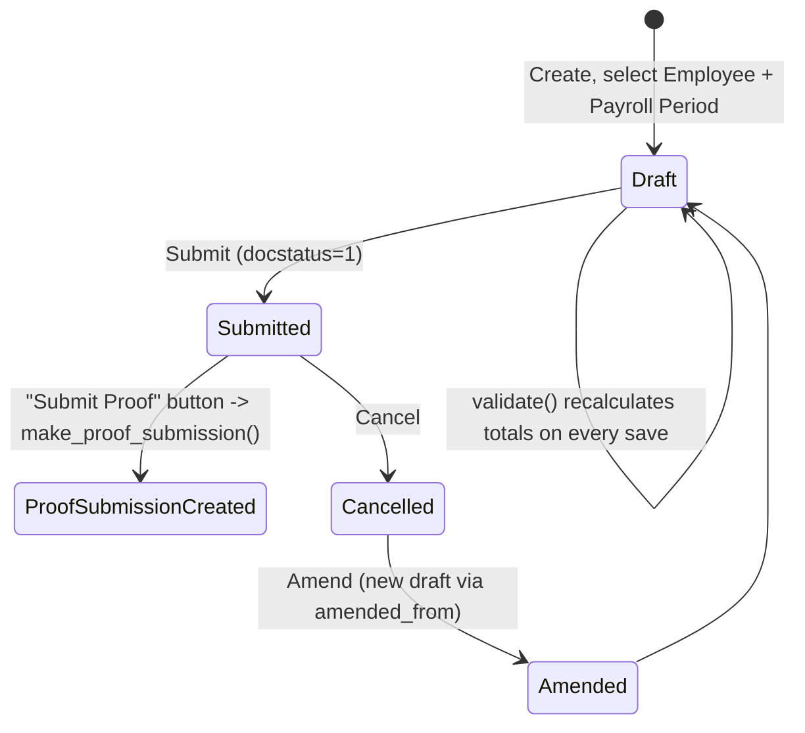

# Employee Tax Exemption Declaration

The employee's up-front, per-payroll-period statement of intended tax-saving investments/expenses (e.g. "I will invest X in PPF, pay Y in insurance premium, and pay Z monthly house rent"), submitted so payroll can withhold income tax correctly across the period instead of under/over-deducting and reconciling only at year-end. It is the input side of the exemption-declaration → proof-submission pair used to compute [[Income Tax Slab]]-based TDS/withholding during payroll runs.

## Key Fields

| Field | Type | Purpose |
|---|---|---|
| `employee` | Link (Employee), required | Whose declaration this is; query restricted to Active employees client-side. |
| `payroll_period` | Link (Payroll Period), required | The period this declaration applies to; combined with `employee` must be unique (enforced in `validate`). |
| `company` | Link (Company) | Fetched from `employee.company`. |
| `currency` | Link (Currency), required | Fetched via `get_employee_currency` call when employee is set. |
| `declarations` | Table ([[Employee Tax Exemption Declaration Category]]) | The actual per-sub-category declared amounts. |
| `total_declared_amount` | Currency, read-only | Sum of all declaration row `amount`s, computed in `set_total_declared_amount()`. |
| `total_exemption_amount` | Currency, read-only | Capped exemption total (per category, then including HRA), computed in `set_total_exemption_amount()` + `calculate_hra_exemption()`. |
| `amended_from` | Link (self) | Standard amendment trail for a submittable doctype. |
| (India regional custom fields) `monthly_house_rent`, `rented_in_metro_city`, `salary_structure_hra`, `annual_hra_exemption`, `monthly_hra_exemption` | Currency/Check | Added by `hrms/regional/india/setup.py` — drive HRA exemption calculation; not present outside India regional install. |

## Relationships

- [[Employee]] — links to (`employee`), and read via `validate_active_employee` which blocks the transaction if the employee's `status` is Inactive.
- [[Payroll Period]] — links to (`payroll_period`); uniqueness of `(employee, payroll_period)` is enforced across non-cancelled documents.
- [[Employee Tax Exemption Declaration Category]] — parent/child (`declarations` table).
- [[Employee Tax Exemption Proof Submission]] — triggers creation of, via the whitelisted `make_proof_submission()` mapped-doc method exposed as a "Submit Proof" button once the declaration is submitted.
- [[Company]] — fetched field, no validation dependency.
- [[Salary Structure Assignment]] — its `get_employee_currency` whitelisted method is called client-side to populate `currency`.

## Logic — What Happens and Why

**Draft → Submit**: `validate()` runs on every save (including before submit):
1. `validate_active_employee(self.employee)` — blocks the document if the employee is Inactive, so exemption declarations can't be created/edited for someone no longer employed.
2. `validate_tax_declaration(self.declarations)` — throws if the same `exemption_sub_category` is chosen more than once in the child table (prevents double-declaring the same instrument).
3. `validate_duplicate_exemption_for_payroll_period(...)` — throws `DuplicateDeclarationError` if another non-cancelled declaration already exists for this `employee` + `payroll_period` (one declaration per employee per period).
4. `set_total_declared_amount()` — sums `declarations[].amount` into `total_declared_amount`.
5. `set_total_exemption_amount()` — calls `get_total_exemption_amount(self.declarations)` (in `hrms/hr/utils.py`), which caps each sub-category's contribution at its `max_amount`, groups by `exemption_category`, caps each category total at the category's `max_amount`, and sums — result stored (precision-rounded) in `total_exemption_amount`.
6. `calculate_hra_exemption()` — if `monthly_house_rent` is set (India-only custom field), calls `calculate_annual_eligible_hra_exemption(self)` (an `@erpnext.allow_regional` hook — **regional override exists**, see `hrms/regional/india/utils.py::calculate_annual_eligible_hra_exemption`). If it returns a value, adds the annual HRA exemption on top of the category-based `total_exemption_amount` and stores `salary_structure_hra`, `annual_hra_exemption`, `monthly_hra_exemption`.

**Submit**: standard Frappe submit (`is_submittable: 1`); once `docstatus == 1`, the form shows a "Submit Proof" button that calls the whitelisted `make_proof_submission(source_name, target_doc)` — a `get_mapped_doc` that creates a new [[Employee Tax Exemption Proof Submission]], mapping each `declarations` row into a `tax_exemption_proofs` row (via `Employee Tax Exemption Declaration Category` → `Employee Tax Exemption Proof Submission Detail`, `add_if_empty=True`), and explicitly excluding `monthly_house_rent`/`monthly_hra_exemption` from being copied (`field_no_map`) since actual HRA proof figures must be entered fresh, not inherited from the declared estimate.

**Cancel/Amend**: standard Frappe cancel/amend via `amended_from` — no custom `on_cancel` logic in the controller.

Why this structure exists: income tax withholding during the year must be estimated from the employee's stated intent (declaration) before actual proof/receipts exist; splitting declaration from proof lets payroll compute provisional TDS from declared amounts, then true it up once the Proof Submission with real evidence is available at year-end (India tax-compliance pattern).

## Roles & Permissions

| Role | Can Do | Notes |
|---|---|---|
| [[System Manager]] | create/read/write/delete/submit/cancel/amend | Full lifecycle control. |
| [[HR Manager]] | create/read/write/delete/submit/cancel/amend | Full lifecycle control. |
| [[HR User]] | create/read/write/delete/submit/cancel/amend | Full lifecycle control, same as HR Manager. |
| [[Employee]] | create/read/write/delete/submit/cancel/amend | Full rights per the DocType permission row — restriction to "only for self" is not enforced in this doctype's JSON (no `if_owner` flag present); if such a restriction exists it would be via a separate permission rule/user-permission setup not visible in this file. |

## Mermaid: State/Flow

