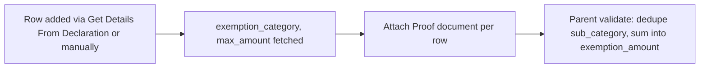

# Employee Tax Exemption Proof Submission Detail

Child table row of [[Employee Tax Exemption Proof Submission]] — one line per sub-category where the employee has now provided actual evidence (receipts/documents) of an investment or expense, as opposed to the earlier declared estimate. It carries the real `amount` and the attached document, and is what the payroll-tax calculation ultimately trusts over the declaration.

## Key Fields

| Field | Type | Purpose |
|---|---|---|
| `exemption_sub_category` | Link (Employee Tax Exemption Sub Category), required | The instrument being proven. |
| `exemption_category` | Read Only, required | Fetched from `exemption_sub_category.exemption_category`. |
| `max_amount` | Currency, read-only, required | Fetched from `exemption_sub_category.max_amount`; cap applied in `get_total_exemption_amount`. |
| `type_of_proof` | Data, required | Free-text description of what kind of document is attached (e.g. "Rent Receipt", "Insurance Premium Receipt"). |
| `amount` | Currency | The actual/proven amount, non-negative. |
| `attach_proof` | Attach | The uploaded evidence document for this specific line (per-row attach button, as opposed to the parent's single `attachments` field). |

## Relationships

- [[Employee Tax Exemption Proof Submission]] — parent/child (this is the `tax_exemption_proofs` table).
- [[Employee Tax Exemption Sub Category]] — links to, via `exemption_sub_category`.
- [[Employee Tax Exemption Category]] — links to indirectly via fetched `exemption_category`.
- [[Employee Tax Exemption Declaration Category]] — linked from (rows are typically populated by mapping from a declaration via `make_proof_submission` / "Get Details From Declaration").

## Logic — What Happens and Why

No controller logic (`employee_tax_exemption_proof_submission_detail.py` is `pass`) — pure data row. Parent-level `validate()` on [[Employee Tax Exemption Proof Submission]] applies the same duplicate-sub-category check (`validate_tax_declaration`) and the same category-capped summation (`get_total_exemption_amount`) as the Declaration doctype, but the sum feeds `total_actual_amount`/`exemption_amount` instead of `total_declared_amount`/`total_exemption_amount`.

Why a per-row attach: statutory proof requirements are per-instrument (a rent receipt proves HRA, an insurance receipt proves 80C-life-insurance) — bundling everything into one parent attachment would lose the association between evidence and the specific exemption line being claimed, which matters for audit/compliance.

## Roles & Permissions

Child table — no standalone `permissions` array (`"permissions": []`). Access follows the parent [[Employee Tax Exemption Proof Submission]] (System Manager, HR Manager, HR User, Employee — full create/write/submit/cancel/amend rights).

## Mermaid: State/Flow

