# Employee Tax Exemption Proof Submission

The evidence-backed follow-up to [[Employee Tax Exemption Declaration]] — where an employee actually submits receipts/documents proving the investments/expenses they earlier declared for a payroll period, so the final, authoritative tax-exempt amount can be computed for accurate income-tax withholding/settlement. This is the doctype payroll trusts for the real (not estimated) exemption figure.

## Key Fields

| Field | Type | Purpose |
|---|---|---|
| `employee` | Link (Employee), required | Whose proof this is; query restricted to Active employees. |
| `payroll_period` | Link (Payroll Period), required | Period this proof applies to; unique per `(employee, payroll_period)`. |
| `submission_date` | Date, default Today, required | When proofs were submitted. |
| `company` | Link (Company), read-only, required | Fetched from `employee.company`. |
| `currency` | Link (Currency), required | Fetched via `get_employee_currency` on employee change. |
| `tax_exemption_proofs` | Table ([[Employee Tax Exemption Proof Submission Detail]]) | The actual per-sub-category proven amounts + attachments. |
| `total_actual_amount` | Currency, read-only | Sum of all proof row amounts (plus India `house_rent_payment_amount` if set), from `set_total_actual_amount()`. |
| `exemption_amount` | Currency, read-only | Final capped exemption total (category caps + HRA), from `set_total_exemption_amount()` + `calculate_hra_exemption()`. |
| `attachments` | Attach | Legacy/fallback single attachment field; hidden in the form unless already populated (`frm.toggle_display`), superseded by per-row `attach_proof`. |
| `amended_from` | Link (self) | Standard amendment trail. |
| (India regional custom fields) `house_rent_payment_amount`, `rented_in_metro_city`, `rented_from_date`, `rented_to_date`, `monthly_house_rent`, `monthly_hra_exemption`, `total_eligible_hra_exemption` | — | Added by `hrms/regional/india/setup.py`; drive the period-prorated HRA exemption calculation. |

## Relationships

- [[Employee]] — links to (`employee`); `validate_active_employee` blocks the transaction for Inactive employees.
- [[Payroll Period]] — links to (`payroll_period`); uniqueness enforced across non-cancelled documents for the same employee.
- [[Employee Tax Exemption Proof Submission Detail]] — parent/child (`tax_exemption_proofs`).
- [[Employee Tax Exemption Declaration]] — linked from: created via that doctype's `make_proof_submission()` mapped-doc ("Submit Proof" button), or pulled in via this form's "Get Details From Declaration" button (`erpnext.utils.map_current_doc` against submitted, matching-company/employee/payroll_period declarations).
- [[Company]], [[Salary Structure Assignment]] — same fetch/whitelisted-call relationships as the Declaration doctype.

## Logic — What Happens and Why

**Draft → Submit**: `validate()`:
1. `validate_active_employee(self.employee)` — same Inactive-employee guard as the Declaration.
2. `validate_tax_declaration(self.tax_exemption_proofs)` — blocks duplicate `exemption_sub_category` rows.
3. `set_total_actual_amount()` — starts from `house_rent_payment_amount` (India field, 0 if absent) and adds every proof row's `amount`.
4. `set_total_exemption_amount()` — `get_total_exemption_amount(self.tax_exemption_proofs)` applies the same per-sub-category/per-category capping logic as the Declaration, writing the result into `exemption_amount`.
5. `calculate_hra_exemption()` — if `house_rent_payment_amount` is set, calls `calculate_hra_exemption_for_period(self)` (`@erpnext.allow_regional` — **regional override exists**, see `hrms/regional/india/utils.py::calculate_hra_exemption_for_period`, which internally re-derives `calculate_annual_eligible_hra_exemption` and adjusts for the actual rented period/eligible months). Adds `total_eligible_hra_exemption` on top of `exemption_amount` and records `monthly_hra_exemption`/`monthly_house_rent`.
6. `validate_duplicate_exemption_for_payroll_period(...)` — throws `DuplicateDeclarationError` if another non-cancelled Proof Submission already exists for this employee+period.

**Data entry conveniences (client-side, `employee_tax_exemption_proof_submission.js`)**:
- "Get Details From Declaration" button (visible while draft) uses `erpnext.utils.map_current_doc` to pull rows from a submitted Declaration matching company/employee/payroll_period, calling the same server-side `make_proof_submission` mapper.
- Attachments section is hidden unless already populated, since per-row `attach_proof` on each detail line is the primary way to attach evidence.

**Submit/Cancel/Amend**: standard Frappe lifecycle (`is_submittable: 1`), no custom `on_submit`/`on_cancel` in the controller — the submitted proof's `exemption_amount` is the figure downstream payroll/tax reporting is expected to consume.

Why: separating proof from declaration lets the system distinguish "what the employee said they'd do" (used for provisional withholding) from "what they actually did and can document" (used for final reconciliation) — a standard requirement of India's income-tax TDS compliance regime, where employers must reconcile declared vs. proven exemptions before year-end Form 16 issuance.

## Roles & Permissions

| Role | Can Do | Notes |
|---|---|---|
| [[System Manager]] | create/read/write/delete/submit/cancel/amend | Full lifecycle control. |
| [[HR Manager]] | create/read/write/delete/submit/cancel/amend | Full lifecycle control. |
| [[HR User]] | create/read/write/delete/submit/cancel/amend | Full lifecycle control, same as HR Manager. |
| [[Employee]] | create/read/write/delete/submit/cancel/amend | Full rights per DocType permission row; no `if_owner` restriction present in JSON, so "only for self" is not enforced in code at the doctype-permission level. |

## Mermaid: State/Flow

```mermaid
stateDiagram-v2
    [*] --> Draft: Create (manually or via "Submit Proof" from Declaration)
    Draft --> Draft: Get Details From Declaration; validate() recalculates totals
    Draft --> Submitted: Submit (docstatus=1)
    Submitted --> Cancelled: Cancel
    Cancelled --> Amended: Amend (new draft via amended_from)
    Amended --> Draft
```

