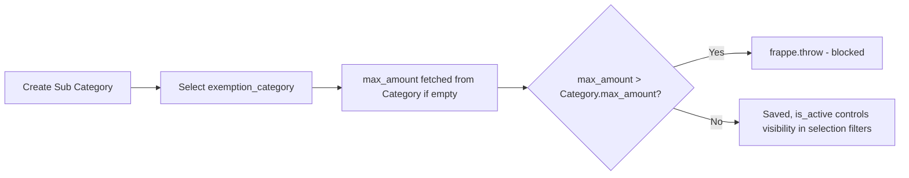

# Employee Tax Exemption Sub Category

Represents a specific instrument or expense head within a statutory exemption category (e.g. "Life Insurance Premium" or "PPF" under Section 80C). This is the actual line item employees pick when declaring or proving a tax-saving investment — the category itself is too coarse to select against, so this doctype is the real selectable unit throughout the declaration/proof flow.

## Key Fields

| Field | Type | Purpose |
|---|---|---|
| `exemption_category` | Link (Employee Tax Exemption Category) | Parent statutory category this sub-category rolls up to; required. |
| `max_amount` | Currency | Ceiling for this specific sub-category; `fetch_from`/`fetch_if_empty` from the parent category's `max_amount`, but can be overridden lower — validated in `validate()` to never exceed the parent's `max_amount`. |
| `is_active` | Check | Controls whether this sub-category appears in the active-only filtered Link queries used on [[Employee Tax Exemption Declaration]] and [[Employee Tax Exemption Proof Submission]] child tables. |
| `description` | Small Text | Explanatory text for the employee. |

## Relationships

- [[Employee Tax Exemption Category]] — links to (parent, via `exemption_category`), triggers a `max_amount` fetch and a validation constraint.
- [[Employee Tax Exemption Declaration Category]] — linked from (each declaration row selects an `exemption_sub_category`).
- [[Employee Tax Exemption Proof Submission Detail]] — linked from (each proof row selects an `exemption_sub_category`).

## Logic — What Happens and Why

`validate()` in `employee_tax_exemption_sub_category.py`:
1. Reads the parent `Employee Tax Exemption Category.max_amount` via `frappe.db.get_value`.
2. If this sub-category's `max_amount` is greater than the parent category's `max_amount`, throws: "Max Exemption Amount cannot be greater than maximum exemption amount {0} of Tax Exemption Category {1}".

Why: a sub-category is a subset of its parent category's statutory allowance, so its individual ceiling can never exceed the category-wide ceiling — this keeps the two-level cap hierarchy internally consistent at data-entry time, before the runtime aggregation logic (`get_total_exemption_amount` in `hrms/hr/utils.py`) even runs.

No submit/cancel lifecycle — this is a plain master doctype (`is_submittable` not set).

## Roles & Permissions

| Role | Can Do | Notes |
|---|---|---|
| [[System Manager]] | read/write/create/delete | Full control. |
| [[HR Manager]] | read/write/create/delete | Full control. |
| [[HR User]] | read/write/create/delete | Full control — identical rights to HR Manager. |

No `Employee` role — employees only select sub-categories via Link fields on declarations/proofs, never edit the master.

## Mermaid: State/Flow

