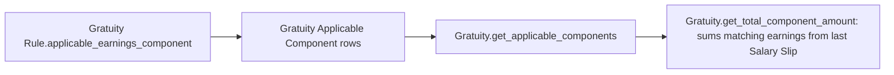

# Gratuity Applicable Component

A single row identifying one Salary Component that counts toward an employee's "qualifying earnings" for gratuity purposes (e.g. Basic Pay, but not a reimbursement or a one-off bonus). It exists because gratuity is legally/contractually calculated only against certain parts of pay, and this table lets each [[Gratuity Rule]] declare exactly which components apply.

## Key Fields

| Field | Type | Purpose |
|---|---|---|
| `salary_component` | Link (Salary Component) | The earning component considered part of the gratuity base. |

## Relationships

- [[Gratuity Rule]] — parent, via the Table MultiSelect field `applicable_earnings_component`.
- [[Salary Component]] — linked from; the rule's description notes the component "should be part of the Salary Structure" (not enforced in code — only a UI hint).
- [[Gratuity]] — read indirectly: `get_applicable_components()` fetches all rows where `parent = gratuity_rule`, then `get_total_component_amount()` sums the matching earning rows from the employee's last [[Salary Slip]].

## Logic — What Happens and Why

Pure data/child-table doctype (`gratuity_applicable_component.py` has no overrides beyond the stock Document class). No validation, no lifecycle. All meaning comes from how [[Gratuity]] consumes it: if no rows exist for a rule, or none of them are present in the employee's last submitted Salary Slip earnings, Gratuity's calculation throws (`No applicable Earning components found...` / `No applicable Earning component found in last salary slip...`).

## Roles & Permissions

| Role | Can Do | Notes |
|---|---|---|
| — | — | No `permissions` entries; access follows the parent [[Gratuity Rule]]. |

## Mermaid: State/Flow

