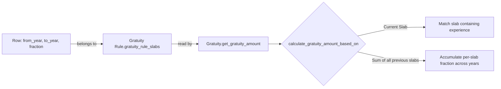

# Gratuity Rule Slab

A single row in a [[Gratuity Rule]]'s slab table: a year-of-service range paired with the fraction of qualifying earnings paid per year for service that falls in that range. It exists because gratuity formulas are almost always tiered (e.g. "0.5x salary/year for years 1–5, 1x salary/year beyond that"), and this child table is the data structure that encodes those tiers.

## Key Fields

| Field | Type | Purpose |
|---|---|---|
| `from_year` | Int (read-only in UI) | Lower bound (inclusive) of the slab's service-year range; 0 with `to_year` also 0 means "no lower/upper bound." |
| `to_year` | Int | Upper bound (inclusive) of the range; 0 means "no upper limit." |
| `fraction_of_applicable_earnings` | Float | Multiplier applied to the qualifying earnings total per year of service within this slab. |

## Relationships

- [[Gratuity Rule]] — parent; this is a pure child table (`istable: 1`), no independent lifecycle or permissions of its own.
- [[Gratuity]] — read indirectly via `Gratuity.get_gratuity_rule_slabs()`, which pulls these rows (filtered by `parent = gratuity_rule`, ordered by `idx`) to drive the amount calculation.

## Logic — What Happens and Why

No controller logic of its own (`gratuity_rule_slab.py` is the stock Frappe `Document` boilerplate with no overrides). All validation of slab consistency (overlapping/inverted ranges) happens in the parent [[Gratuity Rule]]'s `validate()`. All consumption logic (slab selection for "Current Slab" vs. accumulation for "Sum of all previous slabs") happens in [[Gratuity]]'s `get_gratuity_amount()`.

## Roles & Permissions

| Role | Can Do | Notes |
|---|---|---|
| — | — | No `permissions` entries in the JSON; access is entirely governed by the parent [[Gratuity Rule]] document's permissions. |

## Mermaid: State/Flow

