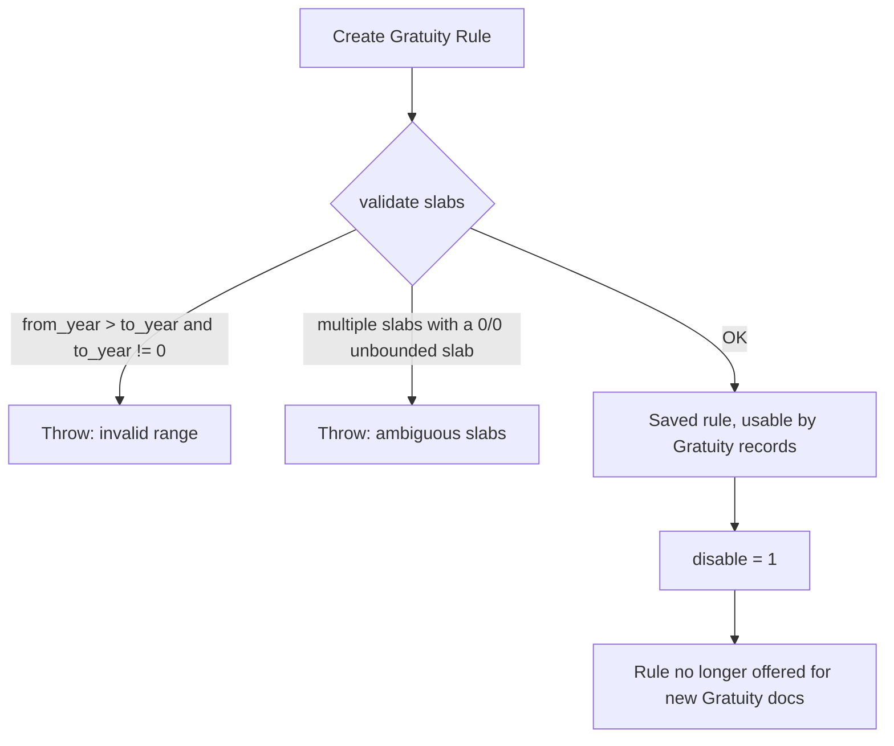

# Gratuity Rule

A named, reusable policy definition for how gratuity is calculated — the calculation basis (current slab vs. cumulative), the minimum qualifying tenure, how work experience itself is derived, and the slab table of year-ranges and payout fractions. It exists so gratuity math (which varies by country law and by company policy) is configured once as data rather than hardcoded, and so region-specific presets (India, UAE) can be seeded as fixtures and picked per-company or per-employee at Gratuity creation time.

## Key Fields

| Field | Type | Purpose |
|---|---|---|
| `name` (autoname: Prompt) | — | User-chosen rule name, e.g. "Indian Standard Gratuity Rule". |
| `disable` | Check | Deactivates the rule without deleting it. |
| `calculate_gratuity_amount_based_on` | Select | "Current Slab" (whole tenure valued at the slab the employee currently sits in) or "Sum of all previous slabs" (progressive, per-slab-year accumulation). |
| `work_experience_calculation_function` | Select | "Round off Work Experience" / "Take Exact Completed Years" / "Manual" — controls how [[Gratuity]] derives `current_work_experience`. |
| `total_working_days_per_year` | Float | Divisor used to turn worked days into years (default 365). |
| `minimum_year_for_gratuity` | Int | Minimum completed years of service required before any gratuity is payable. |
| `applicable_earnings_component` | Table MultiSelect (Gratuity Applicable Component) | Which Salary Slip earning components form the gratuity base amount. |
| `gratuity_rule_slabs` | Table (Gratuity Rule Slab) | The year-range → fraction table driving the payout formula. |

## Relationships

- [[Gratuity]] — linked from; a Gratuity record's entire calculation is driven by the referenced rule (`gratuity_settings` property, `get_gratuity_rule_slabs`, `get_applicable_components`).
- [[Gratuity Rule Slab]] — parent/child (Table field `gratuity_rule_slabs`).
- [[Gratuity Applicable Component]] — parent/child (Table MultiSelect field `applicable_earnings_component`); duplicated conceptually as its own child rows queried directly by parent name in Gratuity's `get_applicable_components`.
- [[Salary Component]] — indirectly, through Gratuity Applicable Component rows (must be part of the employee's [[Salary Structure]] per the field description).
- Regional setup — hrms/regional/india/setup.py `create_gratuity_rule_for_india()` (~line 262) creates "Indian Standard Gratuity Rule" with `minimum_year_for_gratuity=5`, "Current Slab" basis. hrms/regional/united_arab_emirates/setup.py `create_gratuity_rules_for_uae()` (~line 11) creates several UAE-specific rules with `minimum_year_for_gratuity=1` and mixed calculation bases. Regional override exists — full deep-dive owned by another agent.

## Logic — What Happens and Why

**Validate (`validate()`):** for every row in `gratuity_rule_slabs`:
- Throws if `from_year > to_year` (unless `to_year == 0`, which is the "no upper limit" sentinel) — a slab can't have an inverted range.
- Throws if more than one slab is defined while any slab has both `from_year == 0` and `to_year == 0` — that combination means "applies to all years, no bounds," which is only meaningful as the sole slab; combining it with others would create ambiguous overlapping coverage.

**Helper `get_gratuity_rule(name, slabs, **args)`:** a programmatic constructor (used by tests/fixtures) that builds an in-memory Gratuity Rule document with a default `minimum_year_for_gratuity = 1` and appends the given slab dicts — not part of the normal UI flow but the mechanism regional setup scripts use to seed rules.

There is no submit/cancel lifecycle — this is a plain (non-submittable) configuration doctype; its only enforcement is the slab-consistency check above, run on every save.

## Roles & Permissions

| Role | Can Do | Notes |
|---|---|---|
| [[HR Manager]] | read/write/create/delete | Configuration-level access. |
| [[HR User]] | read/write/create/delete | Same as HR Manager per JSON — no differentiation. |

## Mermaid: State/Flow

