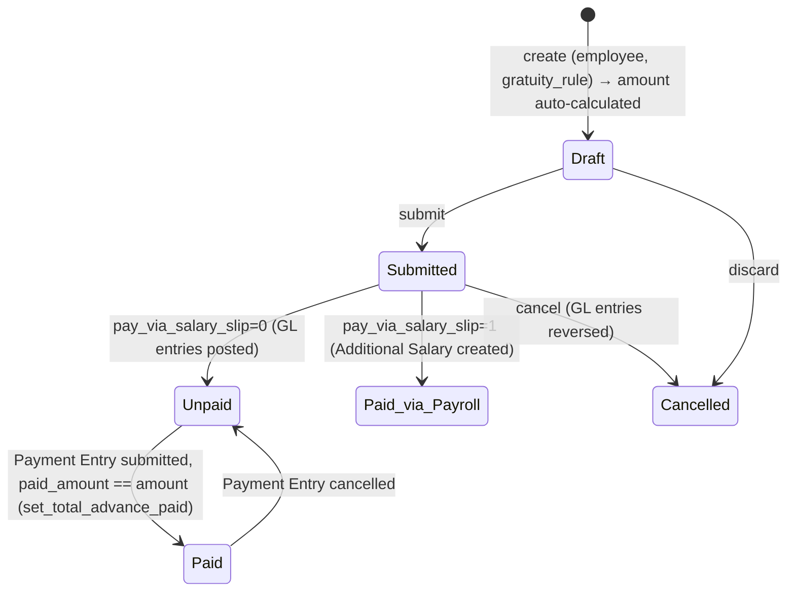

# Gratuity

Calculates and pays out the statutory/contractual end-of-service gratuity owed to an employee (typically on relieving), based on a configurable [[Gratuity Rule]] and the employee's completed work experience. It exists because gratuity is a legally mandated or contractually defined lump-sum benefit in many jurisdictions (India's Payment of Gratuity Act, UAE end-of-service gratuity, etc.) whose calculation — slab-based fractions of qualifying earnings per year of service — is complex enough to need its own engine, and because the payout must be tracked as a payable liability (or routed through payroll) with its own accounting/audit trail.

## Key Fields

| Field | Type | Purpose |
|---|---|---|
| `employee` | Link (Employee) | Recipient. |
| `gratuity_rule` | Link (Gratuity Rule) | Defines the slab/experience/rounding logic used. |
| `current_work_experience` | Float | Auto-calculated (or manually entered if the rule's method is "Manual") years of service used for slab lookup. |
| `amount` | Currency | Computed total gratuity amount (read-only). |
| `status` | Select | Draft / Unpaid / Paid / Submitted / Cancelled — auto-managed. |
| `pay_via_salary_slip` | Check | If set, gratuity is paid as an Additional Salary earning in a future Salary Slip; if unset, it's posted as a GL payable/expense and settled via Payment Entry. |
| `payroll_date` / `salary_component` | Date / Link | Required only when `pay_via_salary_slip` is set. |
| `expense_account` / `payable_account` / `mode_of_payment` | Link | Required only when `pay_via_salary_slip` is unset — direct accounting route. |
| `paid_amount` | Currency | Tracks payments received against this Gratuity via the Advance Payment Ledger (non-salary-slip route). |
| `cost_center` | Link (Cost Center) | GL cost center for the direct-accounting route. |

## Relationships

- [[Employee]] — linked from; joining/relieving dates and Attendance/Leave records used in experience calculation.
- [[Gratuity Rule]] — linked from; supplies calculation method, minimum eligible years, slab basis.
- [[Gratuity Rule Slab]] — read (via `frappe.get_all` filtered by `parent = gratuity_rule`) to walk slab fractions.
- [[Gratuity Applicable Component]] — read to determine which Salary Slip earning components count toward the gratuity base amount.
- [[Salary Slip]] — the employee's most recent submitted slip supplies the "applicable earnings" total used in the calculation (`get_last_salary_slip`).
- [[Attendance]] — queried for "On Leave"/"Absent" days (depending on `Payroll Settings.payroll_based_on`) to net out non-working days from total tenure.
- [[Leave Type]] — LWP-flagged leave types are used to filter qualifying "On Leave" attendance rows.
- [[Additional Salary]] — triggers: created and submitted on submit when `pay_via_salary_slip` is set.
- GL Entry / Payment Ledger Entry / Advance Payment Ledger Entry — triggers: GL entries created/reversed via `create_gl_entries` when not paid via salary slip; ignored-on-cancel for those ledger types.
- Payment Entry — linked from indirectly: `hrms/overrides/employee_payment_entry.py`'s `get_payment_entry_for_employee` builds a Payment Entry against a Gratuity's `payable_account`/`amount`/`paid_amount` when the "Create Payment Entry" button is used (only visible when submitted, not paid via salary slip, and status is Unpaid).
- hrms/hooks.py — `advance_payment_payable_doctypes = ["Leave Encashment", "Gratuity", "Employee Advance"]` (hrms/hooks.py:281) registers Gratuity as a doctype the core Advance Payment Ledger mechanism understands, enabling the "Create Payment Entry" / advance-reconciliation flow for it. `audit_trail_doctypes = [..., "Gratuity"]` (hrms/hooks.py:297) enrolls Gratuity in the framework's audit trail feature.
- Regional override: hrms/regional/india/setup.py (`create_gratuity_rule_for_india`, lines ~262-276) auto-creates an "Indian Standard Gratuity Rule" (5-year minimum, slab-based) fixture. hrms/regional/united_arab_emirates/setup.py (`create_gratuity_rules_for_uae`, lines ~8-50+) auto-creates multiple UAE gratuity rule presets (1-year minimum, both "Sum of all previous slabs" and "Current Slab" bases). Full regional deep-dive owned by another agent.

## Logic — What Happens and Why

**Validate (`validate()`):** recomputes `current_work_experience` and `amount` every time via `calculate_work_experience_and_amount()`, then `set_status()` — so the amount is always live to the current rule/slip/attendance data until submission locks it in.

**`calculate_work_experience_and_amount()`** (also whitelisted, called from the client on employee/gratuity_rule change):
- If the rule's `work_experience_calculation_function` is "Manual", uses the user-entered `current_work_experience` as-is.
- Otherwise calls `get_work_experience()`: computes total calendar days between `date_of_joining` and `relieving_date` (throws if relieving date isn't set — gratuity can't be finalized for an active employee), subtracts non-working days (On-Leave-with-LWP days or Absent days, depending on `Payroll Settings.payroll_based_on`), divides by the rule's `total_working_days_per_year`, then rounds per the rule ("Round off Work Experience" rounds to nearest int; otherwise keeps float precision). Throws if the result is below the rule's `minimum_year_for_gratuity` — an employee who hasn't served long enough is not eligible at all.
- `get_gratuity_amount(experience)`: fetches the rule's slabs (ordered by idx) and the total qualifying earning-component amount from the employee's last submitted Salary Slip (`get_total_component_amount`, restricted to components listed in Gratuity Applicable Component; throws if none found in that slip). Then, depending on `calculate_gratuity_amount_based_on`:
  - **"Current Slab"** — finds the single slab whose from/to-year range contains the experience value and applies `total_component_amount * experience * slab.fraction_of_applicable_earnings` (the whole tenure is valued at the current slab's rate).
  - **"Sum of all previous slabs"** — walks slabs in order, applying each slab's fraction to the years actually spent within that slab's range and summing across slabs (progressive/graduated calculation), with special-case handling for an unbounded single "no limit" slab.
  - Throws if no slab matches the experience at all (`No applicable slab found`).

**Status (`set_status`)**: derived purely from `docstatus` plus, when submitted, whether `paid_amount` equals `amount` (precision-aware) — Draft (0) / Cancelled (2) / Submitted→"Paid" if fully paid else "Unpaid" (1).

**Submit (`on_submit`):**
- If `pay_via_salary_slip` — `create_additional_salary()` builds and submits an Additional Salary (non-overwrite Earning) dated `payroll_date`, referencing this Gratuity — the amount then flows into the employee's regular payroll run.
- Else — `create_gl_entries()` posts a credit to `payable_account` and a debit to `expense_account` for `amount`, against the Employee as party — a direct liability entry outside payroll, to be settled by Payment Entry.

**Cancel (`on_cancel`):** reverses the GL entries (`create_gl_entries(cancel=True)`, ignoring linked GL/Payment Ledger/Advance Payment Ledger docs so cancellation isn't blocked by those), then recomputes status.

**`set_total_advance_paid()`**: recalculates `paid_amount` from the Advance Payment Ledger Entry total tied to this Gratuity (absolute sum, undelinked entries only) whenever a Payment Entry against it is submitted/cancelled; throws if paid exceeds the total amount; then re-derives status — this is what flips status from Unpaid to Paid once fully settled through Payment Entry.

**Discard (`on_discard`):** force-sets status to "Cancelled" if a draft is discarded.

## Roles & Permissions

| Role | Can Do | Notes |
|---|---|---|
| [[HR Manager]] | read/write/create/delete | No submit/cancel permission listed in the JSON's `permissions` array despite `is_submittable: 1` — submission would need to come from a role with that grant elsewhere (e.g. System Manager by default) or this is a gap in the fixture; not enforced beyond what's shown. |
| [[HR User]] | read/write/create/delete | Same as HR Manager — no submit right listed. |

## Mermaid: State/Flow

