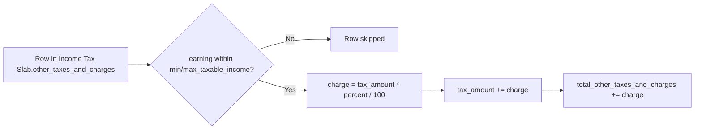

# Income Tax Slab Other Charges

Child table row of [[Income Tax Slab]] representing an additional percentage-based charge layered on top of the computed base tax (and surcharge) — e.g. education cess or health-and-education cess — that only applies within a specified taxable-income range. It exists so jurisdictions that stack multiple compounding levies on income tax (rather than a single flat slab table) can model each levy as its own conditional percentage rule.

## Key Fields

| Field | Type | Purpose |
|---|---|---|
| `description` | Data, required | Label for the charge (e.g. "Health and Education Cess"). |
| `percent` | Percent, required | Rate applied to the running `tax_amount` (not to the raw earning) if the income falls in range. |
| `min_taxable_income` | Currency | Row only applies if `annual_taxable_earning >= min_taxable_income` (when set). |
| `max_taxable_income` | Currency | Row only applies if `annual_taxable_earning <= max_taxable_income` (when set). |

## Relationships

- [[Income Tax Slab]] — parent/child (`other_taxes_and_charges` table).

## Logic — What Happens and Why

No controller logic (`income_tax_slab_other_charges.py` is `pass`) — pure data row. Consumed by `hrms.payroll.doctype.income_tax_slab.income_tax_slab.calculate_other_charges(tax_amount, annual_taxable_earning, tax_slab)`:
1. For each row, skip if `min_taxable_income` is set and the earning is below it, or if `max_taxable_income` is set and the earning is above it.
2. Otherwise compute `tax_amount * percent / 100`, add it to the running `tax_amount` (so charges compound on top of each other and on top of the base+surcharge tax, in table order), and accumulate the total into `total_other_taxes_and_charges`.
3. Returns the updated `tax_amount` and the total charges, which `calculate_tax_by_tax_slab` adds to the surcharge amount as the second element of its return tuple.

Why compounding-on-tax rather than on-income: statutory cess/surcharge levies are typically defined as "a percentage of the tax payable," not a percentage of income, so this mirrors real tax-computation order (income → base tax via slabs → surcharge → cess on the resulting tax).

## Roles & Permissions

Child table — no standalone `permissions` array (`"permissions": []`). Access follows the parent [[Income Tax Slab]] (System Manager, HR Manager, HR User — full submit/cancel/amend rights).

## Mermaid: State/Flow

