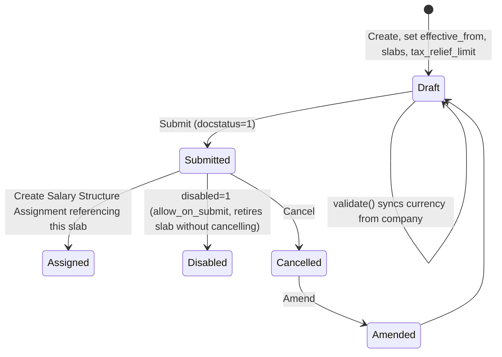

# Income Tax Slab

The configurable income-tax rate table (progressive slabs, surcharges, standard deduction, tax-relief threshold) that payroll applies to an employee's annualized taxable earnings to compute periodic TDS/income-tax deduction. It is assigned to an employee via [[Salary Structure Assignment]] and lets each company/jurisdiction (and each budget year, since it's `is_submittable` and dated by `effective_from`) define its own tax regime without changing code.

## Key Fields

| Field | Type | Purpose |
|---|---|---|
| `effective_from` | Date, required | Slab becomes applicable to salary structure assignments from this date onward. |
| `disabled` | Check, `allow_on_submit` | Retires a slab (e.g. superseded by a new year's slab) even after submission. |
| `company` | Link (Company) | Optional company scoping; when set, `currency` is force-set to the company's currency in `validate()`. |
| `currency` | Link (Currency), required | Fetched from `company.default_currency`; determines what currency the slab amounts are denominated in. |
| `allow_tax_exemption` | Check | If enabled, [[Employee Tax Exemption Declaration]]/[[Employee Tax Exemption Proof Submission]] amounts are factored into the taxable-earning calculation for employees on this slab. |
| `standard_tax_exemption_amount` | Currency | Flat standard deduction subtracted from taxable income before slab calculation (consumed by payroll's annual taxable earning computation, outside this doctype). |
| `tax_relief_limit` | Currency | If annual taxable earning is at or below this, tax is zero (`calculate_tax_by_tax_slab` returns `0, 0` immediately). |
| `slabs` | Table ([[Taxable Salary Slab]]) | The progressive rate bands, required. |
| `other_taxes_and_charges` | Table ([[Income Tax Slab Other Charges]]) | Additional percentage-based charges (e.g. cess) layered on top of the base+surcharge tax. |
| `amended_from` | Link (self) | Standard amendment trail. |
| `marginal_relief_limit` (India regional custom field) | Currency | Added by `hrms/regional/india/setup.py`; caps where marginal relief can apply, only shown when `tax_relief_limit > 0` and `currency == 'INR'`. |

## Relationships

- [[Taxable Salary Slab]] — parent/child (`slabs` table).
- [[Income Tax Slab Other Charges]] — parent/child (`other_taxes_and_charges` table).
- [[Company]] — links to (`company`), drives `currency`.
- [[Salary Structure Assignment]] — linked from (an assignment references an Income Tax Slab by name; a "Create > Salary Structure Assignment" quick-create button appears on a submitted slab, pre-filling `income_tax_slab`).
- [[Employee Tax Exemption Declaration]] / [[Employee Tax Exemption Proof Submission]] — linked from conceptually: when `allow_tax_exemption` is enabled, their `total_exemption_amount`/`exemption_amount` reduce the taxable earning fed into this slab's calculation (that reduction happens in payroll salary-slip logic, not in this file).

## Logic — What Happens and Why

**validate()**: if `company` is set, forces `self.currency = erpnext.get_company_currency(self.company)` — keeps the slab's currency consistent with its owning company rather than trusting a stale fetched value.

**Module-level tax calculation (called from payroll, not a doc-event)**:
- `calculate_tax_by_tax_slab(annual_taxable_earning, tax_slab, ...)`:
  1. If `annual_taxable_earning <= tax_slab.tax_relief_limit` → return `(0, 0)` — no tax at all below the relief threshold.
  2. `calculate_base_tax_from_tax_slabs()` — iterates `tax_slab.slabs` in order; for each slab row, evaluates an optional Python `condition` (via `safe_eval`, e.g. gender/age/date-of-birth-based slab differences) and skips the row if the condition is false; otherwise computes `(min(earning, to_amount) - from_amount + 1) * percent_deduction / 100` and accumulates. An open-ended top slab (`to_amount` empty) taxes everything above `from_amount` at that row's percent.
  3. `calculate_tax_with_marginal_relief()` (`@erpnext.allow_regional` on the underlying `hrms.hr.utils` hook) — **regional override exists**: `hrms/regional/india/utils.py::calculate_tax_with_marginal_relief` recalculates tax as if income were at the tax-free threshold plus the excess, to avoid a scenario where earning slightly over a threshold pays disproportionately more tax than earning at the threshold; only applies if a `tax_with_marginal_relief` value is returned.
  4. `apply_surcharge_with_marginal_relief()` (`@erpnext.allow_regional`, default no-op returning `(tax_amount, 0)`) — regional installs can add surcharge slabs with their own marginal-relief smoothing on top of the base tax.
  5. `calculate_other_charges()` — iterates `other_taxes_and_charges`, applying each row's `percent` (skipping rows where `annual_taxable_earning` falls outside `min_taxable_income`/`max_taxable_income`) as `tax_amount * percent / 100`, compounding onto `tax_amount`, and returning the total added.
  6. Returns `(tax_amount, surcharge + other_taxes)`.

**condition evaluation** (`eval_tax_slab_condition`): uses `frappe.safe_eval` with a restricted globals dict (`int`, `float`, `date`, `getdate`, `get_first_day`, `get_last_day`) plus caller-supplied `eval_locals` (e.g. `date_of_birth`, `gender`, salary component values) — lets HR encode age/gender/component-based tax rules declaratively per slab row instead of in code, per the in-form HTML examples field (`html_6`).

Why this structure exists: tax law changes yearly and differs by jurisdiction/company; representing the whole tax regime (base slabs + relief threshold + surcharge + cess + conditional rules) as submittable, dated, versionable documents lets HR update tax policy without a code deployment, and `is_submittable`+`amended_from` gives an audit trail of every tax-year's exact rules.

## Roles & Permissions

| Role | Can Do | Notes |
|---|---|---|
| [[System Manager]] | create/read/write/delete/submit/cancel/amend | Full lifecycle control. |
| [[HR Manager]] | create/read/write/delete/submit/cancel/amend | Full lifecycle control. |
| [[HR User]] | create/read/write/delete/submit/cancel/amend | Full lifecycle control, same as HR Manager. |

No `Employee` role — employees never directly interact with tax slab configuration.

## Mermaid: State/Flow

