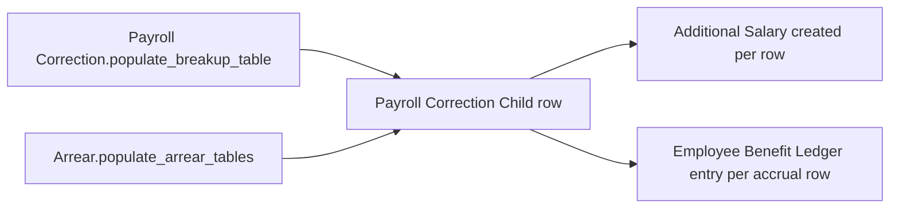

# Payroll Correction Child

A single component/amount pair used inside the earning, deduction, and accrual arrear breakup tables of both [[Payroll Correction]] and [[Arrear]]. It exists as one shared child-table shape so both doctypes (LWP-reversal corrections and structure-change back-pay) can express "this salary component owes this much" identically, letting [[Arrear]] read [[Payroll Correction]]'s historical rows (and vice versa, conceptually) without a schema mismatch.

## Key Fields

| Field | Type | Purpose |
|---|---|---|
| `salary_component` | Link (Salary Component) | Which component the arrear/correction amount applies to. |
| `amount` | Float (non-negative) | The computed arrear/correction amount for that component. |

## Relationships

- [[Payroll Correction]] — parent, via `earning_arrears`, `deduction_arrears`, `accrual_arrears` Table fields.
- [[Arrear]] — parent, via the identically-named `earning_arrears`, `deduction_arrears`, `accrual_arrears` Table fields (same child doctype reused).
- [[Salary Component]] — linked from.
- [[Additional Salary]] — read by both parents' `create_additional_salary()` to build one Additional Salary per row.
- [[Employee Benefit Ledger]] — read by both parents' `create_benefit_ledger_entry()` for accrual rows.

## Logic — What Happens and Why

Pure data child table (`payroll_correction_child.py` has no overrides). All computation of these rows happens in the parent doctypes: [[Payroll Correction]]'s `populate_breakup_table()` (per-day amount × days_to_reverse) and [[Arrear]]'s `populate_arrear_tables()` (new-structure amount minus existing-slip amount). All downstream consumption (Additional Salary creation, Benefit Ledger posting) also happens in the parent controllers.

## Roles & Permissions

| Role | Can Do | Notes |
|---|---|---|
| — | — | No `permissions` entries; access follows whichever parent document ([[Payroll Correction]] or [[Arrear]]) contains the row. |

## Mermaid: State/Flow

