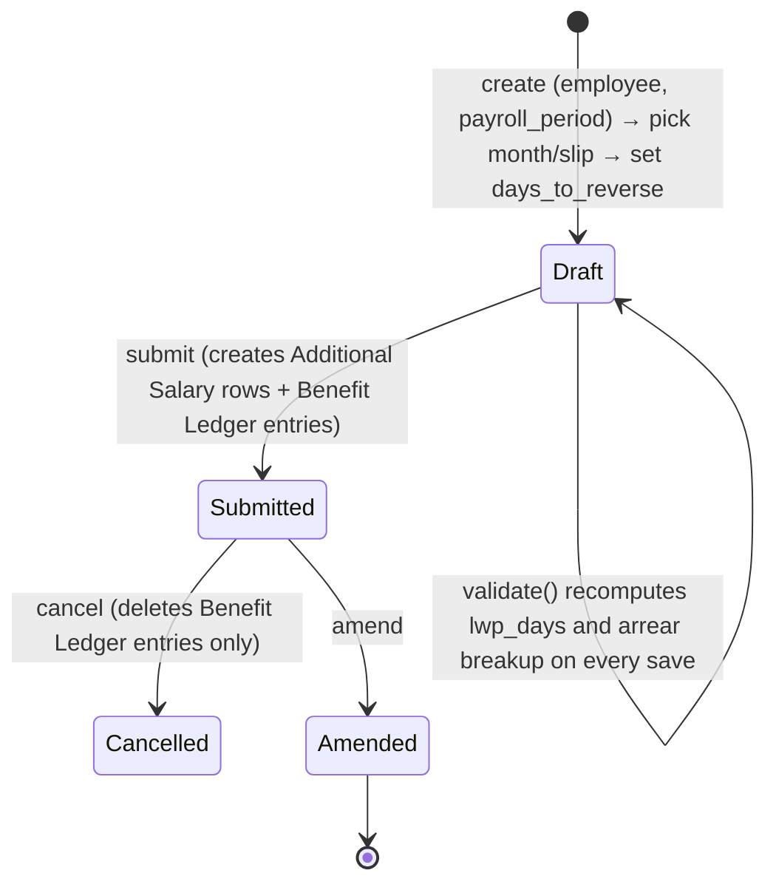

# Payroll Correction

Reverses Leave-Without-Pay (LWP) deductions that were applied to an already-submitted Salary Slip — e.g. when leave is regularized or an attendance error is corrected after payroll has run — by calculating what the arrear-flagged components would have been worth for the reversed days and paying that amount forward via Additional Salary. It exists because submitted Salary Slips can't be edited directly; this doctype is the sanctioned "fix a past payroll mistake without reopening it" mechanism, scoped specifically to LWP-day reversals (as opposed to [[Arrear]], which is scoped to structure-change back-pay).

## Key Fields

| Field | Type | Purpose |
|---|---|---|
| `employee` | Link (Employee) | Whose slip is being corrected. |
| `payroll_period` | Link (Payroll Period) | Scopes which slips are eligible for selection. |
| `month_for_lwp_reversal` | Select (dynamic options) | Client-side picker populated from slips with LWP in the period; drives `salary_slip_reference` and day counts. |
| `salary_slip_reference` | Link (Salary Slip) | The specific submitted slip being corrected. |
| `working_days` / `payment_days` / `lwp_days` | Float (read-only) | Pulled from the selected slip; `lwp_days = working_days - payment_days`. |
| `days_to_reverse` | Float | How many LWP days to reverse; must be > 0 and cannot exceed remaining unreversed LWP days for that slip (across other Payroll Corrections). |
| `payroll_date` | Date | Date the resulting Additional Salary/arrear components are posted for. |
| `earning_arrears` / `deduction_arrears` / `accrual_arrears` | Table (Payroll Correction Child) | Computed component/amount breakdown for the reversed days. |

## Relationships

- [[Employee]] — linked from.
- [[Salary Slip]] — linked from via `salary_slip_reference`; its earning/deduction/accrued_benefits rows are the source for `populate_breakup_table`.
- [[Salary Component]] — only components flagged `arrear_component` (and, for earnings/deductions, not `variable_based_on_taxable_salary`) are included.
- [[Additional Salary]] — triggers: one created and submitted per earning/deduction arrear row on submit.
- [[Employee Benefit Ledger]] — triggers: one accrual entry per accrual arrear row on submit; deleted on cancel via `delete_employee_benefit_ledger_entry`.
- [[Payroll Period]] — linked from; scopes slip lookup.
- [[Arrear]] — sibling consumer of the same [[Payroll Correction Child]] child-table doctype and referenced by Arrear's `fetch_existing_payroll_corrections` (so a slip already corrected here isn't double-arreared by a later structure-change Arrear).

## Logic — What Happens and Why

**Validate (`validate()`):**
- `days_to_reverse` must be > 0.
- `validate_days` — recomputes `working_days`/`payment_days`/`lwp_days` fresh from the referenced Salary Slip, then sums `days_to_reverse` across all *other* submitted Payroll Corrections for the same employee/payroll period/salary slip and throws if the new total would exceed the slip's actual `lwp_days` — you cannot reverse more LWP days than were actually deducted, even across multiple correction documents.
- `populate_breakup_table` — rebuilds the three arrear child tables from scratch each time:
  - Reads the referenced slip's earnings/deductions (skipping any row already tied to an Additional Salary — those aren't structure-driven pay) and accrued_benefits, keyed by salary component.
  - Filters to components flagged `arrear_component=1`, not `variable_based_on_taxable_salary`, not `disabled`.
  - For each, computes a per-day amount (`default_amount / total_working_days`, or `default_amount / payment_days` for accrual components) and multiplies by `days_to_reverse` to get the arrear amount, rounded to the slip's currency precision — this is the "what those reversed days would have earned" calculation.
  - Warns (does not block) if no arrear components are found on the slip at all.

**Submit (`on_submit`):**
- `validate_arrear_details` — requires at least one populated arrear row.
- `create_additional_salary` — for every earning/deduction arrear row, creates and submits a non-overwrite Additional Salary dated `payroll_date`, referencing this Payroll Correction — this pays the reversed-day value forward into a future slip.
- `create_benefit_ledger_entry` — for every accrual arrear row, inserts an Employee Benefit Ledger accrual entry, additionally recording `salary_slip=salary_slip_reference` (unlike Arrear's ledger entries, which don't set this field) to trace it back to the corrected slip.

**Cancel (`on_cancel`):** deletes the Employee Benefit Ledger entries tied to this document. As with Arrear, the Additional Salary documents created on submit are independent and not auto-cancelled.

**Client-side (`payroll_correction.js`):** on `employee`/`payroll_period` change, calls the whitelisted `fetch_salary_slip_details` to populate the `month_for_lwp_reversal` dropdown from slips that have `leave_without_pay > 0`, then on month selection auto-fills `salary_slip_reference`, `payment_days`, `working_days`, `lwp_days`, and resets `days_to_reverse` to 0 for a fresh entry — pure UX convenience layered over the server-side recomputation in `validate()`.

## Roles & Permissions

| Role | Can Do | Notes |
|---|---|---|
| [[System Manager]] | read/write/create/delete/submit/cancel/amend | Full control. |
| [[HR Manager]] | read/write/create/delete/submit/cancel, select | Full lifecycle plus report "select" access. |
| [[HR User]] | read/write/create/delete/submit/cancel, select | Same as HR Manager per JSON. |
| [[Employee]] | read/write/create | No submit/cancel/delete — can draft but not finalize a correction for themself; not restricted to "own records only" in code shown here. |

## Mermaid: State/Flow

